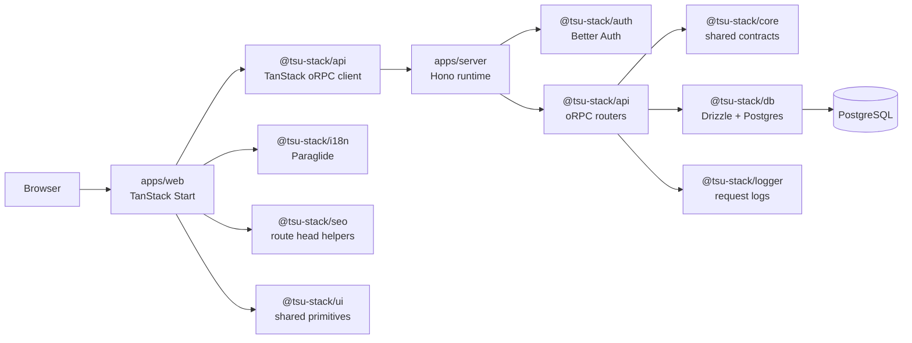
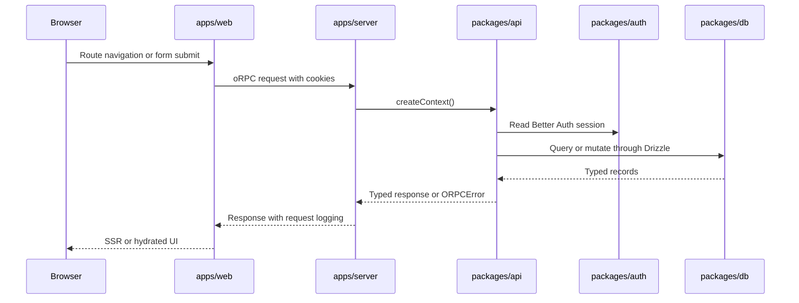
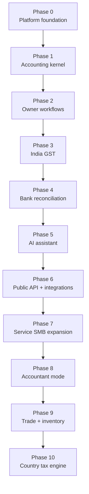

# Edernal Books

Owner-first accounting platform for India SMBs, built on the existing
`tsu-stack` TypeScript monorepo. The product direction is simple workflows for
business owners with accountant-grade books underneath: every posted business
document must eventually flow into immutable, balanced journal batches.

The repository is intentionally split into runtime apps, transport packages,
domain-neutral shared contracts, persistence, and platform utilities. Use this
README for setup and orientation; use [docs/README.md](docs/README.md) for the
full documentation map.

## What This Repo Contains

| Area              | Path                                         | Responsibility                                                        |
| ----------------- | -------------------------------------------- | --------------------------------------------------------------------- |
| Web app           | [apps/web](apps/web/README.md)               | TanStack Start frontend, routes, SSR, SEO, i18n, app UI               |
| API runtime       | [apps/server](apps/server/README.md)         | Hono process, CORS, auth routes, oRPC/OpenAPI handlers, log ingestion |
| API contracts     | [packages/api](packages/api/README.md)       | oRPC routers, context, procedure factories, TanStack client           |
| Auth              | [packages/auth](packages/auth/README.md)     | Better Auth config and React/TanStack auth helpers                    |
| Shared contracts  | [packages/core](packages/core/README.md)     | Runtime-agnostic schemas, constants, helpers                          |
| Database          | [packages/db](packages/db/README.md)         | Drizzle schema, DB client, migrations, readiness checks               |
| Env               | [packages/env](packages/env/README.md)       | Validated runtime env surfaces                                        |
| Logger            | [packages/logger](packages/logger/README.md) | evlog facade for browser, Hono, TanStack Start, jobs                  |
| i18n              | [packages/i18n](packages/i18n/README.md)     | Paraglide compile output, Vite plugin, localized navigation           |
| SEO               | [packages/seo](packages/seo/README.md)       | TanStack Start route `head()` helpers                                 |
| UI                | [packages/ui](packages/ui/README.md)         | App-agnostic shadcn/base UI primitives                                |
| TypeScript config | [tools/tsconfig](tools/tsconfig/README.md)   | Shared TS base config                                                 |
| Vite Plus config  | [tools/vite-plus](tools/vite-plus/README.md) | Shared Oxlint/FSD lint helpers                                        |

## System Architecture



Request flow:



More detail lives in [docs/architecture.md](docs/architecture.md).

## Quick Start

Prerequisites:

- Node.js matching the project runtime from Vite Plus.
- `vp` and `vpx` from Vite Plus.
- Docker for local PostgreSQL.

Setup:

```bash
rtk vp env install
rtk vp install
rtk cp packages/env/.env.example packages/env/.env
rtk vp run auth:secret
rtk vp run db:dev:start
rtk vp run db:migrate
rtk vp run dev
```

Local services:

| Service  | URL                                                                  |
| -------- | -------------------------------------------------------------------- |
| Web      | `http://localhost:3000/web`                                          |
| Server   | `http://localhost:5000/server`                                       |
| API docs | `http://localhost:5000/server/docs` when `ENABLE_OPEN_API_DOCS=true` |

## Core Commands

Use Vite Plus commands from the workspace root.

| Command                    | Purpose                                       |
| -------------------------- | --------------------------------------------- |
| `rtk vp run dev`           | Start apps/packages in development mode       |
| `rtk vp run build`         | Build all buildable packages/apps             |
| `rtk vp run -w fix`        | Workspace format, lint, and typecheck         |
| `rtk vp check`             | Package-local lint and typecheck              |
| `rtk vp check --fix`       | Package-local format, lint fix, and typecheck |
| `rtk vp run db:dev:start`  | Start local PostgreSQL                        |
| `rtk vp run db:dev:stop`   | Stop local PostgreSQL                         |
| `rtk vp run db:generate`   | Generate Drizzle migrations                   |
| `rtk vp run db:migrate`    | Apply Drizzle migrations                      |
| `rtk vp run db:studio`     | Open Drizzle Studio                           |
| `rtk vp run auth:generate` | Regenerate Better Auth schema                 |
| `rtk vp run auth:secret`   | Generate a Better Auth secret                 |

Validation timing is user-directed by policy. See
[.agents/workflow.md](.agents/workflow.md) before running broad checks.

## Environment Variables

The app env template lives in [packages/env/.env.example](packages/env/.env.example);
Docker Compose env examples live in [.env.docker.example](.env.docker.example).
Validated env surfaces live in [packages/env/src](packages/env/src).

| Variable                  | Surface                   | Required   | Notes                                                                      |
| ------------------------- | ------------------------- | ---------- | -------------------------------------------------------------------------- |
| `VITE_SERVER_URL`         | server, web client/server | production | API base URL, may include `/server` subpath                                |
| `VITE_WEB_URL`            | server, web client/server | production | Web base URL, may include `/web` subpath                                   |
| `DATABASE_URL`            | server                    | yes        | PostgreSQL URL used by runtime queries, Drizzle generation, and migrations |
| `BETTER_AUTH_SECRET`      | server                    | yes        | Minimum 32 characters                                                      |
| `ENABLE_OPEN_API_DOCS`    | server                    | no         | Enables `/docs` endpoint                                                   |
| `SOURCE_COMMIT`           | server, web server        | no         | Build/deploy version string                                                |
| `IS_BUILD`                | server, web server        | no         | Disables runtime-only behavior during build                                |
| `NODE_ENV`                | server, web server        | no         | `development` or `production`                                              |
| `VITE_IMGPROXY_URL`       | web client/server         | no         | Optional image proxy base URL                                              |
| `VITE_IMGPROXY_SIGNATURE` | web client/server         | no         | Optional imgproxy signature segment                                        |

When changing env, update validation, template, Docker propagation, and docs
together. See [packages/env/README.md](packages/env/README.md).

Deployment and database-role details live in [docs/deployment.md](docs/deployment.md).

## Product Roadmap

The accounting roadmap is staged so correctness lands before breadth.



Start with:

- [AI-native accounting foundation design](docs/superpowers/specs/2026-06-16-ai-native-accounting-foundation-design.md)
- [Accounting plan set index](docs/superpowers/plans/2026-06-16-plan-set-index.md)
- [Accounting foundation schema revision](docs/superpowers/plans/2026-06-17-accounting-foundation-schema-revision-plan.md)
- [ADR-0001: Accounting Foundation Spine](docs/decisions/0001-accounting-foundation-spine.md)

## Documentation Benchmark

The docs structure is inspired by the strongest parts of Midday's public repo:
package-level READMEs, architecture files, diagrams, provider/domain boundaries,
and explicit operational notes. We copy the documentation style, not their stack
or implementation assumptions.

Reference examples:

- [Midday root README](https://github.com/midday-ai/midday/blob/main/README.md)
- [Midday accounting README](https://github.com/midday-ai/midday/blob/main/packages/accounting/README.md)
- [Midday accounting architecture](https://github.com/midday-ai/midday/blob/main/packages/accounting/ARCHITECTURE.md)
- [Midday docs index](https://github.com/midday-ai/midday/blob/main/docs/README.md)

## Contribution Notes

- Read [AGENTS.md](AGENTS.md) first when working with agents.
- Use the most specific `.agents/*.md` file for the task.
- Keep package docs close to package ownership.
- Add or update ADRs in [docs/decisions](docs/decisions) for expensive
  architectural decisions.
- Do not duplicate rules across docs; link to the owning document.
