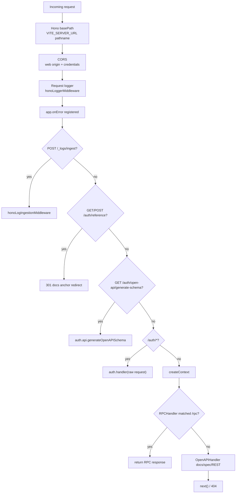
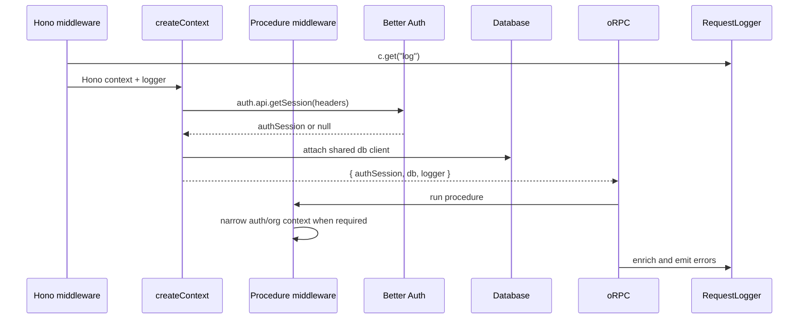

# @tsu-stack/server Architecture

`apps/server` is a runtime shell. It should stay boring: initialize env, create
Hono, mount infrastructure routes, delegate to package-owned handlers, and start
the Node server.

## Middleware And Handler Order

## Context Flow

## OpenAPI Composition

The server creates one `OpenAPIHandler` from `appRouter`.

It provides:

- JSON schema conversion through `ZodToJsonSchemaConverter`.
- Smart coercion for OpenAPI inputs.
- Scalar reference UI at `/docs` when `ENABLE_OPEN_API_DOCS=true`.
- Spec output at `/docs/spec.json` when `ENABLE_OPEN_API_DOCS=true`.
- Better Auth schema source mounted separately at
  `/auth/open-api/generate-schema`.
- `authCookie` security scheme for protected procedures.

## Error Handling

Unhandled Hono errors flow through `app.onError`:

1. Use request logger when available.
2. Fall back to global `log.error`.
3. Parse unknown thrown value with `parseError`.
4. Return response-safe fields: `message`, optional `code`, `why`, `fix`, `link`.

oRPC handlers additionally attach interceptors that set `handler` on the request
logger before logging errors.

## Deployment Model

Default deployment runs server separately from the web app:

- Web: `/web`, port `3000`.
- Server: `/server`, port `5000`.

Server runtime and production migrations both use `DATABASE_URL`. MVP tenant
isolation is enforced in application/query code through explicit
`organizationId` predicates rather than PostgreSQL RLS policies.

Merged deployment can import `app` from this package into TanStack Start, but it
should be treated as an explicit deployment architecture decision because API
load then shares resources with SSR.

## Extension Points

Add new route groups before the catch-all handler when they need:

- raw request body;
- provider signature verification;
- OAuth callback state handling;
- file streaming;
- custom status/body semantics;
- public API versioning outside current oRPC mapping.

Keep ordinary app procedures in `packages/api`.
