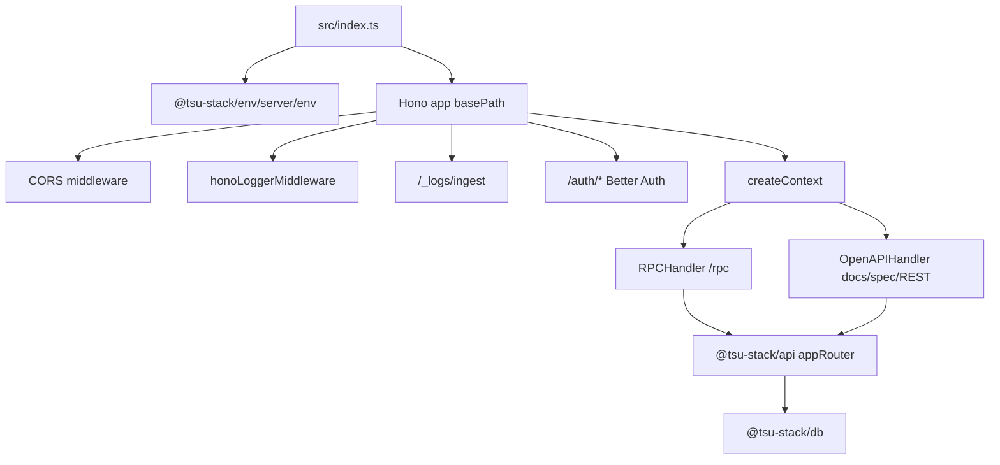

# @tsu-stack/server

Node/Hono runtime shell for the API server. It owns process startup, the Hono
app, CORS, request logging middleware, Better Auth route mounting, browser-log
ingestion, oRPC/OpenAPI handlers, and startup database migration behavior.

Domain logic should live in `packages/api`, `packages/db`, `packages/core`, or
future domain packages, not in this app.

## Responsibilities

- Create the Hono app with the base path from `ENV_SERVER.VITE_SERVER_URL`.
- Mount CORS and request logging globally.
- Mount `/_logs/ingest` for browser log batches.
- Mount Better Auth raw routes under `/auth/*`.
- Generate Better Auth OpenAPI schema under `/auth/open-api/generate-schema`.
- Serve oRPC RPC, OpenAPI REST, and optional Scalar docs handlers.
- Run production database migrations on startup through `migrateDatabase()`.

## Architecture

See [ARCHITECTURE.md](ARCHITECTURE.md) for middleware order and handler details.

## Public Entrypoints

| Export           | Purpose                                            |
| ---------------- | -------------------------------------------------- |
| `app`            | Hono app, useful for merged deployment experiments |
| `openApiHandler` | oRPC OpenAPI/Scalar handler                        |
| `rpcHandler`     | oRPC RPC handler                                   |

## Routes

| Route                                   | Purpose                                          |
| --------------------------------------- | ------------------------------------------------ |
| `/server/_logs/ingest`                  | Browser log batch ingestion                      |
| `/server/auth/*`                        | Better Auth routes                               |
| `/server/auth/open-api/generate-schema` | Better Auth OpenAPI schema                       |
| `/server/health/live`                   | process liveness through the API health router   |
| `/server/health/ready`                  | database readiness through the API health router |
| `/server/rpc/*`                         | oRPC app client endpoint                         |
| `/server/docs`, `/server/docs/*`        | Scalar docs/spec when enabled                    |
| `/server/*`                             | OpenAPI REST mapping for oRPC routes             |

Actual prefix comes from `VITE_SERVER_URL`.

## Development Commands

| Command                                         | Purpose                              |
| ----------------------------------------------- | ------------------------------------ |
| `rtk vp run --filter @tsu-stack/server dev`     | Start watched server with env loaded |
| `rtk vp run --filter @tsu-stack/server build`   | Build server bundle                  |
| `rtk vp run --filter @tsu-stack/server start`   | Run built server                     |
| `rtk vp run --filter @tsu-stack/server compile` | Build executable-style output        |

## Integration Notes

- Server-only env comes from `@tsu-stack/env/server/env`.
- `DATABASE_URL` is used by runtime queries and the production migration
  runner.
- Auth routes use raw `Request` delegation through `auth.handler`.
- oRPC/OpenAPI requests share one dispatcher and one context creation path.
- API context includes the Better Auth `authSession`, shared `db`, and request
  logger.
- Hono global errors are parsed through `@tsu-stack/logger/server`.
- Keep external/webhook routes before the oRPC/OpenAPI catch-all.

## Gotchas

- `ENABLE_OPEN_API_DOCS=false` disables the docs route but not OpenAPI route
  handling.
- Startup migrations run only in production and skip during build.
- Merged web/server deployment changes request logging and resource isolation;
  document that decision before adopting it.
