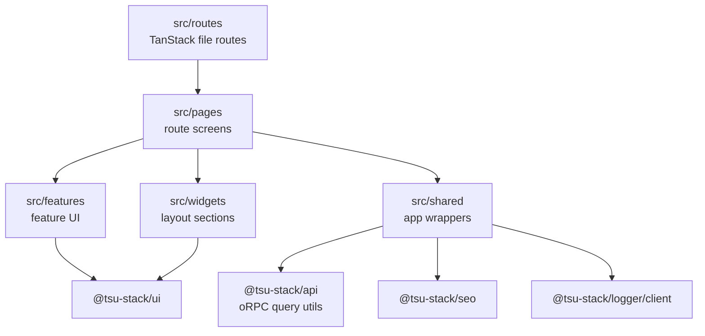
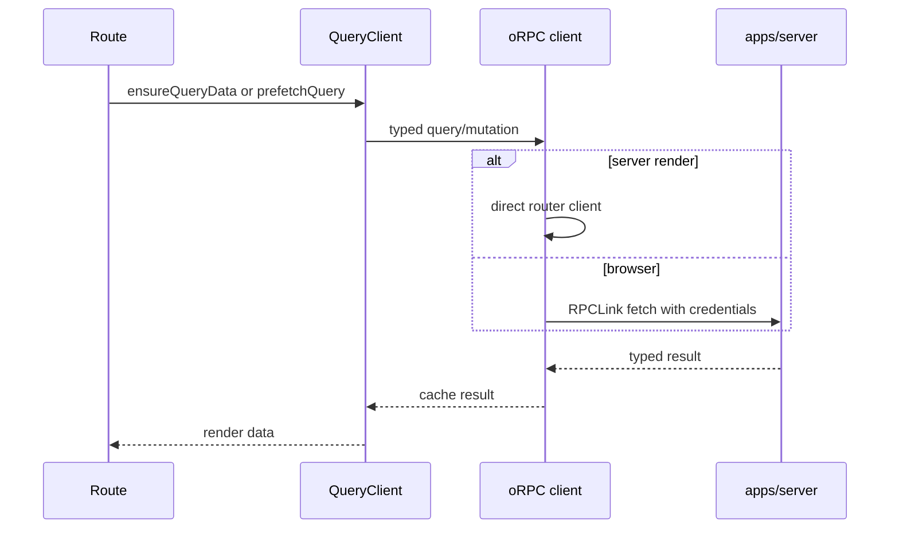

# @tsu-stack/web

TanStack Start frontend for Edernal Books. It owns routes, SSR document shell,
page composition, route-level SEO, i18n-aware navigation, browser logging, and
app-specific wrappers around shared packages.

## Responsibilities

- Own file-based routes under `src/routes`.
- Keep route files thin; compose UI in `pages`, `widgets`, `features`, and
  `shared`.
- Use TanStack Query as the server-data cache owner.
- Use `@tsu-stack/api/client/tanstack-start/orpc` for typed API calls.
- Use `@tsu-stack/i18n` for messages, localized links, and locale-aware routing.
- Use `@tsu-stack/seo` for route `head()` output.
- Use `@tsu-stack/ui` primitives before adding app-local primitives.

Does not own DB queries, Hono middleware, reusable domain contracts, or package
exports.

## Architecture

## Rendering And Data Flow

## Public Entrypoints

| File                       | Purpose                                                     |
| -------------------------- | ----------------------------------------------------------- |
| `src/router.tsx`           | Router factory, React Query integration, client logger init |
| `src/start.ts`             | TanStack Start client/server entry integration              |
| `src/server.ts`            | Paraglide middleware wrapper around Start handler           |
| `src/routes/__root.tsx`    | HTML shell, root SEO, providers, devtools                   |
| `src/shared/lib/seo.ts`    | App-specific SEO wrapper around `@tsu-stack/seo`            |
| `src/config/app.config.ts` | Site metadata, locale config, support email                 |

## Local Structure

| Path                   | Purpose                                          |
| ---------------------- | ------------------------------------------------ |
| `src/routes`           | TanStack route definitions and loaders           |
| `src/pages`            | Page-level UI composition                        |
| `src/widgets`          | Reusable page sections and layouts               |
| `src/features`         | Feature-owned UI and configs                     |
| `src/shared`           | App-level providers, styles, wrappers, shared UI |
| `src/routeTree.gen.ts` | Generated route tree; do not edit manually       |

## Development Commands

| Command                                      | Purpose                              |
| -------------------------------------------- | ------------------------------------ |
| `rtk vp run --filter @tsu-stack/web dev`     | Start web dev server with env loaded |
| `rtk vp run --filter @tsu-stack/web preview` | Preview built web app                |
| `rtk vp run --filter @tsu-stack/web ui`      | Run shadcn CLI in web context        |
| `rtk vp run --filter @tsu-stack/web check`   | Package-local check when approved    |

## Integration Notes

- Use `orpc.<router>.<procedure>.queryOptions()` for TanStack Query integration.
- Prefer `queryClient.ensureQueryData()` in loaders to avoid duplicate fetches.
- Keep owner-facing accounting routes free of debit/credit terminology unless the
  route is explicitly advanced/accountant mode.
- Keep app-specific image, locale, auth, and router wrappers in `src/shared`.
- Extract to `packages/ui` only after a second app-agnostic use case exists.

## Performance Notes

- `defaultPreload: "intent"` preloads route assets on hover/touch intent.
- `defaultPreloadStaleTime: 0` lets React Query own freshness.
- `defaultStructuralSharing: true` reduces unnecessary renders.
- Browser logs are batched every 2 seconds or 25 events.
- Root auth prefetch skips preload events to avoid session request spam.
- Fonts are preloaded in `__root.tsx`; keep additional font work centralized.

## Gotchas

- `src/routeTree.gen.ts` is generated by TanStack tooling.
- `@tsu-stack/ui` must stay app-agnostic; do not import `apps/web` code there.
- `VITE_*` values can reach the browser. Never move server secrets into web env.
- Route `head()` should use `generateAppSeo`; root-only document meta belongs in
  `__root.tsx`.
