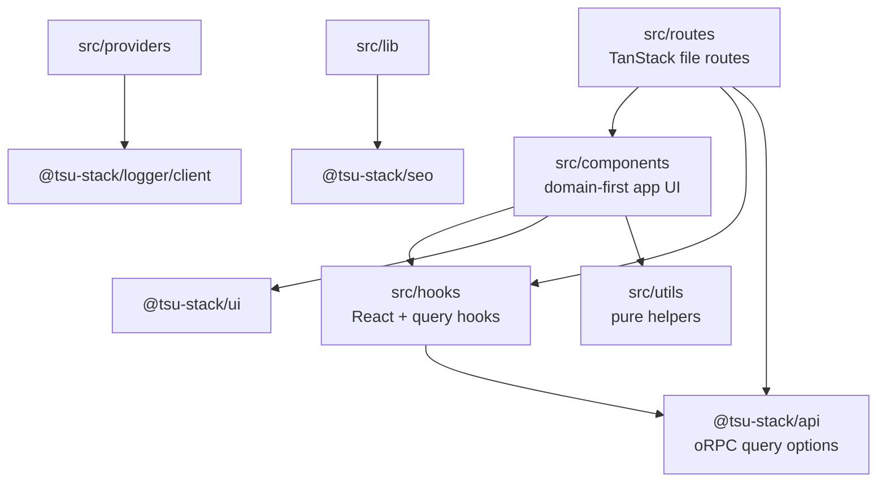
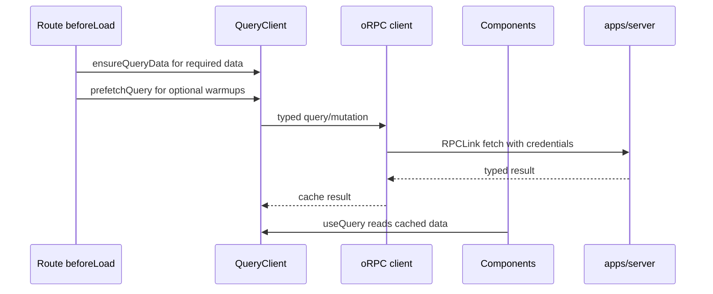

# @tsu-stack/web

TanStack Start frontend for Edernal Books. It owns routes, SSR document shell,
page composition, route-level SEO, i18n-aware navigation, browser logging, and
app-specific wrappers around shared packages.

## Responsibilities

- Own file-based routes under `src/routes`.
- Use Midday-style app folders: `components`, `hooks`, `utils`, `lib`,
  `providers`, `styles`, and `config`.
- Keep route files readable and usually under 250 lines.
- Compose page UI directly in routes when simple; move stateful or repeated UI
  into `src/components/<area>/...`.
- Own owner-facing document register/detail/create/post/void screens under the
  app shell.
- Use TanStack Query as the server-data cache owner.
- Use `@tsu-stack/api/client/tanstack-start/orpc` for typed API calls.
- Use `@tsu-stack/i18n` for messages, localized links, and locale-aware routing.
- Use `@tsu-stack/seo` for route `head()` output.
- Use `@tsu-stack/ui` primitives before adding app-local primitives.

Does not own DB queries, Hono middleware, reusable domain contracts, or package
exports.

Do not add `src/features`, `src/pages`, `src/widgets`, `src/entities`,
`src/shared`, or frontend `api/` folders.

## Architecture

## Rendering And Data Flow

Midday's `prefetch(...)` helper is not copied directly. TanStack Start routes
already receive `context.queryClient`, and `@tanstack/react-router-ssr-query`
handles dehydration.

## Public Entrypoints

| File                       | Purpose                                                     |
| -------------------------- | ----------------------------------------------------------- |
| `src/router.tsx`           | Router factory, React Query integration, client logger init |
| `src/start.ts`             | TanStack Start client/server entry integration              |
| `src/server.ts`            | Paraglide middleware wrapper around Start handler           |
| `src/routes/__root.tsx`    | HTML shell, root SEO, providers, devtools                   |
| `src/lib/seo.ts`           | App-specific SEO wrapper around `@tsu-stack/seo`            |
| `src/config/app.config.ts` | Site metadata, locale config, support email                 |

## Local Structure

| Path                   | Purpose                                          |
| ---------------------- | ------------------------------------------------ |
| `src/routes`           | TanStack route definitions and route guards      |
| `src/components`       | Domain-first app UI and flat generic components  |
| `src/hooks`            | React hooks, query hooks, mutation hooks         |
| `src/utils`            | Pure helpers, formatters, defaults, option lists |
| `src/lib`              | App services and integration glue                |
| `src/providers`        | React provider components                        |
| `src/styles`           | Global styles                                    |
| `src/config`           | App config and constants                         |
| `src/routeTree.gen.ts` | Generated route tree; do not edit manually       |

Component rules:

- Domain UI: `src/components/settings/business-settings-form.tsx`.
- Generic app UI: `src/components/form-fields.tsx`.
- Generic app-agnostic primitives: `@tsu-stack/ui/components/container`.
- No `components/shared`, `components/ui`, `components/forms`,
  `components/tables`, or `components/navigation`.
- No app barrel files. Import exact files.

## Development Commands

| Command                                      | Purpose                              |
| -------------------------------------------- | ------------------------------------ |
| `rtk vp run --filter @tsu-stack/web dev`     | Start web dev server with env loaded |
| `rtk vp run --filter @tsu-stack/web preview` | Preview built web app                |
| `rtk vp run --filter @tsu-stack/web ui`      | Run shadcn CLI in web context        |
| `rtk vp run --filter @tsu-stack/web check`   | Package-local check when approved    |

## Integration Notes

- Use `orpc.<router>.<procedure>.queryOptions()` for TanStack Query integration.
- Prefer `queryClient.ensureQueryData()` in `beforeLoad` when the route needs
  data before rendering or redirecting.
- Use `queryClient.prefetchQuery()` only for optional warmups.
- Put mutation invalidation and reusable query policy in `src/hooks`.
- Do not create `getXQueryOptions(...)` factories unless shared policy or
  repeated use justifies them.
- Keep owner-facing accounting routes free of debit/credit terminology unless
  the route is explicitly advanced/accountant mode.
- Sales, purchase, and settlement documents use business labels such as invoice, bill, receipt, payment,
  customer, vendor, total, outstanding, and document number.
- Extract to `packages/ui` only when the component is app-agnostic and actively
  reused; keep routing, env, auth, locale, and SEO glue in `src/components`.

## Performance Notes

- `defaultPreload: "intent"` preloads route assets on hover/touch intent.
- `defaultPreloadStaleTime: 0` lets React Query own freshness.
- `defaultStructuralSharing: true` reduces unnecessary renders.
- Browser logs are batched every 2 seconds or 25 events.
- Root auth prefetch skips preload events to avoid session request spam.
- Fonts are defined in `src/styles/fonts.css`; keep additional font work centralized there.

## Gotchas

- `src/routeTree.gen.ts` is generated by TanStack tooling.
- Use `_public`, `_guest`, and `_app` for pathless route groups.
- Use route-ignored `-<name>` only for route-only helpers, not default UI slices.
- `@tsu-stack/ui` must stay app-agnostic; do not import `apps/web` code there.
- `VITE_*` values can reach the browser. Never move server secrets into web env.
- Route `head()` should use `generateAppSeo`; root-only document meta belongs in
  `__root.tsx`.
