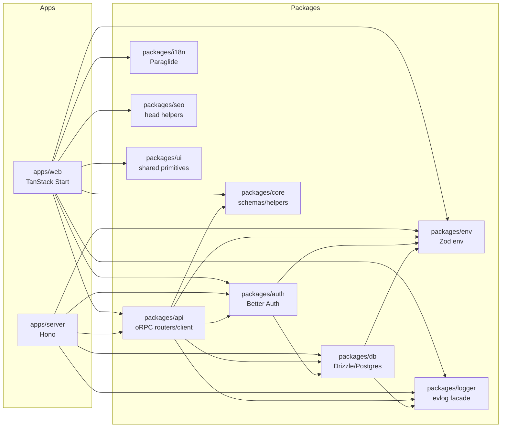
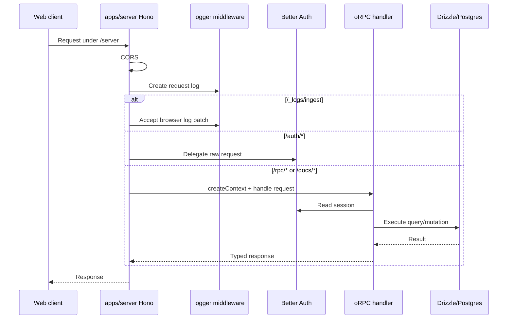
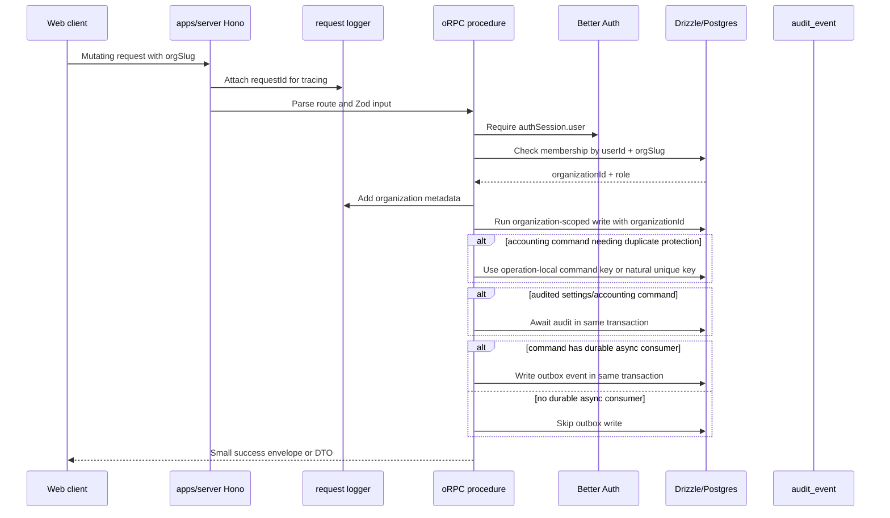
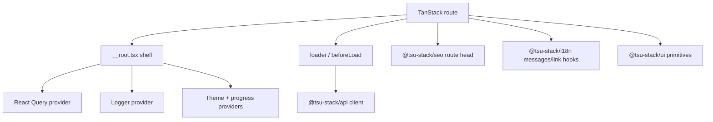
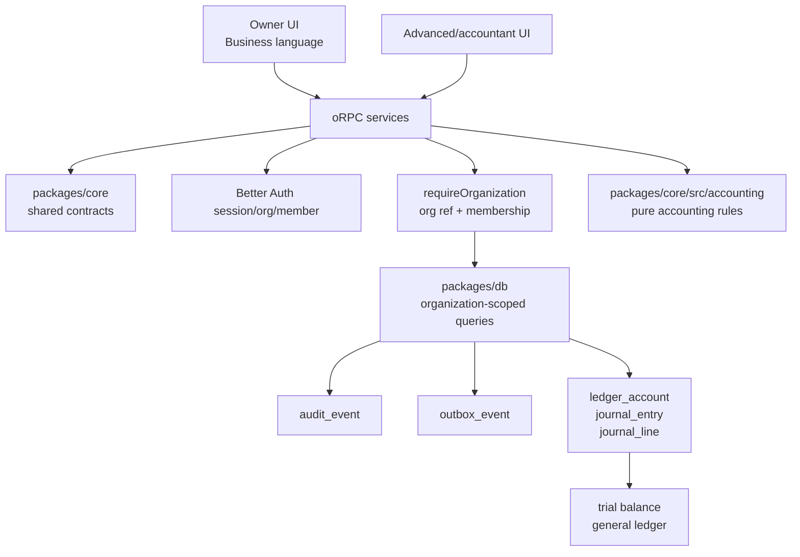
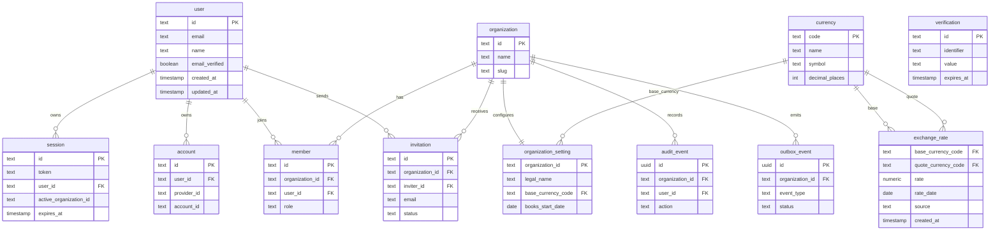

# Architecture

Edernal Books uses the existing `tsu-stack` monorepo as a platform for an
owner-first accounting product. The architecture prioritizes type-safe
boundaries, deterministic accounting services, explicit tenancy, and fast UI
delivery.

## Design Goals

- Keep runtime shells thin.
- Keep business contracts shared through `packages/core`.
- Keep persistence and migrations inside `packages/db`.
- Keep transport concerns in `packages/api`.
- Keep owner-facing UI in `apps/web`, with shared primitives in `packages/ui`.
- Keep accounting correctness in pure packages before wiring it into API/UI.
- Prefer simple, measurable performance wins over speculative infrastructure.
- Make every abstraction earn its cost through real reuse, shared policy,
  independent testing, or a clear runtime/package boundary.

## Current Package Graph

## Runtime Boundaries

| Boundary          | Owns                                                                      | Does not own                                                          |
| ----------------- | ------------------------------------------------------------------------- | --------------------------------------------------------------------- |
| `apps/web`        | Routes, route-level data loading, page composition, app wrappers          | DB queries, Hono middleware, reusable domain contracts                |
| `apps/server`     | Process startup, Hono app, CORS, auth mount, docs mount, request logger   | Domain business logic, reusable DB queries                            |
| `packages/api`    | oRPC routers, context, procedure factories, router-owned transport errors | React UI, process startup, schema migrations, DB error conversion     |
| `packages/auth`   | Better Auth config, auth client/hooks/query helpers                       | App-specific accounting authorization rules beyond shared permissions |
| `packages/core`   | Pure contracts, constants, formatters, shared Zod schemas                 | DB, env, logger, React, Hono, oRPC                                    |
| `packages/db`     | Drizzle schema, migrations, DB client, query helpers                      | UI, transport response shape, auth cookies, oRPC error contracts      |
| `packages/env`    | Runtime env validation                                                    | Business logic and feature flags without code consumers               |
| `packages/logger` | Client/server/request logging facade                                      | Analytics product logic or arbitrary console logging                  |
| `packages/ui`     | App-agnostic components/styles/hooks                                      | Router, locale, auth, env, analytics                                  |

## Server Request Flow

Middleware order lives in [../apps/server/ARCHITECTURE.md](../apps/server/ARCHITECTURE.md).

## Tenant Mutation Flow

Use this flow for organization-scoped app mutations:

`requestId` is observability only. It identifies one HTTP attempt in logs and
audit metadata; it is not a duplicate-prevention key. Current internal
accounting commands use direct database transactions plus domain constraints.
Existing document post and void commands lock rows and reject stale
statuses. Create-and-post does not replay retried requests in this phase.
External provider calls may use provider idempotency keys when the provider owns
duplicate creation semantics.

## Web Rendering Flow

Performance decisions already present:

- TanStack Router preloads links on intent.
- React Query owns server-data caching.
- Router structural sharing is enabled.
- Route loaders should call `queryClient.ensureQueryData()` when fetching.
- Root route preloads auth only outside router preload to avoid session spam.
- Fonts are preloaded in the root shell.
- Browser logs batch to HTTP rather than sending one request per event.
- Heavy accounting lists use cursor pagination and `ssr: "data-only"` by
  default; see
  [Accounting Application Architecture Playbook](accounting-application-architecture-playbook.md)
  for examples and sources.

## Frontend File Boundaries

App code in `apps/web/src` follows a Midday-style structure: `routes`,
`components`, `hooks`, `utils`, `lib`, `providers`, `styles`, and `config`.
Do not create `features`, `pages`, `widgets`, `entities`, `shared`, or frontend
`api` folders in the web app.

Route files use TanStack `_` pathless groups such as `_public`, `_guest`, and
`_app`. They may compose UI directly when they stay readable and should usually
remain under 250 lines. Stateful forms, tables, modals, repeated page sections,
and cross-route UI move into `components/<area>/...`.

Components are domain-first. A settings form lives at
`components/settings/business-settings-form.tsx`; a members table lives at
`components/members/members-table.tsx`. Generic app components stay flat, for
example `components/form-fields.tsx`, `components/theme-switcher.tsx`, and
`components/logo.tsx`. Generic app-agnostic primitives such as `Container`
live in `packages/ui`. Do not create `components/shared`, `components/ui`,
`components/forms`, `components/tables`, or `components/navigation`.

TanStack Query integration is direct. Routes may inline
`orpc.<router>.<procedure>.queryOptions(...)` inside `beforeLoad`. Components use
hooks from `hooks/` when the hook owns mutation invalidation, query policy, or a
clear domain contract. Do not create a `getXQueryOptions(...)` factory unless
shared non-trivial policy justifies it.

App code imports exact files. App barrel files are not allowed. Package-level
entrypoints such as `packages/core/src/index.ts` remain allowed only when they
are the declared public API for a package or domain and stay narrow.

`routes/**/index.tsx` files are TanStack route files, not barrels.

## Accounting Target Architecture

The accounting system is staged. Phase 0 builds tenant/platform guarantees.
Phase 1 builds the double-entry kernel. Later phases add owner workflows, tax,
banking, AI, integrations, services, accountant mode, inventory, and country tax
plugins.

Accounting invariants:

- Posted journal entries are immutable.
- Corrections use reversal plus new posting.
- Every journal entry balances before posting.
- Money uses integer minor units.
- Tenant-owned rows carry `organization_id`.
- App routes accept client-provided `orgSlug`, verify membership, then use the
  canonical `organizationId` for tenant data access.
- Sensitive mutations write `audit_event`.
- Async side effects start from `outbox_event`.
- `requestId` stays a log correlation id, not a replay key.

The source of truth is
[AI-native accounting foundation design](superpowers/specs/2026-06-16-ai-native-accounting-foundation-design.md).

## Database Model Today

Current schema includes Better Auth identity/organization tables, Phase 0
app-owned platform tables, the Phase 1 ledger kernel, the Phase 2 owner record
foundation tables (`party`, `item`), and the Phase 2.5 document spine.
[ADR-0012](decisions/0012-replace-source-document-with-journal-source-metadata.md)
removed the historical Phase 1 `source_document` table in favor of journal
source metadata. This diagram shows the platform foundation subset; ledger,
owner records, and document records are tracked in the schema revision and
package architecture docs.

[Phase 2.5 document spine](superpowers/plans/2026-06-28-phase-02-5-document-spine-plan.md)
is the implemented bridge before Phase 3 GST semantics. It adds typed posted
invoices, purchase bills/expenses, settlements, allocations, journal-entry
links, audit rows, journal source metadata, and number-sequence-backed document
numbers. The current branch has typed document tables, document routers, and
`@tsu-stack/core/documents` contracts.

The implemented Phase 1 ledger kernel and later accounting schema are documented
in [schema revision plan](superpowers/plans/2026-06-17-accounting-foundation-schema-revision-plan.md).

Phase 0 web routes:

- `/` shows the public home page for anonymous users and redirects authenticated users to their active organization.
- `/home` is the explicit public home page route for authenticated users who want to view it.
- `/organizations/new` creates or joins a Better Auth business, then sends the user to organization onboarding.
- `/$orgSlug/settings/business` reads and writes `organization_setting` through oRPC after server-side membership verification.

Onboarding visibility follows server-backed user and organization state, not
local storage. Protected app routing fetches the current user plus organization
membership once, then gates organization routes with the Better Auth
organization `onboardingCompletedAt` additional field. `organization_setting`
can exist before onboarding is finished, so route guards must not infer
completion from settings rows. The onboarding completion command writes the
business settings and completion timestamp in one transaction, preserving the
first completion timestamp on retry.
Onboarding step progression is UI state carried in the route search param as a
named step key, such as `?step=business-contact`, so direct links and refreshes
can resume the same visible step without making route guards depend on
incomplete form state. Do not persist step progress without also persisting
draft values.
Do not add top-level compatibility redirects such as `/dashboard` or
`/settings/business`; the canonical app entry is `/$orgSlug`.

Local migration status: the fresh baseline migration is generated, but applying
it locally requires Docker/Postgres to be running on the configured
`DATABASE_URL`.

Current idempotency policy is owned by
[Tenant Mutation Flow](#tenant-mutation-flow): `requestId` is tracing only,
internal writes use operation-local or natural keys, and a central replay store
waits until a public API needs heterogeneous response replay.

## Public API Strategy

- Internal app calls use oRPC by default.
- OpenAPI docs are generated from the oRPC router and Better Auth schema.
- External stable public APIs wait until Phase 6.
- Routes needing raw request behavior, provider signatures, streaming, or custom
  response semantics should mount in Hono before the oRPC/OpenAPI catch-all.

## Logging Strategy

`packages/logger` wraps evlog for structured client/server logging:

- Browser logs batch to `/_logs/ingest`.
- Hono middleware creates request-scoped loggers.
- Global Hono errors are parsed into response-safe fields.
- Server packages use `createLogger` for non-request work.

See [../packages/logger/ARCHITECTURE.md](../packages/logger/ARCHITECTURE.md).

## Deployment Shape

Current default shape runs two Node processes:

- `apps/web`: TanStack Start/Nitro app on `/web`.
- `apps/server`: Hono API server on `/server`.

Docker Compose files support local and Coolify-style deployments. Merged
web/server deployment is possible but should be treated as a deployment decision
because it changes scaling and request-log behavior.

Database deployment uses one server-side `DATABASE_URL` for runtime queries,
Drizzle generation, and migrations. MVP tenant isolation is application-owned:
API code verifies the caller-provided organization reference and DB queries
include explicit `organizationId` predicates.

See [deployment.md](deployment.md) for Docker and Coolify notes.

## Documentation Style Source

This architecture documentation follows the pattern used by strong package docs
in Midday: local package READMEs, architecture diagrams where relationships are
non-obvious, explicit data-flow sections, and clear "do not copy" boundaries.
See [documentation-style-guide.md](documentation-style-guide.md).
