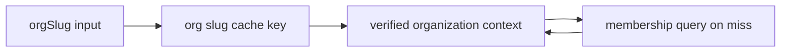

# ADR-0003: Organization Context And Permission Cache Pattern

## Status

Accepted

## Date

2026-06-18

## Context

Tenant-owned procedures need a stable organization reference that works across
multiple browser tabs. A session-level active organization is not enough because
one user can work in multiple organizations at the same time.

Midday's API has useful patterns worth copying later:

- request context carries infrastructure such as session, db, request id,
  Cloudflare ray id, and primary-read flags;
- team permission middleware resolves the current team once, dedupes repeated
  resolution with a request-local `WeakMap`, verifies membership, and narrows
  context for downstream handlers;
- Redis-backed `teamCache` stores user/team access booleans with a 30-minute TTL;
- primary-read-after-write middleware marks recent mutations and routes related
  reads to the primary database while replicas catch up;
- request tracing prefers `cf-ray`, then `x-request-id`, then a generated id.

Sources:

- [Midday team permission middleware](https://github.com/midday-ai/midday/blob/main/apps/api/src/trpc/middleware/team-permission.ts)
- [Midday tRPC context initialization](https://github.com/midday-ai/midday/blob/main/apps/api/src/trpc/init.ts)
- [Midday team cache](https://github.com/midday-ai/midday/blob/main/packages/cache/src/team-cache.ts)
- [Midday primary read-after-write middleware](https://github.com/midday-ai/midday/blob/main/apps/api/src/trpc/middleware/primary-read-after-write.ts)
- [Midday request trace helper](https://github.com/midday-ai/midday/blob/main/apps/api/src/utils/request-trace.ts)

## Decision

Use a caller-provided organization slug for app tenant scope.

TanStack Start loaders own the frontend route reference, for example
`example.com/<orgSlug>`. oRPC clients pass top-level `orgSlug` in
organization-scoped procedure input.

The server treats that reference as untrusted until procedure middleware verifies
it:

1. Route input parses exactly one organization reference: `orgSlug`.
2. Request context includes the Better Auth `authSession`.
3. The procedure checks `member` plus `organization` in the database.
4. Middleware adds verified `authSession`, `organizationId`,
   `organizationSlug`, `organizationRole`, and `organizationMembership` to context.
5. Handlers pass verified `context.organizationId` into tenant-owned queries.

The current implementation intentionally does not add request-local or Redis
permission caching. oRPC supports context-based middleware dedupe when a
middleware is applied multiple times, but current organization-scoped routes run
one membership check per request.

Future dedupe, if needed before Redis, should use context fields instead of a
side cache. If one request can touch more than one organization slug, the
context value must be keyed by slug until middleware resolves the canonical
organization id:

`OrpcContext` carries `authSession`, `db`, and `logger`. Authenticated
procedures require a non-null `authSession`; organization procedures also add
verified tenant fields to context.

## Future Redis Pattern

Do not add Redis yet. When this repo needs multi-instance permission caching or
read replicas, add a cache package with explicit invalidation points.

Target shape:

- `organizationPermissionCache.get(userId, organizationId)` returns a cached
  boolean membership decision.
- Cache key uses canonical organization id after slug resolution.
- TTL starts around 30 minutes, matching Midday's team access cache, then gets
  tuned from production behavior.
- Membership create/update/delete, organization slug changes, and user removal
  invalidate affected user/org keys.
- Recent tenant mutations write a short-lived read-after-write marker keyed by
  organization id.
- Tenant reads check that marker and use primary DB while the marker is valid.

Request context should also grow explicit trace fields before durable cache work:

- `requestId`;
- provider trace id such as `cfRay` when deployed behind Cloudflare;
- `forcePrimary` for controlled read-replica bypass;
- request IP and user agent for audit metadata.

## Alternatives Considered

### Better Auth Active Organization

Rejected for app tenant scope. It makes one mutable session field decide which
tenant every tab uses. That breaks concurrent multi-org work and makes URLs less
stable.

### Path Or Header Extraction In API Middleware

Rejected. The frontend route loader already knows the organization slug.
Passing that reference through typed oRPC input keeps procedure contracts
explicit and avoids hidden coupling to URL shape or custom headers.

### Caller-Provided Organization Id

Rejected for app tenant scope. `organizationId` remains the internal DB tenant
key after membership verification, but accepting both slug and id in client
inputs creates two valid contracts for the same route. `orgSlug` is the single
user-facing reference because it comes directly from the URL and supports
multiple organization tabs without a mutable active-organization session field.

### Redis Permission Cache Now

Rejected for MVP. There is no Redis runtime in the repo yet, no read replica,
and no cross-instance pressure. A direct membership check keeps the current path
simple until caching has a measured need and clear invalidation points.

## Consequences

- Organization-scoped inputs are flat: `{ orgSlug }` or
  `{ orgSlug, ...mutationFields }`.
- Schema/type exports stay close to the router contract instead of routing
  through generic wrapper schemas.
- Middleware verifies membership on every organization-scoped request.
- Handlers rely on verified context, not raw input, when querying tenant data.
- Redis and primary-read-after-write behavior need a follow-up ADR before
  implementation.
