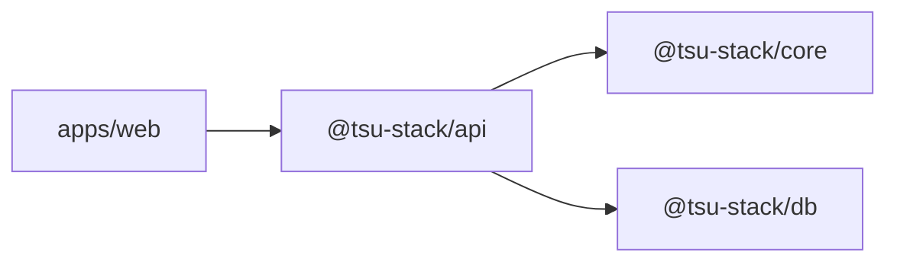

# Documentation Style Guide

Use this guide when creating or changing repository docs. The goal is
documentation that future engineers and agents can execute, not marketing copy.

## Principles

- Document ownership and reasons, not obvious code.
- Put facts next to the owner. Link instead of copying.
- Prefer diagrams for flows, package dependencies, state machines, and schemas.
- Keep docs executable: commands, paths, env vars, and exit criteria must match
  the repo.
- Prefer small focused files over giant catch-all docs.
- Treat package READMEs as public interfaces for other packages.

## File Ownership

| Doc kind                   | Owner                          |
| -------------------------- | ------------------------------ |
| Product/repo orientation   | `README.md`                    |
| Documentation map          | `docs/README.md`               |
| System architecture        | `docs/architecture.md`         |
| Expensive decisions        | `docs/decisions/*.md`          |
| Agent routing/policy       | `AGENTS.md` and `.agents/*.md` |
| Package behavior           | `<package>/README.md`          |
| Complex package internals  | `<package>/ARCHITECTURE.md`    |
| Accounting execution plans | `docs/superpowers/plans/*.md`  |
| Accounting source specs    | `docs/superpowers/specs/*.md`  |

## Package README Template

Use this structure unless a package has a stronger reason to differ:

```md
# @tsu-stack/<name>

One-paragraph responsibility summary.

## Responsibilities

- What this package owns.
- What this package explicitly does not own.

## Architecture

Mermaid diagram when relationships are non-obvious.

## Public API / Entrypoints

| Import | Purpose |
| ------ | ------- |

## Local Structure

| Path | Purpose |
| ---- | ------- |

## Development Commands

| Command | Purpose |
| ------- | ------- |

## Integration Notes

How other packages should consume this package.

## Gotchas

Known traps, ordering rules, generated files, performance concerns.
```

## Mermaid Rules

Use Mermaid when a section describes:

- package dependencies;
- request/data flow;
- lifecycle/state transitions;
- database relationships;
- async/outbox/job flow;
- auth or permission flow.

Keep diagrams small enough to scan. If a graph needs more than roughly 12 nodes,
split it by concern.

Example:



## Command Rules

- Use `rtk` prefix in command examples because local agent instructions require
  it.
- Use `vp` and `vpx` for Vite Plus workflows.
- Do not document `npm`, `pnpm`, or `yarn` alternatives unless the file is
  explaining an upstream reference.
- When documenting validation, reference [.agents/workflow.md](../.agents/workflow.md)
  because validation timing is user-directed.

## Env Rules

Docs that mention env vars must match:

- [../packages/env/src/server/env.ts](../packages/env/src/server/env.ts)
- [../packages/env/src/web/env.isomorphic.ts](../packages/env/src/web/env.isomorphic.ts)
- [../packages/env/src/web/env.server.ts](../packages/env/src/web/env.server.ts)
- [../packages/env/.env.example](../packages/env/.env.example)

Never add an env var to docs without adding validation and a template value.

## ADR Rules

Write an ADR for:

- changing package boundaries;
- adding or replacing framework/runtime choices;
- changing auth/tenant strategy;
- changing public API strategy;
- changing persistence shape or migration policy;
- changing accounting invariants;
- adding worker/cache/integration infrastructure.

Do not delete old ADRs. Supersede them with a new ADR.

## Stale-Doc Scan

Use this scan after broad doc edits:

```bash
rtk rg -n "Logtape|packages/domain|packages/shared|@app/|tsu-stack.tsu|variant/merged|tsu-moe" README.md docs .github AGENTS.md .agents apps packages tools
```

Intentional historical references are allowed only when labeled as historical or
external reference material.

## Midday-Inspired Benchmark

The target quality bar is the best of Midday's docs:

- package READMEs that explain responsibilities, providers, flows, and gotchas;
- architecture docs with Mermaid class, ER, and sequence diagrams;
- docs index that helps readers choose the right file quickly;
- explicit boundaries between runtime shell, domain package, persistence, and
  public API.

Copy the style and rigor. Do not copy Midday-specific Supabase, tRPC, worker,
banking provider, or read-replica assumptions unless this repo adopts those
decisions through an ADR.
