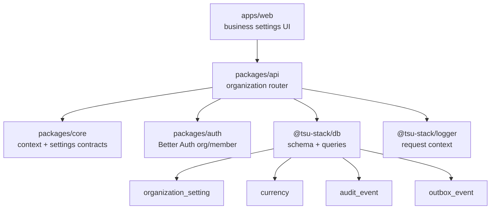
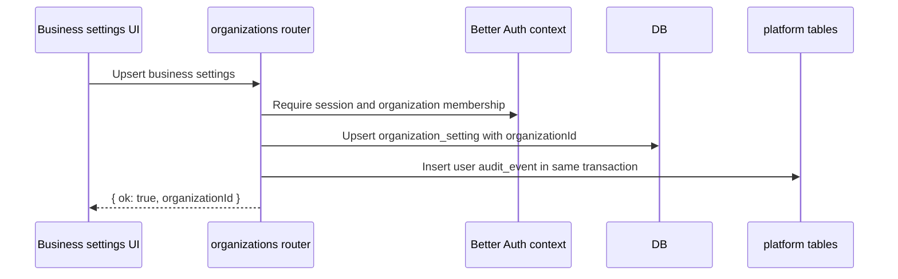

# Phase 00 Platform Foundation Implementation Plan

> **For agentic workers:** REQUIRED SUB-SKILL: Use superpowers:subagent-driven-development (recommended) or superpowers:executing-plans to implement this plan task-by-task. Steps use checkbox (`- [ ]`) syntax for tracking.

> **Schema source of truth:** Follow `docs/superpowers/plans/2026-06-17-accounting-foundation-schema-revision-plan.md`. That amendment overrides older names and any copied reference-repo assumptions.

**Goal:** Establish organization-scoped platform foundation for the accounting app: auth, business settings, request context, tenant-scoped DB queries, audit events, and outbox events.

**Architecture:** Use Better Auth `organization` as the business tenant. Keep Better Auth-owned IDs and tables in the format generated by this repo; app-owned accounting/settings tables reference those IDs using matching column types. Shared contracts live in `packages/core`, persistence lives in `packages/db`, API wiring lives in `packages/api`, auth config lives in `packages/auth`, and UI lives in `apps/web`.

**Tech Stack:** TanStack Start, Hono, oRPC, Drizzle, PostgreSQL, Better Auth, Zod, Vite Plus.

---

## Implementation Status

Updated: 2026-06-19.

Implemented in the current Phase 0 slice:

- Better Auth organization plugin and generated organization/member/invitation schema.
- `packages/db/src/client.ts`, `migrate.ts`, `queries/*`, `utils/health.ts`, and schema modules.
- `organization_setting`, `currency`, `audit_event`, and `outbox_event`.
- UUID-v7 defaults for app-owned UUID primary keys.
- Shared organization settings contracts in `packages/core/src/organizations`.
- API `organizationProcedure` using `orgSlug` input and canonical `organizationId` context.
- Organization settings `get` and `upsert` oRPC procedures.
- Transactional organization settings audit rows in `audit_event`.
- Fresh baseline migration for current schema. Supported currency reference rows use a separate seed/admin path.
- Role permission helpers and tests in `packages/auth`.
- Unit tests for schema tenant-scope invariants, organization membership resolution, and settings audit rows.
- Better Auth organization client plugin is enabled in the browser auth client.
- Web organization setup creates/selects a business at `/organizations/new`.
- Web onboarding continues setup for a selected business at `/$orgSlug/onboarding`.
- Web business settings reads and writes `organization_setting` at `/$orgSlug/settings/business`.

Remaining environment gate before Phase 1:

- Apply the generated migration in local development after Docker/Postgres is running. On 2026-06-19, local migration failed with `ECONNREFUSED` because no Postgres process was listening on localhost port 5432 and Docker was not running.

Current deviation from the original task text: settings upsert does not emit `outbox_event`. The table exists for future durable async intent, but settings and Phase 1 accounting posting currently have no async consumer. Use transactional outbox later where retry/delivery matters.

Current idempotency decision: Phase 0 does not add a generic `idempotency_ledger`
or helper. `requestId` is only for tracing. Future accounting commands use
operation-local command keys or natural unique constraints.

## Architecture Map



Current settings mutation flow:



## File Structure

Phase 0 modifies existing workspace packages instead of creating a new scaffold:

- `packages/db/src/schema/organization.ts`: `organization_setting`, `currency`.
- `packages/db/src/schema/audit.ts`: `audit_event`.
- `packages/db/src/schema/outbox.ts`: `outbox_event`.
- `packages/db/src/schema/migration.ts`: active phase-owned migration exports.
- `packages/db/src/client.ts`: Drizzle client and transaction types.
- `packages/db/src/utils/health.ts`: database readiness checks.
- `packages/db/src/queries/organizations.ts`: organization membership checks.
- `packages/db/src/queries/organization-settings.ts`: organization settings read/write helpers.
- `packages/auth/src/index.ts`: Better Auth organization plugin and role metadata.
- `packages/auth/src/permissions.ts`: app role permission helpers.
- `packages/core/src/organizations/settings.ts`: Zod contracts for business settings.
- `packages/api/src/lib/context/*`: session, organization membership, role, request metadata.
- `packages/api/src/routers/organizations/index.ts`: business settings procedures.
- `apps/web/src/routes/{-$locale}/_app/organizations/new.tsx`: business creation/selection view.
- `apps/web/src/routes/{-$locale}/_app/$orgSlug/onboarding.tsx`: selected business onboarding view.
- `apps/web/src/routes/{-$locale}/_app/$orgSlug/_shell/settings/business.tsx`: business settings view.

Do not create `packages/domain` or `packages/shared` in this repo.

## Task 1: Repository Alignment Guardrails

**Files:**

- Modify: `docs/superpowers/plans/2026-06-16-plan-set-index.md`
- Modify: `docs/superpowers/specs/2026-06-16-ai-native-accounting-foundation-design.md`

- [x] **Step 1: Confirm package vocabulary**

Use these package boundaries in all Phase 0 work:

```txt
@tsu-stack/core  -> shared Zod contracts, pure types, pure helpers
@tsu-stack/db    -> Drizzle schema, database client, migrations, query helpers
@tsu-stack/auth  -> Better Auth config and auth helpers
@tsu-stack/api   -> Hono/oRPC context and routers
@tsu-stack/web   -> TanStack Start UI
```

- [x] **Step 2: Confirm command vocabulary**

Use root scripts through Vite Plus:

```bash
rtk vp run -w db generate
rtk vp run -w db migrate
rtk vp run --filter @tsu-stack/db test:unit
rtk vp run --filter @tsu-stack/core test:unit
rtk vp run --filter @tsu-stack/web check
rtk vp check
```

Expected: commands resolve through existing `package.json` scripts or fail with a missing-script error that tells the implementer which package script must be added.

- [x] **Step 3: Keep API keys out of the Phase 0 hard gate**

Phase 0 may retain Better Auth API-key support only if dependency versions are aligned. Do not add an app-owned API-key table, developer settings UI, public API scopes, webhook scopes, or MCP policy tables in Phase 0. Those belong to Phase 6.

If `@better-auth/api-key` is used, verify it peers against the installed `better-auth` version before merging.

## Task 2: Database Client and Tenant Query Boundary

**Files:**

- Create: `packages/db/src/schema/migration.ts`
- Create or verify: `packages/db/src/client.ts`
- Create or verify: `packages/db/src/utils/health.ts`
- Future: `packages/db/src/queries/*`

Plain-language note:

- Tenant-scope inventory means "list app-owned business tables and verify every tenant-owned table has `organization_id`." It is not warehouse, stock, or item inventory.
- Report snapshots are stable read views for reports/exports. They do not create an organization snapshot table.

- [x] **Step 1: Verify DB client exports**

`packages/db/src/client.ts` exports the singleton `db`, lifecycle helpers, and
`DatabaseOrTransaction` types. Query helpers must receive `db` or `tx` from the
caller instead of importing the singleton.

- [x] **Step 2: Use explicit tenant query shape**

```ts
export async function getOrganizationSetting(
  dbOrTx: DatabaseOrTransaction,
  input: { organizationId: string }
) {
  // Drizzle query includes where organization_id = input.organizationId.
}
```

- [ ] **Step 3: Use transactions for multi-table writes**

Use `db.transaction` when a command writes multiple rows that must commit or
rollback together. Settings writes `organization_setting` and awaited
`audit_event` in one transaction; future posting commands use awaited
transactional audit. Add outbox writes only when a durable async consumer
exists and correctness depends on delivery.

- [x] **Step 4: Run tests**

```bash
rtk vp run --filter @tsu-stack/db test:unit
```

Expected: tenant query helper tests pass after the query layer is implemented.

- [ ] **Step 5: Commit**

```bash
rtk git add packages/db
rtk git commit -m "feat: add tenant query boundary"
```

## Task 3: Phase 0 App-Owned Schema

**Files:**

- Create: `packages/db/src/schema/organization.ts`
- Create: `packages/db/src/schema/audit.ts`
- Create: `packages/db/src/schema/outbox.ts`
- Modify: `packages/db/src/schema/index.ts`
- Modify: `packages/db/src/schema/migration.ts`
- Test: `packages/db/src/schema/platform-foundation.test.ts`

- [x] **Step 1: Add schema invariant test**

```ts
import { describe, expect, it } from "vite-plus/test";
import { auditEvent, currency, organizationSetting, outboxEvent } from "./index";

describe("platform foundation schema", () => {
  it("keeps tenant scope on app-owned tables", () => {
    expect(organizationSetting.organizationId).toBeDefined();
    expect(auditEvent.organizationId).toBeDefined();
    expect(outboxEvent.organizationId).toBeDefined();
  });

  it("keeps currency global", () => {
    expect("organizationId" in currency).toBe(false);
  });
});
```

- [x] **Step 2: Add `organization_setting`**

Fields:

- `organization_id`: primary key, same type as Better Auth `organization.id`.
- `legal_name`: required text.
- `trade_name`: optional text.
- `country_code`: required text default `IN`.
- `base_currency_code`: required text default `INR`.
- `timezone`: required text default `Asia/Kolkata`.
- `fiscal_year_start_month`: integer default `4`.
- `books_start_date`: date.
- `primary_email`: optional text.
- `primary_phone`: optional text.
- `created_at`, `updated_at`.

Do not add PAN, GSTIN, registered address JSON, invoice profile JSON, feature JSON, approval mode, or payment terms in Phase 0.

- [x] **Step 3: Add `currency`**

Fields:

- `code`: primary key text.
- `name`: required text.
- `symbol`: required text.
- `decimal_places`: required integer.
- `active`: boolean default true.

Seed at least `INR`, `USD`, `EUR`, and `GBP`.

- [x] **Step 4: Add `audit_event`**

Fields:

- `id`.
- `scope_type`.
- `scope_id`.
- `organization_id`.
- `user_id`.
- `entity_type`.
- `entity_id`.
- `action`.
- `payload_json`.
- `created_at`.

Payload shape:

```json
{
  "before": {},
  "after": {},
  "metadata": {
    "requestId": "",
    "ip": "",
    "userAgent": "",
    "source": "web"
  }
}
```

- [x] **Step 5: Add `outbox_event`**

Fields:

- `id`.
- `organization_id`.
- `aggregate_type`.
- `aggregate_id`.
- `event_type`.
- `payload_json`.
- `status`.
- `retry_count`.
- `available_at`.
- `processed_at`.
- `error`.
- `created_at`.

Write rows in the same transaction as the domain mutation. Do not add webhook delivery fields here.

- [x] **Step 6: Defer central idempotency ledger**

Do not add a generic idempotency table in Phase 0. Natural upserts use natural
keys. Future posting commands use operation-local command keys or domain-owned
unique constraints; public API response replay can revisit a central store in
Phase 6.

- [ ] **Step 7: Apply generated migration locally**

```bash
rtk vp run db:generate
rtk vp run db:migrate
```

Expected: Phase 0 app-owned tables are migrated locally. Better Auth-owned tables remain generated by Better Auth CLI/plugin. Current blocker: local Docker/Postgres is not running.

- [ ] **Step 8: Commit**

```bash
rtk git add packages/db
rtk git commit -m "feat: add platform foundation schema"
```

## Task 4: Better Auth Organization Setup

**Files:**

- Modify: `packages/auth/src/index.ts`
- Create: `packages/auth/src/permissions.ts`
- Test: `packages/auth/src/permissions.test.ts`

- [x] **Step 1: Add role permission tests**

```ts
import { describe, expect, it } from "vite-plus/test";
import { canManageMembers, canPostJournals, type AppRole } from "./permissions";

describe("role permissions", () => {
  it("allows owner to manage members", () => {
    expect(canManageMembers("owner")).toBe(true);
  });

  it("allows accountant to post journals", () => {
    expect(canPostJournals("accountant")).toBe(true);
  });

  it("blocks viewer from posting manual journals", () => {
    expect(canPostJournals("viewer" satisfies AppRole)).toBe(false);
  });
});
```

- [x] **Step 2: Implement permissions**

```ts
export type AppRole = "owner" | "accountant" | "viewer";

export function canManageMembers(role: AppRole) {
  return role === "owner";
}

export function canPostJournals(role: AppRole) {
  return role === "owner" || role === "accountant";
}
```

- [x] **Step 3: Configure organization plugin**

`packages/auth/src/index.ts` should use Better Auth organization support. Do not force UUID-v7 ID generation. If the API-key plugin is included, its package version must match the installed `better-auth` peer range and its generated tables remain Better Auth-owned.

- [ ] **Step 4: Generate auth schema**

```bash
rtk vp run auth:generate
rtk vp run -w db migrate
```

Expected: Better Auth organization/member/invitation tables exist. Any API-key table is generated by Better Auth only when the plugin version is valid.

- [ ] **Step 5: Commit**

```bash
rtk git add packages/auth packages/db
rtk git commit -m "feat: configure organization auth"
```

## Task 5: Shared Contracts and API Context

**Files:**

- Verify: `packages/core/src/organizations/settings.ts`
- Modify: `packages/core/src/index.ts`
- Verify: `packages/api/src/lib/context/types.ts`
- Verify: `packages/api/src/lib/context/hono/create-context.ts`
- Modify: `packages/api/src/lib/procedures/factory.ts`
- Test: organization procedure behavior through router/procedure tests when a
  transport test harness exists.

- [x] **Step 1: Keep organization access in the procedure factory**

`organizationProcedure(inputSchema)` verifies `authSession.user`, checks
membership by `orgSlug`, and narrows context with `organizationId`,
`organizationSlug`, role, and membership. Do not extract a helper until another
consumer needs it.

- [x] **Step 2: Implement oRPC context contract**

```ts
export type OrpcContext = {
  db: Database;
  authSession: AuthSession | null;
  logger: RequestLogger;
};

export type OrganizationOrpcContext = AuthenticatedOrpcContext & {
  organizationId: string;
  organizationMembership: OrganizationMembership;
  organizationRole: string;
  organizationSlug: string;
};
```

- [ ] **Step 3: Add shared app error contract when a second package needs it**

Current organization access failures map directly to typed oRPC errors:
`UNAUTHORIZED` for missing auth and `FORBIDDEN` for missing membership. Do not
add a shared error abstraction until another package needs stable non-transport
error codes.

- [x] **Step 4: Add organization-setting Zod contract**

```ts
import { z } from "zod";

export const upsertOrganizationSettingInput = z.object({
  legalName: z.string().min(2),
  tradeName: z.string().min(2).optional(),
  countryCode: z.string().length(2).default("IN"),
  baseCurrencyCode: z.string().length(3).default("INR"),
  timezone: z.string().default("Asia/Kolkata"),
  fiscalYearStartMonth: z.number().int().min(1).max(12).default(4),
  booksStartDate: z.string().date(),
  primaryEmail: z.string().email().optional(),
  primaryPhone: z.string().optional()
});
```

- [x] **Step 5: Wire API context**

API context reads the Better Auth session and request metadata. Organization-scoped
routes accept client-provided `orgSlug` only, verify membership, then expose
canonical `organizationId`, slug, membership, and role through narrowed oRPC context.

- [x] **Step 6: Run tests**

```bash
rtk vp run --filter @tsu-stack/api test:unit
```

Expected: organization access resolver tests pass.

- [ ] **Step 7: Commit**

```bash
rtk git add packages/core packages/api
rtk git commit -m "feat: add shared app context"
```

## Task 6: Business Settings Service and UI

**Files:**

- Create: `packages/api/src/routers/organizations/index.ts`
- Modify: `packages/api/src/routers/index.ts`
- Create: `apps/web/src/routes/{-$locale}/_app/organizations/new.tsx`
- Create: `apps/web/src/routes/{-$locale}/_app/$orgSlug/onboarding.tsx`
- Create: `apps/web/src/routes/{-$locale}/_app/$orgSlug/_shell/settings/business.tsx`
- Test: `packages/db/src/queries/__tests__/organization-settings.test.ts`

- [x] **Step 1: Test settings mutation side effects**

```ts
import { describe, expect, it } from "vite-plus/test";
import { buildOrganizationSettingAuditRow } from "@tsu-stack/db/queries";

describe("organization settings router helpers", () => {
  it("builds a user audit row for settings changes", () => {
    const audit = buildOrganizationSettingAuditRow({
      baseCurrencyCode: "INR",
      booksStartDate: "2026-04-01",
      countryCode: "IN",
      fiscalYearStartMonth: 4,
      source: "user",
      legalName: "Acme Traders",
      organizationId: "org_1",
      timezone: "Asia/Kolkata",
      userId: "user_1"
    });

    expect(audit.action).toBe("organization_setting.upserted");
    expect(audit.payloadJson.metadata.source).toBe("user");
  });
});
```

- [x] **Step 2: Implement settings audit helper**

```ts
export function buildOrganizationSettingAuditRow(input: {
  organizationId: string;
  userId: string;
  source: "user" | "system" | "api";
  legalName: string;
}) {
  // Builds durable audit metadata. No outbox row is emitted until a real
  // durable async consumer exists.
}
```

- [x] **Step 3: Implement upsert procedure**

The oRPC procedure validates the shared settings input, verifies owner
permission through `organizationPermissionProcedure`, writes
`organization_setting`, inserts `audit_event` in the same transaction, and
returns `{ ok: true, organizationId }`.

- [x] **Step 4: Build onboarding form**

The first business form collects:

- business legal name;
- trade name;
- books start date;
- email;
- phone.

Do not show PAN, GSTIN, invoice branding, feature flags, or approval mode in Phase 0.

- [x] **Step 5: Build settings route**

`apps/web/src/routes/{-$locale}/_app/$orgSlug/_shell/settings/business.tsx` reads and updates `organization_setting` using owner-facing labels. Use "Business", not "organization".

- [x] **Step 6: Run checks**

```bash
rtk vp run --filter @tsu-stack/api test:unit
rtk vp run --filter @tsu-stack/web check
```

Expected: API tests pass and the web app checks. Current validation ran `rtk vp run --filter @tsu-stack/web check`; API package has no package-local `test:unit` task.

- [ ] **Step 7: Commit**

```bash
rtk git add packages/api apps/web
rtk git commit -m "feat: add business settings flow"
```

## Phase 0 Completion Gate

Do not start Phase 1 until:

- Better Auth signup/login and organization membership work.
- One business has one `organization_setting` row.
- Role checks are server-side.
- `audit_event` and `outbox_event` exist.
- Sensitive settings mutation writes `organization_setting` and awaited `audit_event` in the same transaction; future accounting-critical commands use awaited audit, with outbox only for real async consumers.
- App-owned tenant tables have `organization_id`.
- Better Auth membership checks guard every tenant-scoped API mutation/read.
- Tenant-scoped DB queries include explicit `organizationId` predicates.
- No Phase 1/2/3 tables are exported from `schema/migration.ts`.
- Commands use `vp`/root scripts and imports use `@tsu-stack/*`.
