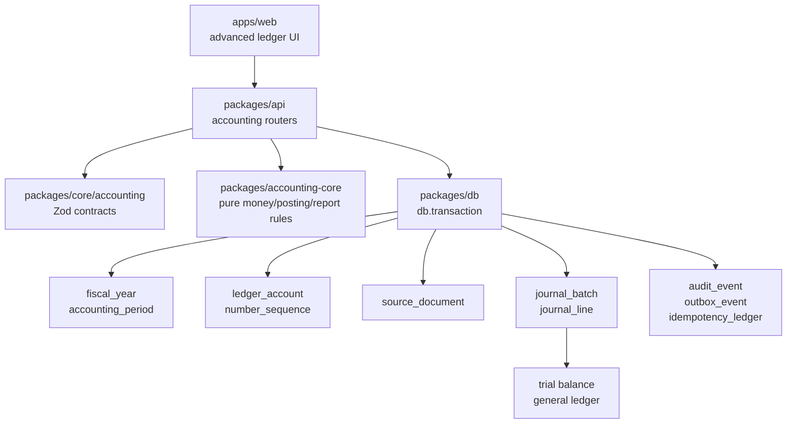
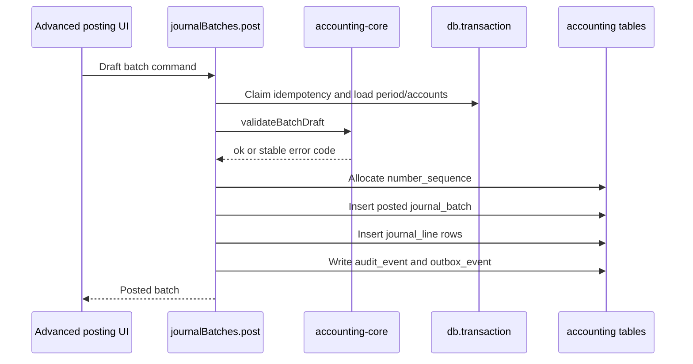

# Phase 01 Accounting Kernel Implementation Plan

> **For agentic workers:** REQUIRED SUB-SKILL: Use superpowers:subagent-driven-development (recommended) or superpowers:executing-plans to implement this plan task-by-task. Steps use checkbox (`- [ ]`) syntax for tracking.

> **Schema source of truth:** Follow `docs/superpowers/plans/2026-06-17-accounting-foundation-schema-revision-plan.md`.

**Goal:** Build the smallest durable double-entry kernel: fiscal years, accounting periods, hierarchical ledger accounts, number sequences, source-document shell, immutable journal batches/lines, reversals, trial balance, and general ledger.

**Architecture:** Pure accounting rules live in `packages/accounting-core`. Shared API contracts live in `packages/core`. Database tables live in `packages/db` and are tenant-scoped through explicit `organizationId` predicates. API services post through `journal_batch` and `journal_line`; owner document workflows arrive in Phase 2.

**Tech Stack:** TypeScript, Vitest, Drizzle, PostgreSQL, Zod, TanStack Start, Hono, oRPC, Vite Plus.

---

## Architecture Map



Posting flow:



## File Structure

- `packages/accounting-core/package.json`: new pure accounting package.
- `packages/accounting-core/src/money.ts`: minor-unit money helpers. "Minor unit" means storing INR 123.45 as `12345`, not as a JavaScript float.
- `packages/accounting-core/src/accounts.ts`: account categories, normal balances, posting account checks. "Normal balance" means whether the account normally increases by debit or credit.
- `packages/accounting-core/src/journal.ts`: batch validation and reversal helpers.
- `packages/accounting-core/src/reports/trial-balance.ts`: pure trial balance grouping.
- `packages/accounting-core/src/reports/general-ledger.ts`: pure general ledger line ordering/running balance helpers.
- `packages/db/src/schema/periods.ts`: `fiscal_year`, `accounting_period`.
- `packages/db/src/schema/accounts.ts`: `ledger_account`, `number_sequence`.
- `packages/db/src/schema/source-documents.ts`: minimal `source_document`.
- `packages/db/src/schema/journal.ts`: `journal_batch`, `journal_line`.
- `packages/core/src/accounting/*.ts`: Zod contracts and shared accounting types.
- `packages/api/src/routers/accounting.ts`: internal oRPC procedures for setup, posting, reversal, reports.
- `apps/web/src/routes/settings/chart-of-accounts.tsx`: chart setup.
- `apps/web/src/routes/settings/accounting-periods.tsx`: period lock view.
- `apps/web/src/routes/accounting/journal-batches.tsx`: advanced batch register.
- `apps/web/src/routes/reports/trial-balance.tsx`: trial balance view.
- `apps/web/src/routes/reports/general-ledger.tsx`: general ledger view.

Do not create `party`, `tax_code`, `tax_code_component`, invoice, expense, payment, subledger, settlement, or balance-cache tables in Phase 1.

## Task 1: Accounting-Core Package and Money Helpers

**Files:**

- Create: `packages/accounting-core/package.json`
- Create: `packages/accounting-core/src/money.ts`
- Create: `packages/accounting-core/src/index.ts`
- Test: `packages/accounting-core/src/money.test.ts`

- [ ] **Step 1: Add package manifest**

```json
{
  "name": "@tsu-stack/accounting-core",
  "private": true,
  "type": "module",
  "exports": {
    ".": "./src/index.ts",
    "./*": "./src/*.ts"
  },
  "scripts": {
    "test:unit": "vp test"
  },
  "dependencies": {},
  "devDependencies": {
    "@tsu-stack/tsconfig": "workspace:*",
    "typescript": "catalog:",
    "vite-plus": "catalog:",
    "vitest": "catalog:"
  }
}
```

- [ ] **Step 2: Write money tests**

```ts
import { describe, expect, it } from "vitest";
import { addMinor, toDecimalString, toMinor } from "./money";

describe("money", () => {
  it("parses decimal strings to minor units", () => {
    expect(toMinor("1234.56", 2)).toBe(123456n);
  });

  it("rejects too many decimal places", () => {
    expect(() => toMinor("1.234", 2)).toThrow("INVALID_MONEY");
  });

  it("adds minor units without floating point arithmetic", () => {
    expect(addMinor(10n, 20n)).toBe(30n);
  });

  it("formats minor units for display", () => {
    expect(toDecimalString(123456n, 2)).toBe("1234.56");
  });
});
```

- [ ] **Step 3: Implement money helpers**

```ts
export type Minor = bigint;

/**
 * Converts a user/API money string into integer minor units.
 *
 * Why this exists: accounting amounts must not use JavaScript floating-point
 * math because values like 0.1 + 0.2 can round incorrectly.
 */
export function toMinor(value: string, decimals: number): Minor {
  const pattern = new RegExp(`^-?\\d+(\\.\\d{1,${decimals}})?$`);
  if (!pattern.test(value)) {
    throw new Error("INVALID_MONEY");
  }

  const negative = value.startsWith("-");
  const unsigned = negative ? value.slice(1) : value;
  const [whole = "0", fraction = ""] = unsigned.split(".");
  const scaled = BigInt(`${whole}${fraction.padEnd(decimals, "0")}`);
  return negative ? -scaled : scaled;
}

export function addMinor(left: Minor, right: Minor) {
  return left + right;
}

export function subtractMinor(left: Minor, right: Minor) {
  return left - right;
}

export function toDecimalString(value: Minor, decimals: number) {
  const negative = value < 0n;
  const absolute = negative ? -value : value;
  const raw = absolute.toString().padStart(decimals + 1, "0");
  const whole = raw.slice(0, -decimals);
  const fraction = raw.slice(-decimals);
  return `${negative ? "-" : ""}${whole}.${fraction}`;
}
```

- [ ] **Step 4: Export package API**

```ts
export * from "./money";
```

- [ ] **Step 5: Run tests**

```bash
rtk vp run --filter @tsu-stack/accounting-core test:unit
```

Expected: money tests pass.

- [ ] **Step 6: Commit**

```bash
rtk git add packages/accounting-core
rtk git commit -m "feat: add accounting core money helpers"
```

## Task 2: Phase 1 Database Schema

**Files:**

- Create: `packages/db/src/schema/periods.ts`
- Create: `packages/db/src/schema/accounts.ts`
- Create: `packages/db/src/schema/source-documents.ts`
- Create: `packages/db/src/schema/journal.ts`
- Modify: `packages/db/src/schema/index.ts`
- Modify: `packages/db/src/schema/migration.ts`
- Test: `packages/db/src/schema/accounting-kernel.test.ts`

- [ ] **Step 1: Add schema invariant test**

```ts
import { describe, expect, it } from "vitest";
import {
  accountingPeriod,
  fiscalYear,
  journalBatch,
  journalLine,
  ledgerAccount,
  sourceDocument
} from "./index";

describe("accounting kernel schema", () => {
  it("tenant-scopes all accounting tables", () => {
    expect(fiscalYear.organizationId).toBeDefined();
    expect(accountingPeriod.organizationId).toBeDefined();
    expect(ledgerAccount.organizationId).toBeDefined();
    expect(sourceDocument.organizationId).toBeDefined();
    expect(journalBatch.organizationId).toBeDefined();
    expect(journalLine.organizationId).toBeDefined();
  });

  it("stores journal money in minor units", () => {
    expect(journalLine.baseDebitMinor).toBeDefined();
    expect(journalLine.baseCreditMinor).toBeDefined();
  });
});
```

- [ ] **Step 2: Add fiscal year and accounting period tables**

`fiscal_year` fields:

- `id`.
- `organization_id`.
- `name`.
- `start_date`.
- `end_date`.
- `status`: `open`, `closed`.
- `closed_at`.
- `closed_by`.
- `created_at`.

`accounting_period` fields:

- `id`.
- `organization_id`.
- `fiscal_year_id`.
- `name`.
- `start_date`.
- `end_date`.
- `status`: `open`, `soft_locked`, `hard_locked`, `closed`.
- `locked_at`.
- `locked_by`.
- `created_at`.

Rules:

- No overlapping fiscal years per organization.
- Period rows are generated by service code when a fiscal year is created.
- Normal posting rejects hard-locked periods.

- [ ] **Step 3: Add `ledger_account`**

Fields:

- `id`.
- `organization_id`.
- `code`.
- `name`.
- `description`.
- `account_category`: `asset`, `liability`, `equity`, `income`, `expense`.
- `account_type`.
- `normal_balance`: `debit`, `credit`.
- `parent_account_id`.
- `sort_order`.
- `system_key`.
- `is_group`.
- `is_control_account`.
- `is_reconcilable`.
- `allow_manual_posting`.
- `currency_code`.
- `active`.
- `created_at`.
- `updated_at`.

Constraints:

- Unique `(organization_id, code)`.
- Unique `(organization_id, system_key)` where `system_key` is not null.
- Parent account references are organization-scoped.
- Posting cannot target `is_group = true`.

- [ ] **Step 4: Add `number_sequence`**

Fields:

- `id`.
- `organization_id`.
- `entity_type`.
- `prefix`.
- `suffix`.
- `next_number`.
- `padding`.
- `reset_policy`.
- `fiscal_year_id`.
- `active`.
- `created_at`.
- `updated_at`.

Rules:

- Allocate numbers inside the same transaction as posting/finalization.
- Use this table for journal batch numbers now and document numbers later.

- [ ] **Step 5: Add minimal `source_document`**

Fields:

- `id`.
- `organization_id`.
- `type`.
- `document_number`.
- `status`: `draft`, `posted`, `void`.
- `date`.
- `posting_date`.
- `currency_code`.
- `exchange_rate`.
- `grand_total_minor`.
- `base_grand_total_minor`.
- `reference`.
- `notes`.
- `created_by`.
- `posted_at`.
- `created_at`.
- `updated_at`.

Do not add `party_id`, approval fields, snapshot JSON, render JSON, outstanding amounts, or an idempotency-key column in Phase 1.

- [ ] **Step 6: Add `journal_batch` and `journal_line`**

`journal_batch` fields:

- `id`.
- `organization_id`.
- `accounting_period_id`.
- `source_document_id`.
- `batch_number`.
- `status`: `draft`, `posted`, `reversed`.
- `posting_date`.
- `description`.
- `operation_key`.
- `idempotency_ledger_id`.
- `reversal_of_batch_id`.
- `posted_at`.
- `posted_by`.
- `created_at`.

`journal_line` fields:

- `id`.
- `organization_id`.
- `batch_id`.
- `line_number`.
- `account_id`.
- `source_document_id`.
- `description`.
- `transaction_currency_code`.
- `transaction_debit_minor`.
- `transaction_credit_minor`.
- `base_currency_code`.
- `base_debit_minor`.
- `base_credit_minor`.
- `exchange_rate`.
- `created_at`.

Rules:

- A line has debit or credit, not both.
- Batch has at least two lines.
- Base debits equal base credits before posting.
- Posted batch is immutable.
- Reversal creates a new posted batch linked by `reversal_of_batch_id`.

- [ ] **Step 7: Generate migration and run tests**

```bash
rtk vp run --filter @tsu-stack/db test:unit
rtk vp run -w db generate
rtk vp run -w db migrate
```

Expected: accounting kernel schema tests pass and the migration contains only Phase 0/1 active tables with tenant-owned tables carrying `organization_id`.

- [ ] **Step 8: Commit**

```bash
rtk git add packages/db
rtk git commit -m "feat: add accounting kernel schema"
```

## Task 3: Journal Batch Validation

**Files:**

- Create: `packages/accounting-core/src/journal.ts`
- Modify: `packages/accounting-core/src/index.ts`
- Test: `packages/accounting-core/src/journal.test.ts`

- [ ] **Step 1: Add validation tests**

```ts
import { describe, expect, it } from "vitest";
import { validateBatchDraft } from "./journal";

describe("journal batch validation", () => {
  it("accepts balanced batch", () => {
    const result = validateBatchDraft({
      lines: [
        { accountId: "cash", baseDebitMinor: 10000n, baseCreditMinor: 0n },
        { accountId: "capital", baseDebitMinor: 0n, baseCreditMinor: 10000n }
      ]
    });

    expect(result).toEqual({ ok: true });
  });

  it("rejects unbalanced batch", () => {
    const result = validateBatchDraft({
      lines: [
        { accountId: "cash", baseDebitMinor: 9000n, baseCreditMinor: 0n },
        { accountId: "capital", baseDebitMinor: 0n, baseCreditMinor: 10000n }
      ]
    });

    expect(result).toEqual({ ok: false, errorCode: "JOURNAL_BATCH_NOT_BALANCED" });
  });
});
```

- [ ] **Step 2: Implement validation**

```ts
export type JournalDraftLine = {
  accountId: string;
  baseDebitMinor: bigint;
  baseCreditMinor: bigint;
};

export type JournalBatchDraft = {
  lines: JournalDraftLine[];
};

export function validateBatchDraft(draft: JournalBatchDraft) {
  // Enforces core double-entry rules before any row is posted to the ledger.
  if (draft.lines.length < 2) {
    return { ok: false as const, errorCode: "JOURNAL_BATCH_NEEDS_TWO_LINES" };
  }

  for (const line of draft.lines) {
    if (line.baseDebitMinor < 0n || line.baseCreditMinor < 0n) {
      return { ok: false as const, errorCode: "JOURNAL_LINE_NEGATIVE_AMOUNT" };
    }

    if (line.baseDebitMinor > 0n && line.baseCreditMinor > 0n) {
      return { ok: false as const, errorCode: "JOURNAL_LINE_HAS_DEBIT_AND_CREDIT" };
    }

    if (line.baseDebitMinor === 0n && line.baseCreditMinor === 0n) {
      return { ok: false as const, errorCode: "JOURNAL_LINE_HAS_NO_AMOUNT" };
    }
  }

  const totalDebit = draft.lines.reduce((sum, line) => sum + line.baseDebitMinor, 0n);
  const totalCredit = draft.lines.reduce((sum, line) => sum + line.baseCreditMinor, 0n);

  if (totalDebit !== totalCredit) {
    return { ok: false as const, errorCode: "JOURNAL_BATCH_NOT_BALANCED" };
  }

  return { ok: true as const };
}
```

- [ ] **Step 3: Run tests**

```bash
rtk vp run --filter @tsu-stack/accounting-core test:unit
```

Expected: journal validation tests pass.

- [ ] **Step 4: Commit**

```bash
rtk git add packages/accounting-core
rtk git commit -m "feat: validate journal batches"
```

## Task 4: Default Chart and Fiscal Year Services

**Files:**

- Create: `packages/accounting-core/src/accounts.ts`
- Create: `packages/accounting-core/src/default-chart.ts`
- Create: `packages/core/src/accounting/fiscal-year.ts`
- Create: `packages/api/src/routers/accounting-setup.ts`
- Test: `packages/accounting-core/src/default-chart.test.ts`
- Test: `packages/core/src/accounting/fiscal-year.test.ts`

- [ ] **Step 1: Test default chart**

```ts
import { describe, expect, it } from "vitest";
import { defaultIndiaOwnerChart } from "./default-chart";

describe("default India owner chart", () => {
  it("includes required system accounts", () => {
    const keys = defaultIndiaOwnerChart.map((account) => account.systemKey);
    expect(keys).toContain("cash");
    expect(keys).toContain("bank");
    expect(keys).toContain("accounts_receivable");
    expect(keys).toContain("accounts_payable");
    expect(keys).toContain("sales");
    expect(keys).toContain("general_expenses");
  });
});
```

- [ ] **Step 2: Implement default chart**

Use a small India-friendly chart:

- Cash.
- Bank.
- Accounts Receivable.
- Accounts Payable.
- Owner Capital.
- Retained Earnings.
- Sales.
- Purchases.
- General Expenses.
- Bank Charges.

GST input/output accounts are seeded in Phase 3 when tax codes exist.

- [ ] **Step 3: Test fiscal year helper**

```ts
import { describe, expect, it } from "vitest";
import { makeIndiaFiscalYear } from "./fiscal-year";

describe("fiscal year", () => {
  it("uses April to March", () => {
    expect(makeIndiaFiscalYear(2026)).toEqual({
      name: "FY 2026-27",
      startDate: "2026-04-01",
      endDate: "2027-03-31"
    });
  });
});
```

- [ ] **Step 4: Implement setup procedures**

`accountingSetup.createFiscalYear`:

- validates no overlap for same organization;
- creates one fiscal year;
- creates 12 monthly `accounting_period` rows;
- writes `audit_event`;
- writes `outbox_event` with `fiscal_year.created`.

`accountingSetup.ensureDefaultChart`:

- inserts missing `ledger_account` rows by `system_key`;
- leaves existing customized account names alone;
- writes `audit_event`;
- writes `outbox_event` with `ledger_account.default_chart_seeded`.

- [ ] **Step 5: Run tests**

```bash
rtk vp run --filter @tsu-stack/accounting-core test:unit
rtk vp run --filter @tsu-stack/core test:unit
rtk vp run --filter @tsu-stack/api test:unit
```

Expected: default chart, fiscal year, and setup router tests pass.

- [ ] **Step 6: Commit**

```bash
rtk git add packages/accounting-core packages/core packages/api
rtk git commit -m "feat: add accounting setup services"
```

## Task 5: Posting and Reversal Service

**Files:**

- Create: `packages/core/src/accounting/journal-batch.ts`
- Create: `packages/api/src/routers/journal-batches.ts`
- Modify: `packages/accounting-core/src/journal.ts`
- Test: `packages/api/src/routers/journal-batches.test.ts`
- Test: `packages/accounting-core/src/reversal.test.ts`

- [ ] **Step 1: Test reversal helper**

```ts
import { describe, expect, it } from "vitest";
import { reverseBatchLines } from "./journal";

describe("journal batch reversal", () => {
  it("swaps debit and credit", () => {
    expect(
      reverseBatchLines([
        { accountId: "cash", baseDebitMinor: 10000n, baseCreditMinor: 0n },
        { accountId: "capital", baseDebitMinor: 0n, baseCreditMinor: 10000n }
      ])
    ).toEqual([
      { accountId: "cash", baseDebitMinor: 0n, baseCreditMinor: 10000n },
      { accountId: "capital", baseDebitMinor: 10000n, baseCreditMinor: 0n }
    ]);
  });
});
```

- [ ] **Step 2: Implement reversal helper**

```ts
export function reverseBatchLines(lines: JournalDraftLine[]): JournalDraftLine[] {
  // Corrections are recorded by a new opposite batch so posted history stays immutable.
  return lines.map((line) => ({
    ...line,
    baseDebitMinor: line.baseCreditMinor,
    baseCreditMinor: line.baseDebitMinor
  }));
}
```

- [ ] **Step 3: Test posting service behavior**

Router/service tests should cover:

- posting rejects hard-locked period;
- posting rejects group account;
- posting rejects unbalanced draft;
- posting creates `journal_batch` and `journal_line` rows;
- posting writes `audit_event` and `outbox_event`;
- duplicate operation key returns the existing batch;
- posted batch cannot be edited;
- reversal creates a separate posted batch.

- [ ] **Step 4: Implement posting procedure**

`journalBatches.post` runs inside one `db.transaction` after membership has been verified:

1. Claim/check `idempotency_ledger`.
2. Load accounting period and reject hard lock.
3. Load accounts and reject inactive/group/manual-blocked accounts.
4. Validate lines with `validateBatchDraft`.
5. Allocate `batch_number` through `number_sequence`.
6. Insert `journal_batch`.
7. Insert `journal_line` rows.
8. Write `audit_event`.
9. Write `outbox_event` with `journal_batch.posted`.
10. Store terminal idempotency response.

- [ ] **Step 5: Implement reversal procedure**

`journalBatches.reverse` loads the original posted batch, generates reversed lines, posts a new batch with `reversal_of_batch_id`, writes audit/outbox rows, and leaves the original batch immutable.

- [ ] **Step 6: Run tests**

```bash
rtk vp run --filter @tsu-stack/accounting-core test:unit
rtk vp run --filter @tsu-stack/api test:unit
```

Expected: posting and reversal tests pass.

- [ ] **Step 7: Commit**

```bash
rtk git add packages/accounting-core packages/core packages/api
rtk git commit -m "feat: add journal batch posting"
```

## Task 6: Reports and Minimal UI

**Files:**

- Create: `packages/accounting-core/src/reports/trial-balance.ts`
- Create: `packages/accounting-core/src/reports/general-ledger.ts`
- Create: `packages/api/src/routers/accounting-reports.ts`
- Create: `apps/web/src/routes/settings/chart-of-accounts.tsx`
- Create: `apps/web/src/routes/settings/accounting-periods.tsx`
- Create: `apps/web/src/routes/accounting/journal-batches.tsx`
- Create: `apps/web/src/routes/reports/trial-balance.tsx`
- Create: `apps/web/src/routes/reports/general-ledger.tsx`
- Test: `packages/accounting-core/src/reports/trial-balance.test.ts`

- [ ] **Step 1: Test trial balance**

```ts
import { describe, expect, it } from "vitest";
import { buildTrialBalance } from "./trial-balance";

describe("trial balance", () => {
  it("keeps debits and credits balanced", () => {
    const result = buildTrialBalance([
      { accountId: "cash", baseDebitMinor: 10000n, baseCreditMinor: 0n },
      { accountId: "capital", baseDebitMinor: 0n, baseCreditMinor: 10000n }
    ]);

    expect(result.totalDebitMinor).toBe(10000n);
    expect(result.totalCreditMinor).toBe(10000n);
    expect(result.isBalanced).toBe(true);
  });
});
```

- [ ] **Step 2: Implement report builders**

Trial balance groups posted lines by account and sums base debit/credit minor units. General ledger orders posted lines by posting date, batch number, and line number, then computes running balance using account normal balance.

- [ ] **Step 3: Implement report procedures**

Report procedures:

- require organization context;
- read posted batches only;
- filter by date range;
- return minor-unit totals plus formatted display strings at the boundary.

- [ ] **Step 4: Build minimal UI**

Build:

- chart table with account code, name, category, type, active/system flags;
- accounting-period list with open/soft-lock/hard-lock actions;
- journal-batch register with posting date, batch number, source document, description, total debit/credit, status;
- trial balance report;
- general ledger report.

Keep manual journal posting in advanced/accountant-facing UI only.

- [ ] **Step 5: Run checks**

```bash
rtk vp run --filter @tsu-stack/accounting-core test:unit
rtk vp run --filter @tsu-stack/api test:unit
rtk vp run --filter @tsu-stack/web check
```

Expected: report tests pass and web app builds.

- [ ] **Step 6: Commit**

```bash
rtk git add packages/accounting-core packages/api apps/web
rtk git commit -m "feat: add accounting reports and kernel ui"
```

## Phase 1 Completion Gate

Do not start owner documents until:

- `ledger_account`, `number_sequence`, `source_document`, `journal_batch`, and `journal_line` tables exist.
- `party` and `tax_code` tables do not exist yet.
- Fiscal year creation generates accounting periods.
- Default chart can be seeded idempotently.
- Balanced batch posts successfully.
- Unbalanced batch is rejected.
- Posted batch is immutable.
- Reversal creates a separate posted batch.
- Posting writes `audit_event` and `outbox_event`.
- Posting uses `idempotency_ledger`.
- Trial balance balances from posted lines.
- General ledger reads only organization-scoped posted lines.
- Accounting-core has no React, Hono, oRPC, Drizzle, or Better Auth dependency.
