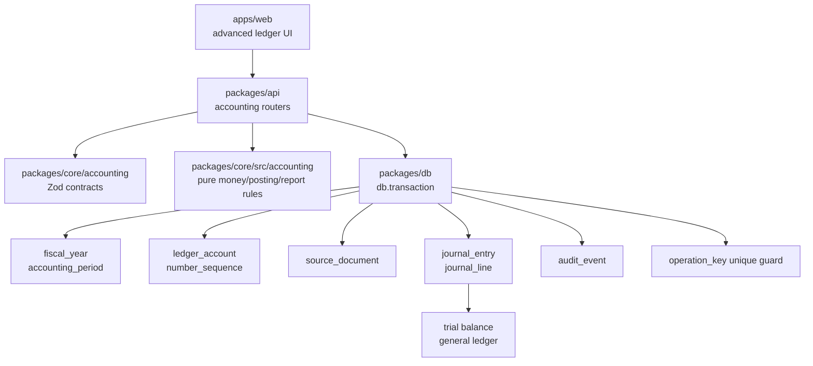
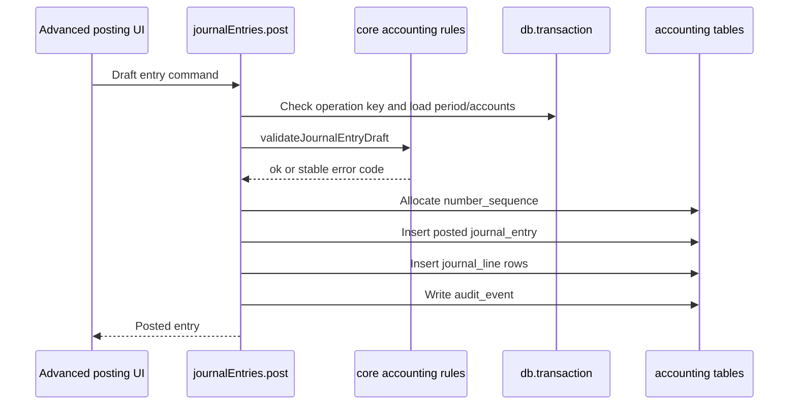

# Phase 01 Accounting Kernel Implementation Plan

> **For agentic workers:** REQUIRED SUB-SKILL: Use superpowers:subagent-driven-development (recommended) or superpowers:executing-plans to implement this plan task-by-task. Steps use checkbox (`- [ ]`) syntax for tracking.

> **Schema source of truth:** Follow `docs/superpowers/plans/2026-06-17-accounting-foundation-schema-revision-plan.md`.

**Goal:** Build the smallest durable double-entry kernel before owner workflow UI: fiscal years, accounting periods, hierarchical ledger accounts, journal entry numbers, source-document anchors, immutable posted journal entries/lines, reversals, trial balance, and general ledger.

**Architecture:** Pure accounting rules and shared API contracts live in `packages/core/src/accounting`. Database tables live in `packages/db` and are tenant-scoped through explicit `organizationId` predicates and composite foreign keys. API services post through `journal_entry` and `journal_line`; owner document workflows arrive in Phase 2.

**Tech Stack:** TypeScript, Vitest, Drizzle, PostgreSQL, Zod, TanStack Start, Hono, oRPC, Vite Plus.

**Foundation invariants to design in now:**

- Use composite tenant foreign keys for accounting references, for example `journal_line(organization_id, account_id)` to `ledger_account(organization_id, id)`. Add parent unique constraints such as `(organization_id, id)` even when `id` is the primary key.
- Enforce posted-entry immutability through the posting/reversal service boundary and database constraints in Phase 1. Add PostgreSQL triggers only when a second writer path or public/integration API makes service bypass realistic.
- Store money as `bigint` minor units in PostgreSQL, but expose minor-unit values as decimal strings in oRPC/Zod DTOs. No raw `bigint` crosses JSON.
- Phase 1 journal posting is base-currency-only. Journal lines store base debit/credit minor units only; do not add per-line currency, transaction-currency, or exchange-rate fields until a real FX workflow exists.
- Do not persist journal drafts in Phase 1. Form state is a draft; `journal_entry` rows are posted accounting facts.
- Lock `organization_setting.base_currency_code`, `books_start_date`, and `fiscal_year_start_month` in the settings write path after fiscal years exist. Do not fetch base currency during every journal post.
- Allocate `number_sequence` values atomically inside the posting transaction with `UPDATE ... RETURNING` or an explicit row lock. Do not read then write.
- Treat Phase 1 posting as one transaction: lock the operation key, allocate the number, insert journal entry/lines, write awaited `audit_event`, and enforce unique `(organization_id, operation_key)`.
- Do not write `outbox_event` from Phase 1 posting. Start outbox writes when public API, integrations, webhooks, AI indexing, or another durable async consumer exists.
- Use operation-local duplicate protection in Phase 1: unique `(organization_id, operation_key)`, a narrow transaction lock on that operation key before number allocation, and a request hash on `journal_entry` to reject same-key payload mismatches. Do not add central replay stores yet.

## Current Implementation Status

Updated: 2026-06-27 after Phase 1 merge to `main`.

Phase 1 is implemented in `main`:

- `packages/core/src/accounting` with default ledger account definitions, journal validation, report arithmetic, contracts for internal fiscal-year setup, default chart seed, posting, reversal, and minor-unit string transport.
- `packages/db` accounting schema for periods, accounts, source documents, journal entries, journal lines, and atomic number sequences.
- Drizzle migrations for `exchange_rate` and the Phase 1 accounting kernel.
- Service rules plus PostgreSQL constraints for posted-entry immutability, posted-line immutability, posting balance/date validation, and accounting settings lock.
- `packages/db/src/queries/accounting.ts` transactional services for onboarding accounting defaults, internal fiscal-year setup, chart seed, post, and reverse.
- `packages/db/src/queries/accounting-reports.ts` SQL-backed posted-line readers for as-of trial balance and account-scoped general ledger.
- `packages/api/src/routers/accounting` oRPC procedures for chart/period reads, journal posting/reversal, and reports. Fiscal-year/chart initialization happens through organization onboarding.
- `packages/core/src/accounting/reports` pure report arithmetic helpers.
- Focused unit tests for money/journal rules, DTO minor-unit strings, schema invariants, migration SQL, period building, sequence formatting, and report arithmetic.
- DB integration tests for duplicate operation keys, concurrent duplicate replay, concurrent sequence allocation, fiscal-year sequence reset, sequence rollback after failed posting, posting date rejection, reversal behavior, and accounting-settings locks.
- Web UI routes for chart view, accounting periods, journal entry register, trial balance, and general ledger.
- Owner/accountant accounting affordances, with viewer blocked from accounting-kernel reports and actions by default.

Still left outside Phase 1:

- Source-document writer consumers in Phase 2 owner workflows.
- Durable async/outbox producers until Phase 5/6 or another real consumer exists.

---

## Architecture Map



Posting flow:



## File Structure

- `packages/core/src/accounting/accounts.ts`: account categories, normal balances, and default chart definitions. "Normal balance" means whether the account normally increases by debit or credit.
- `packages/core/src/accounting/journal.ts`: entry validation helpers.
- `packages/core/src/accounting/reports/trial-balance.ts`: pure trial-balance arithmetic.
- `packages/core/src/accounting/reports/general-ledger.ts`: pure general-ledger running-balance arithmetic.
- `packages/db/src/schema/periods.ts`: `fiscal_year`, `accounting_period`.
- `packages/db/src/schema/accounts.ts`: `ledger_account`, `number_sequence`.
- `packages/db/src/schema/source-documents.ts`: minimal `source_document`.
- `packages/db/src/schema/journal.ts`: `journal_entry`, `journal_line`.
- `packages/core/src/accounting/index.ts`: Zod contracts and shared accounting types.
- `packages/api/src/routers/accounting/index.ts`: oRPC procedures for chart/period reads, posting, reversal, and reports.
- `apps/web/src/routes/{-$locale}/_app/$orgSlug/_shell/settings/chart-of-accounts.tsx`: chart view.
- `apps/web/src/routes/{-$locale}/_app/$orgSlug/_shell/settings/accounting-periods.tsx`: period list view.
- `apps/web/src/routes/{-$locale}/_app/$orgSlug/_shell/accounting/journal-entries.tsx`: advanced entry register, manual posting form, and reversal action.
- `apps/web/src/routes/{-$locale}/_app/$orgSlug/_shell/reports/trial-balance.tsx`: trial balance view.
- `apps/web/src/routes/{-$locale}/_app/$orgSlug/_shell/reports/general-ledger.tsx`: general ledger view.

Do not create `party`, `tax_code`, `tax_code_component`, invoice, expense, payment, subledger, settlement, or balance-cache tables in Phase 1.
Do not create Phase 1 FX posting fields, persisted journal drafts, public API replay tables, or outbox producers.

## Task 1: Core Accounting Transport Contracts

Pure accounting helpers live under the existing `packages/core` package. Do not create a separate accounting package for Phase 1.

**Files:**

- Modify: `packages/core/src/accounting/types.ts`
- Test: `packages/core/src/accounting/__tests__/contracts.test.ts`

Verification:

```bash
rtk vp run --filter @tsu-stack/core test:unit
```

## Task 2: Phase 1 Database Schema

**Files:**

- Create: `packages/db/src/schema/periods.ts`
- Create: `packages/db/src/schema/accounts.ts`
- Create: `packages/db/src/schema/source-documents.ts`
- Create: `packages/db/src/schema/journal.ts`
- Modify: `packages/db/src/schema/index.ts`
- Modify: `packages/db/src/schema/migration.ts`
- Test: `packages/db/src/schema/accounting-kernel.test.ts`

- [ ] **Step 1: Add schema invariant test**

```ts
import { describe, expect, it } from "vite-plus/test";
import {
  accountingPeriod,
  fiscalYear,
  journalEntry,
  journalLine,
  ledgerAccount,
  sourceDocument
} from "./index";

describe("accounting kernel schema", () => {
  it("tenant-scopes all accounting tables", () => {
    expect(fiscalYear.organizationId).toBeDefined();
    expect(accountingPeriod.organizationId).toBeDefined();
    expect(ledgerAccount.organizationId).toBeDefined();
    expect(sourceDocument.organizationId).toBeDefined();
    expect(journalEntry.organizationId).toBeDefined();
    expect(journalLine.organizationId).toBeDefined();
  });

  it("stores journal money in minor units", () => {
    expect(journalLine.debitMinor).toBeDefined();
    expect(journalLine.creditMinor).toBeDefined();
  });

  it("uses composite tenant references for accounting joins", () => {
    expect(journalEntry.organizationId).toBeDefined();
    expect(journalLine.organizationId).toBeDefined();
  });
});
```

- [ ] **Step 2: Add fiscal year and accounting period tables**

`fiscal_year` fields:

- `id`.
- `organization_id`.
- `name`.
- `start_date`.
- `end_date`.
- `status`: `open`, `closed`.
- `closed_at`.
- `closed_by`.
- `created_at`.

`accounting_period` fields:

- `id`.
- `organization_id`.
- `fiscal_year_id`.
- `name`.
- `start_date`.
- `end_date`.
- `status`: `open`, `locked`, `closed`.
- `locked_at`.
- `locked_by`.
- `created_at`.

Rules:

- No overlapping fiscal years per organization.
- Period rows are generated by service code when a fiscal year is created.
- Normal posting rejects locked and closed periods.

- [ ] **Step 3: Add `ledger_account`**

Fields:

- `id`.
- `organization_id`.
- `code`.
- `name`.
- `description`.
- `account_category`: `asset`, `liability`, `equity`, `income`, `expense`.
- `account_type`.
- `normal_balance`: `debit`, `credit`.
- `parent_account_id`.
- `sort_order`.
- `system_key`.
- `is_group`.
- `allow_manual_posting`.
- `active`.
- `created_at`.
- `updated_at`.

Constraints:

- Unique `(organization_id, code)`.
- Unique `(organization_id, system_key)` where `system_key` is not null.
- Unique `(organization_id, id)` for composite tenant references.
- Parent account references are organization-scoped through `(organization_id, parent_account_id)`.
- Parent and child accounts must share the same `account_category`.
- Posting cannot target `is_group = true`.
- Normal balance is report metadata. It must not reject valid opposite-side corrections or reversals.
- Accounts Receivable and Accounts Payable are seeded with `allow_manual_posting = false` until party/subledger workflows exist.

- [ ] **Step 4: Add `number_sequence`**

Fields:

- `id`.
- `organization_id`.
- `entity_type`.
- `prefix`.
- `suffix`.
- `next_number`.
- `padding`.
- `reset_policy`.
- `fiscal_year_id`.
- `active`.
- `created_at`.
- `updated_at`.

Rules:

- Allocate numbers inside the same transaction as posting/finalization.
- Allocation must be concurrency-safe with one atomic `UPDATE number_sequence SET next_number = next_number + 1 ... RETURNING next_number - 1` or an explicit row lock.
- Use this table for journal entry numbers now. Phase 2 document services own invoice/bill/payment numbering rules.

- [ ] **Step 5: Add minimal `source_document`**

Fields:

- `id`.
- `organization_id`.
- `type`.
- `document_number` nullable.
- `created_at`.

Do not add status, dates, totals, currency, exchange rate, `party_id`, approval fields, snapshot JSON, render JSON, outstanding amounts, or an idempotency-key column in Phase 1. Source-document lifecycle and numbering belong to Phase 2 document services.

- [ ] **Step 6: Add `journal_entry` and `journal_line`**

`journal_entry` fields:

- `id`.
- `organization_id`.
- `accounting_period_id`.
- `source_document_id`.
- `entry_number`.
- `posting_date`.
- `description`.
- `operation_key`.
- `request_hash`.
- `reversal_of_entry_id`.
- `posted_at`.
- `posted_by`.
- `created_at`.

`journal_line` fields:

- `id`.
- `organization_id`.
- `journal_entry_id`.
- `line_number`.
- `account_id`.
- `source_document_id`.
- `description`.
- `debit_minor`.
- `credit_minor`.
- `created_at`.

Rules:

- A line has debit or credit, not both.
- Entry has at least two lines.
- Base debits equal base credits before posting.
- Journal rows are posted facts immediately. There is no persisted draft status.
- Posted entry changes go through reversal/new posting only. Phase 1 relies on the service boundary plus DB constraints; add triggers when another write path exists.
- Lines under a posted entry cannot be inserted, updated, or deleted.
- `journal_entry` has unique `(organization_id, operation_key)`.
- `journal_line` references entry and account through composite tenant foreign keys.
- Reversal creates a new posted entry linked by `reversal_of_entry_id`.

- [ ] **Step 7: Generate migration and run tests**

```bash
rtk vp run --filter @tsu-stack/db test:unit
rtk vp run -w db generate
rtk vp run -w db migrate
```

Expected: accounting kernel schema tests pass and the migration contains only Phase 0/1 active tables with tenant-owned tables carrying `organization_id`.

- [ ] **Step 8: Commit**

```bash
rtk git add packages/db
rtk git commit -m "feat: add accounting kernel schema"
```

## Task 3: Journal Batch Validation

**Files:**

- Create: `packages/core/src/accounting/journal.ts`
- Modify: `packages/core/src/accounting/index.ts`
- Test: `packages/core/src/accounting/journal.test.ts`

- [ ] **Step 1: Add validation tests**

```ts
import { describe, expect, it } from "vite-plus/test";
import { validateJournalEntryDraft } from "./journal";

describe("journal entry validation", () => {
  it("accepts balanced entry", () => {
    const result = validateJournalEntryDraft({
      lines: [
        { accountId: "cash", debitMinor: 10000n, creditMinor: 0n },
        { accountId: "capital", debitMinor: 0n, creditMinor: 10000n }
      ]
    });

    expect(result).toEqual({ ok: true });
  });

  it("rejects unbalanced entry", () => {
    const result = validateJournalEntryDraft({
      lines: [
        { accountId: "cash", debitMinor: 9000n, creditMinor: 0n },
        { accountId: "capital", debitMinor: 0n, creditMinor: 10000n }
      ]
    });

    expect(result).toEqual({ ok: false, errorCode: "JOURNAL_ENTRY_NOT_BALANCED" });
  });
});
```

- [ ] **Step 2: Implement validation**

```ts
export type JournalDraftLine = {
  accountId: string;
  debitMinor: bigint;
  creditMinor: bigint;
};

export type JournalEntryDraft = {
  lines: JournalDraftLine[];
};

export function validateJournalEntryDraft(draft: JournalEntryDraft) {
  // Enforces core double-entry rules before any row is posted to the ledger.
  if (draft.lines.length < 2) {
    return { ok: false as const, errorCode: "JOURNAL_ENTRY_NEEDS_TWO_LINES" };
  }

  for (const line of draft.lines) {
    if (line.debitMinor < 0n || line.creditMinor < 0n) {
      return { ok: false as const, errorCode: "JOURNAL_LINE_NEGATIVE_AMOUNT" };
    }

    if (line.debitMinor > 0n && line.creditMinor > 0n) {
      return { ok: false as const, errorCode: "JOURNAL_LINE_HAS_DEBIT_AND_CREDIT" };
    }

    if (line.debitMinor === 0n && line.creditMinor === 0n) {
      return { ok: false as const, errorCode: "JOURNAL_LINE_HAS_NO_AMOUNT" };
    }
  }

  const totalDebit = draft.lines.reduce((sum, line) => sum + line.debitMinor, 0n);
  const totalCredit = draft.lines.reduce((sum, line) => sum + line.creditMinor, 0n);

  if (totalDebit !== totalCredit) {
    return { ok: false as const, errorCode: "JOURNAL_ENTRY_NOT_BALANCED" };
  }

  return { ok: true as const };
}
```

- [ ] **Step 3: Run tests**

```bash
rtk vp run --filter @tsu-stack/core test:unit
```

Expected: journal validation tests pass.

- [ ] **Step 4: Commit**

```bash
rtk git add packages/core/src/accounting
rtk git commit -m "feat: validate journal entries"
```

## Task 4: Default Chart and Fiscal Year Services

**Files:**

- Create: `packages/core/src/accounting/accounts.ts`
- Create: `packages/core/src/accounting/fiscal-year.ts`
- Modify: `packages/db/src/queries/accounting.ts`
- Modify: `packages/api/src/routers/organizations/index.ts`
- Test: `packages/db/src/queries/__tests__/accounting.test.ts`

- [ ] **Step 1: Test default chart**

```ts
import { describe, expect, it } from "vite-plus/test";
import { defaultIndiaOwnerChart } from "./default-chart";

describe("default India owner chart", () => {
  it("includes required system accounts", () => {
    const keys = defaultIndiaOwnerChart.map((account) => account.systemKey);
    expect(keys).toContain("cash");
    expect(keys).toContain("bank");
    expect(keys).toContain("accounts_receivable");
    expect(keys).toContain("accounts_payable");
    expect(keys).toContain("sales");
    expect(keys).toContain("general_expenses");
  });
});
```

- [ ] **Step 2: Implement default chart**

Use a small India-friendly chart:

- Asset group.
  - Cash.
  - Bank.
  - Accounts Receivable (`allow_manual_posting = false`).
- Liability group.
  - Accounts Payable (`allow_manual_posting = false`).
- Equity group.
  - Owner Capital.
  - Retained Earnings.
  - Opening Balance Difference.
- Income group.
  - Sales.
- Expense group.
  - Purchases.
  - General Expenses.
  - Bank Charges.

GST input/output accounts are seeded in Phase 3 when tax codes exist.

- [ ] **Step 3: Test fiscal year helper**

```ts
import { describe, expect, it } from "vite-plus/test";
import { formatFiscalYearLabel } from "./fiscal-year";

describe("fiscal year", () => {
  it("formats labels from dates instead of accepting user-entered names", () => {
    expect(formatFiscalYearLabel("2026-06-26", "2027-03-31")).toBe("26-27");
  });
});
```

- [ ] **Step 4: Implement setup procedures**

Organization onboarding:

- accepts `books_start_date` and `initial_fiscal_year_end_date`;
- creates the initial fiscal year from `books_start_date` to `initial_fiscal_year_end_date`;
- formats `fiscal_year.name` with `formatFiscalYearLabel(startDate, endDate)`;
- creates monthly `accounting_period` rows, including partial first/last months when needed;
- seeds the default chart once;
- writes awaited transactional `audit_event`.

Internal setup helpers:

- validate no fiscal-year overlap for the same organization;
- insert missing `ledger_account` rows by `system_key`;
- leaves existing customized account names alone;
- writes awaited transactional `audit_event`.

- [ ] **Step 5: Run tests**

```bash
rtk vp run --filter @tsu-stack/core test:unit
rtk vp run --filter @tsu-stack/api test:unit
```

Expected: default chart, fiscal year, and setup router tests pass.

- [ ] **Step 6: Commit**

```bash
rtk git add packages/core/src/accounting packages/core packages/api
rtk git commit -m "feat: add accounting setup services"
```

## Task 5: Posting and Reversal Service

**Files:**

- Create: `packages/core/src/accounting/journal-entry.ts`
- Create: `packages/api/src/routers/journal-entries.ts`
- Modify: `packages/core/src/accounting/journal.ts`
- Test: `packages/api/src/routers/journal-entries.test.ts`
- Test: `packages/db/src/queries/accounting.integration.test.ts`

- Reversal is implemented in the posting service from persisted line rows. It reverses base-currency amounts, keeps the original immutable, and requires a short reason/description.

- [ ] **Step 3: Test posting service behavior**

Router/service tests should cover:

- posting rejects locked or closed period;
- posting rejects group account;
- posting rejects manual posting to accounts with `allow_manual_posting = false`;
- posting rejects unbalanced draft;
- posting rejects cross-tenant entry/account/period references at the database layer;
- posting creates `journal_entry` and `journal_line` rows;
- posting writes awaited transactional `audit_event`;
- posting does not write `outbox_event`;
- duplicate operation key returns the existing entry;
- posted entry cannot be edited through service code or direct database writes;
- reversal creates a separate posted entry.

- [ ] **Step 4: Implement posting procedure**

`journalEntries.post` runs inside one `db.transaction` after membership has been verified:

1. Check `operation_key`; return the existing posted entry when the same key already succeeded.
2. Load accounting period and reject locked or closed periods. Do not lock the period row for normal posting.
3. Load accounts and reject inactive/group/manual-blocked accounts.
4. Validate lines with `validateJournalEntryDraft`.
5. Allocate `entry_number` through atomic `number_sequence` update.
6. Insert posted `journal_entry`.
7. Insert `journal_line` rows.
8. Write `audit_event`.

All response DTOs serialize minor-unit totals as strings before returning through oRPC.

- [ ] **Step 5: Implement reversal procedure**

`journalEntries.reverse` loads the original posted entry, requires a reason, generates reversed lines, posts a new entry with `reversal_of_entry_id`, writes an audit row, and leaves the original entry immutable. Original entries do not get a `reversed` status; reports include both original and reversal.

- [ ] **Step 6: Run tests**

```bash
rtk vp run --filter @tsu-stack/core test:unit
rtk vp run --filter @tsu-stack/api test:unit
```

Expected: posting and reversal tests pass.

- [ ] **Step 7: Commit**

```bash
rtk git add packages/core/src/accounting packages/core packages/api
rtk git commit -m "feat: add journal entry posting"
```

## Task 6: Reports and Minimal UI

**Files:**

- Create: `packages/core/src/accounting/reports/trial-balance.ts`
- Create: `packages/core/src/accounting/reports/general-ledger.ts`
- Create: `packages/api/src/routers/accounting-reports.ts`
- Create: `apps/web/src/routes/{-$locale}/_app/$orgSlug/_shell/settings/chart-of-accounts.tsx`
- Create: `apps/web/src/routes/{-$locale}/_app/$orgSlug/_shell/settings/accounting-periods.tsx`
- Create: `apps/web/src/routes/{-$locale}/_app/$orgSlug/_shell/accounting/journal-entries.tsx`
- Create: `apps/web/src/routes/{-$locale}/_app/$orgSlug/_shell/reports/trial-balance.tsx`
- Create: `apps/web/src/routes/{-$locale}/_app/$orgSlug/_shell/reports/general-ledger.tsx`
- Test: `packages/core/src/accounting/reports/trial-balance.test.ts`

- [ ] **Step 1: Test trial balance**

```ts
import { describe, expect, it } from "vite-plus/test";
import { buildTrialBalance } from "./trial-balance";

describe("trial balance", () => {
  it("keeps debits and credits balanced", () => {
    const result = buildTrialBalance([
      { accountId: "cash", debitMinor: 10000n, creditMinor: 0n },
      { accountId: "capital", debitMinor: 0n, creditMinor: 10000n }
    ]);

    expect(result.totalDebitMinor).toBe(10000n);
    expect(result.totalCreditMinor).toBe(10000n);
    expect(result.isBalanced).toBe(true);
  });
});
```

- [ ] **Step 2: Implement report builders**

Trial balance groups posted lines by account and sums base debit/credit minor units. General ledger orders posted lines by posting date, entry number, and line number, then computes running balance using account normal balance.

- [ ] **Step 3: Implement report procedures**

Report procedures:

- require organization context;
- read posted entries only;
- filter by date range;
- return minor-unit totals plus formatted display strings at the boundary.

- [ ] **Step 4: Build minimal UI after backend core is solid**

Build:

- chart table with account code, name, category, type, parent, group/posting, active/system flags;
- accounting-period list with open/locked/closed states;
- advanced manual journal form with posting date, description, optional reference, and debit/credit lines;
- opening-balance helper that posts a normal journal entry and uses Opening Balance Difference only after explicit confirmation;
- journal-entry register with posting date, entry number, optional source document, description, total debit/credit, and reversal action;
- trial balance report;
- general ledger report.

Keep manual journal posting in advanced/accountant-facing UI only. Owner and accountant can access Phase 1 accounting kernel screens; viewer cannot access journal register, trial balance, general ledger, setup, posting, reversal, or period locks by default.

Frontend implementation rules:

- Use existing `@tsu-stack/ui/components` shadcn components first: `Table`, `Card`, `Button`, `Field`, `Input`, `Select`, `Tabs`, `Badge`, `Alert`, `Empty`, `Skeleton`, `Spinner`, and `Tooltip`.
- Keep one-off screens as direct route JSX with local state. Do not create compound components, providers, stores, or wrapper components until there are at least two real call sites or real shared policy.
- Forms use `FieldGroup` and `Field`; option sets use `ToggleGroup`; icon buttons use lucide icons with `data-icon`.

- [ ] **Step 5: Run checks**

```bash
rtk vp run --filter @tsu-stack/core test:unit
rtk vp run --filter @tsu-stack/api test:unit
rtk vp run --filter @tsu-stack/web check
```

Expected: report tests pass and web app builds.

- [ ] **Step 6: Commit**

```bash
rtk git add packages/core/src/accounting packages/api apps/web
rtk git commit -m "feat: add accounting reports and kernel ui"
```

## Phase 1 Completion Gate

Do not start owner documents until these remain true:

- `ledger_account`, `number_sequence`, `source_document`, `journal_entry`, and `journal_line` tables exist.
- `party` and `tax_code` tables do not exist yet.
- Fiscal year creation generates accounting periods.
- Default chart can be seeded idempotently.
- Default chart includes group accounts and posting accounts, and blocks normal manual posting to AR/AP.
- Balanced entry posts successfully.
- Unbalanced entry is rejected.
- Posted entry is immutable.
- Reversal creates a separate posted entry.
- Posting writes awaited transactional `audit_event`.
- Posting does not write `outbox_event`.
- Posting uses operation-local idempotency through `journal_entry.operation_key`.
- Trial balance balances from posted lines.
- General ledger reads only organization-scoped posted lines.
- Phase 1 journal lines are base-currency-only.
- Viewer cannot access accounting-kernel reports or actions by default.
- Accounting-core has no React, Hono, oRPC, Drizzle, or Better Auth dependency.

Status: complete in `main`, with local DB integration verification requiring a
running local Postgres instance before Phase 2 schema work starts.
