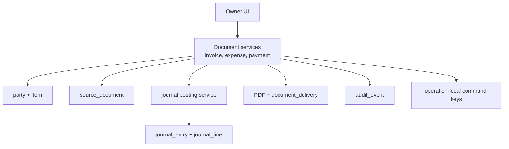
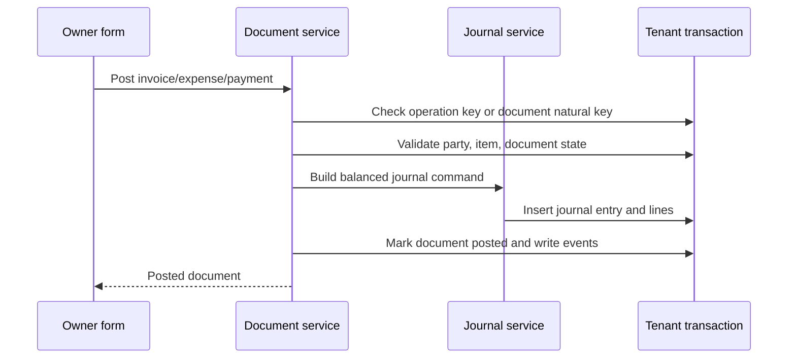

# Phase 02 Owner Workflow MVP Implementation Plan

> **For agentic workers:** REQUIRED SUB-SKILL: Use superpowers:subagent-driven-development (recommended) or superpowers:executing-plans to implement this plan task-by-task. Steps use checkbox (`- [ ]`) syntax for tracking.

**Goal:** Build owner-facing customers, vendors, items, invoices, expenses, payments, PDFs, delivery logs, and dashboard workflows on top of the Phase 1 accounting kernel.

**Architecture:** UI speaks owner language while backend posts deterministic accounting journals through the existing journal posting service. Document services create drafts, post documents, allocate payments, write audit events, and preserve source links from documents to journals. Public external API remains disabled in this phase, but oRPC contracts are shaped so Phase 6 can expose stable OpenAPI endpoints without rewriting business logic. Do not emit outbox events until a durable async consumer exists.

**Tech Stack:** TanStack Start, React Hook Form, Zod, Hono, oRPC, PostgreSQL, Drizzle, core accounting, object storage, PDF renderer, email provider abstraction.

---

## Architecture Flow



Owner document posting:



## Foundation Alignment

Before executing this plan, reconcile it with `docs/superpowers/plans/2026-06-17-accounting-foundation-schema-revision-plan.md`.

- Use existing `number_sequence`; do not create `document_sequence`.
- Posted documents link to `source_document` and the resulting `journal_entry`.
- Write `audit_event`, not `audit_log`.
- Start `outbox_event` writes only when an async consumer, integration, webhook, AI indexer, or public API delivery workflow exists.
- Use operation-local idempotency at posting boundaries.
- Store ordinary money as `*_minor bigint`; any `*_amount` names below are conceptual and must become minor-unit columns.
- Do not add GST/tax-code behavior in Phase 2. Phase 2 can keep tax totals at zero and leave tax UI hidden until Phase 3.
- Shared contracts belong in `packages/core`; side-effectful services and oRPC procedures belong in `packages/api`.

## Scope

Build only routine owner workflows:

- Customer/vendor creation.
- Item/service catalog.
- Sales invoice draft/post/PDF/share.
- Expense draft/post/receipt attachment.
- Money received.
- Money paid.
- Basic dashboard.

Do not build GST return filing, bank reconciliation, AI, public API, e-invoice, e-way bill, inventory, recurring invoices, or accountant review queue in this phase.

## Schema Additions

### `number_sequence`

Use the existing Phase 1 `number_sequence` table. This phase adds document sequence rows and services; it does not create another sequence table.

- `id`
- `organization_id`
- `document_type`: `INVOICE`, `EXPENSE`, `PAYMENT_RECEIVED`, `PAYMENT_PAID`
- `fiscal_year_id`
- `prefix`
- `next_number`
- `padding`
- `is_active`
- `created_at`
- `updated_at`

Constraints:

- Unique `(organization_id, document_type, fiscal_year_id, prefix)`.
- `next_number` must be greater than zero.

### `invoice`

- `id`
- `organization_id`
- `fiscal_year_id`
- `party_id`
- `invoice_number`
- `invoice_date`
- `due_date`
- `status`: `DRAFT`, `POSTED`, `VOID`, `PAID`, `PARTIALLY_PAID`
- `currency_code`
- `subtotal_amount`
- `discount_amount`
- `tax_amount`
- `total_amount`
- `amount_paid`
- `amount_due`
- `notes`
- `terms`
- `journal_entry_id`
- `pdf_attachment_id`
- `posted_by`
- `posted_at`
- `created_at`
- `updated_at`

Constraints:

- Unique `(organization_id, invoice_number)`.
- Posted invoice has `journal_entry_id`.
- Amount due equals total minus paid.
- Draft invoices do not consume final invoice numbers.
- Posted/issued invoices cannot be deleted. Voided invoices retain their invoice number so later numbers do not shift.
- Accounting-impacting fields on posted invoices are immutable. Corrections use void/credit/debit-note workflows, not in-place edits.

### `invoice_line`

- `id`
- `organization_id`
- `invoice_id`
- `line_no`
- `item_id`
- `description`
- `quantity`
- `unit`
- `unit_price`
- `discount_amount`
- `line_subtotal_amount`
- `line_tax_amount`
- `line_total_amount`
- `sales_account_id`

### `expense`

- `id`
- `organization_id`
- `fiscal_year_id`
- `party_id`
- `expense_number`
- `expense_date`
- `status`: `DRAFT`, `POSTED`, `VOID`, `PAID`, `PARTIALLY_PAID`
- `currency_code`
- `subtotal_amount`
- `tax_amount`
- `total_amount`
- `amount_paid`
- `amount_due`
- `payment_due_date`
- `notes`
- `journal_entry_id`
- `receipt_attachment_id`
- `posted_by`
- `posted_at`
- `created_at`
- `updated_at`

### `expense_line`

- `id`
- `organization_id`
- `expense_id`
- `line_no`
- `item_id`
- `description`
- `quantity`
- `unit`
- `unit_price`
- `expense_account_id`
- `line_subtotal_amount`
- `line_tax_amount`
- `line_total_amount`

### `payment`

- `id`
- `organization_id`
- `fiscal_year_id`
- `party_id`
- `payment_number`
- `direction`: `RECEIVED`, `PAID`
- `payment_date`
- `status`: `DRAFT`, `POSTED`, `VOID`
- `currency_code`
- `amount`
- `payment_mode`: `CASH`, `BANK_TRANSFER`, `UPI`, `CARD`, `CHEQUE`, `OTHER`
- `deposit_account_id`
- `reference`
- `notes`
- `journal_entry_id`
- `posted_by`
- `posted_at`
- `created_at`
- `updated_at`

### `payment_allocation`

- `id`
- `organization_id`
- `payment_id`
- `target_type`: `INVOICE`, `EXPENSE`
- `target_id`
- `allocated_amount`
- `created_at`

Constraints:

- Sum allocations cannot exceed payment amount.
- Payment direction must match target type.
- Posted expenses and payments cannot mutate accounting-impacting fields. Corrections use void/reversal/new document workflows.

### `document_delivery`

- `id`
- `organization_id`
- `document_type`
- `document_id`
- `delivery_type`: `EMAIL`, `PUBLIC_LINK`, `DOWNLOAD`
- `recipient`
- `status`: `QUEUED`, `SENT`, `FAILED`, `OPENED`
- `sent_at`
- `last_error`
- `created_at`

## Backend Contracts

Internal oRPC routers:

- `parties.list`, `parties.create`, `parties.update`, `parties.archive`
- `items.list`, `items.create`, `items.update`, `items.archive`
- `invoices.createDraft`, `invoices.updateDraft`, `invoices.post`, `invoices.void`, `invoices.get`, `invoices.list`, `invoices.renderPdf`
- `expenses.createDraft`, `expenses.updateDraft`, `expenses.post`, `expenses.void`, `expenses.get`, `expenses.list`
- `payments.createDraft`, `payments.post`, `payments.void`, `payments.allocate`
- `dashboard.ownerSummary`

Reserved future public REST/OpenAPI mapping:

- `GET /api/v1/customers`
- `POST /api/v1/customers`
- `GET /api/v1/vendors`
- `POST /api/v1/vendors`
- `GET /api/v1/items`
- `POST /api/v1/items`
- `GET /api/v1/invoices`
- `POST /api/v1/invoices`
- `POST /api/v1/invoices/{id}/post`
- `GET /api/v1/payments`
- `POST /api/v1/payments`

Do not mount the public `/api/v1` routes until Phase 6.

Error contract:

```ts
type ApiError = {
  error: {
    code:
      | "VALIDATION_ERROR"
      | "UNAUTHORIZED"
      | "FORBIDDEN"
      | "NOT_FOUND"
      | "DOCUMENT_NOT_DRAFT"
      | "POSTING_FAILED"
      | "IDEMPOTENCY_CONFLICT";
    message: string;
    details?: unknown;
  };
};
```

## Task Checklist

### Task 1: Document Schema

**Files:**

- Create: `packages/db/src/schema/documents.ts`
- Modify: `packages/db/src/schema/index.ts`
- Test: `packages/db/src/schema/documents.test.ts`

- [ ] Add failing schema test that every document table has `organization_id`.
- [ ] Add `number_sequence`, `invoice`, `invoice_line`, `expense`, `expense_line`, `payment`, `payment_allocation`, `document_delivery`.
- [ ] Add indexes for `(organization_id, status)`, `(organization_id, party_id)`, document dates, and document numbers.
- [ ] Generate Drizzle migration.
- [ ] Run `rtk vp run --filter @tsu-stack/db test:unit`.
- [ ] Run `rtk vp run -w db migrate`.
- [ ] Commit: `feat: add owner workflow document schema`.

### Task 2: Party And Item Services

**Files:**

- Create: `packages/api/src/services/parties/party.schemas.ts`
- Create: `packages/api/src/services/parties/party.service.ts`
- Create: `packages/api/src/services/items/item.schemas.ts`
- Create: `packages/api/src/services/items/item.service.ts`
- Test: `packages/api/src/services/parties/party.service.test.ts`
- Test: `packages/api/src/services/items/item.service.test.ts`

- [ ] Test customer creation writes `party.type = CUSTOMER`.
- [ ] Test vendor creation writes `party.type = VENDOR`.
- [ ] Test archived party cannot be selected for new invoice.
- [ ] Test item creation requires sales account for `SERVICE` and `GOODS`.
- [ ] Implement Zod schemas with owner-friendly field names.
- [ ] Implement services scoped by `organization_id`.
- [ ] Write audit events for create/update/archive.
- [ ] Do not emit outbox events until a durable consumer exists.
- [ ] Run `rtk vp run --filter @tsu-stack/api test:unit`.
- [ ] Commit: `feat: add party and item services`.

### Task 3: Invoice Posting

**Files:**

- Create: `packages/api/src/services/invoices/invoice.schemas.ts`
- Create: `packages/api/src/services/invoices/invoice-posting.ts`
- Create: `packages/api/src/services/invoices/invoice.service.ts`
- Test: `packages/api/src/services/invoices/invoice-posting.test.ts`
- Test: `packages/api/src/services/invoices/invoice.service.test.ts`

- [ ] Test draft invoice does not create journal.
- [ ] Test posted invoice debits accounts receivable and credits sales.
- [ ] Test posted invoice stores `journal_entry_id`.
- [ ] Test posting same operation key or document natural key returns same invoice.
- [ ] Test posted invoice cannot be edited.
- [ ] Test final invoice number is allocated only when posting succeeds.
- [ ] Test voided invoice keeps its invoice number.
- [ ] Implement invoice draft create/update.
- [ ] Implement invoice posting through Phase 1 journal service.
- [ ] Write audit events for invoice posting and voiding.
- [ ] Run `rtk vp run --filter @tsu-stack/api test:unit`.
- [ ] Commit: `feat: add invoice posting workflow`.

### Task 4: Expense Posting

**Files:**

- Create: `packages/api/src/services/expenses/expense.schemas.ts`
- Create: `packages/api/src/services/expenses/expense-posting.ts`
- Create: `packages/api/src/services/expenses/expense.service.ts`
- Test: `packages/api/src/services/expenses/expense-posting.test.ts`
- Test: `packages/api/src/services/expenses/expense.service.test.ts`

- [ ] Test posted expense debits expense account and credits accounts payable.
- [ ] Test receipt attachment can be linked to draft expense.
- [ ] Test posted expense cannot be edited.
- [ ] Test void requires reversal journal.
- [ ] Implement expense draft create/update.
- [ ] Implement expense posting through journal service.
- [ ] Write audit events for expense posting and voiding.
- [ ] Run `rtk vp run --filter @tsu-stack/api test:unit`.
- [ ] Commit: `feat: add expense posting workflow`.

### Task 5: Payment Posting And Allocation

**Files:**

- Create: `packages/api/src/services/payments/payment.schemas.ts`
- Create: `packages/api/src/services/payments/payment-posting.ts`
- Create: `packages/api/src/services/payments/payment.service.ts`
- Test: `packages/api/src/services/payments/payment-posting.test.ts`
- Test: `packages/api/src/services/payments/payment-allocation.test.ts`

- [ ] Test payment received debits bank/cash and credits accounts receivable.
- [ ] Test payment paid debits accounts payable and credits bank/cash.
- [ ] Test invoice status becomes `PAID` when fully allocated.
- [ ] Test expense status becomes `PAID` when fully allocated.
- [ ] Test allocation cannot exceed payment amount.
- [ ] Implement payment posting through journal service.
- [ ] Write audit events for payment posting and allocation.
- [ ] Run `rtk vp run --filter @tsu-stack/api test:unit`.
- [ ] Commit: `feat: add payment allocation workflow`.

### Task 6: oRPC Routers And Hono Mount

**Files:**

- Create: `packages/api/src/routers/parties.router.ts`
- Create: `packages/api/src/routers/items.router.ts`
- Create: `packages/api/src/routers/invoices.router.ts`
- Create: `packages/api/src/routers/expenses.router.ts`
- Create: `packages/api/src/routers/payments.router.ts`
- Modify: `packages/api/src/router.ts`
- Modify: `packages/api/src/app.ts`
- Test: `packages/api/src/routers/invoices.router.test.ts`

- [ ] Add oRPC input/output schemas from domain schemas.
- [ ] Add role middleware: owner and accountant can manage owner workflow documents; viewer has no default accounting access.
- [ ] Add operation-local duplicate protection on posting procedures. Do not add a generic idempotency ledger before Phase 6 public API semantics require it.
- [ ] Mount internal RPC under `/rpc`.
- [ ] Generate OpenAPI snapshot for internal review but do not expose public `/api/v1`.
- [ ] Run `rtk vp run --filter @tsu-stack/api test:unit`.
- [ ] Commit: `feat: add owner workflow rpc routers`.

### Task 7: PDF And Delivery

**Files:**

- Create: `packages/api/src/services/documents/pdf.service.ts`
- Create: `packages/api/src/services/documents/delivery.service.ts`
- Create: `apps/web/src/components/invoices/invoice-pdf-template.tsx`
- Test: `packages/api/src/services/documents/pdf.service.test.ts`

- [ ] Test PDF generation stores attachment metadata.
- [ ] Test delivery log records email attempt.
- [ ] Implement invoice PDF rendering with business profile, party, lines, totals, and notes.
- [ ] Store generated PDF in object storage.
- [ ] Record `document_delivery` for download/email/share link.
- [ ] Write delivery/audit records for PDF generation and document delivery.
- [ ] Run `rtk vp run --filter @tsu-stack/api test:unit`.
- [ ] Commit: `feat: add invoice pdf and delivery logs`.

### Task 8: Owner Frontend

**Files:**

- Create: `apps/web/src/routes/customers.tsx`
- Create: `apps/web/src/routes/vendors.tsx`
- Create: `apps/web/src/routes/items.tsx`
- Create: `apps/web/src/routes/invoices/index.tsx`
- Create: `apps/web/src/routes/invoices/new.tsx`
- Create: `apps/web/src/routes/expenses/index.tsx`
- Create: `apps/web/src/routes/expenses/new.tsx`
- Create: `apps/web/src/routes/payments/new.tsx`
- Create: `apps/web/src/routes/index.tsx`

- [ ] Build customer/vendor list and create flows.
- [ ] Build item/service create flow.
- [ ] Build invoice editor with autosave draft.
- [ ] Build expense capture with receipt attachment.
- [ ] Build money received and money paid forms.
- [ ] Build dashboard cards: unpaid invoices, unpaid expenses, cash/bank, sales, expenses.
- [ ] Use mobile-first layouts and plain-language validation messages.
- [ ] Run `rtk vp run --filter /web check`.
- [ ] Run `rtk vp run -r build`.
- [ ] Commit: `feat: add owner workflow ui`.

### Task 9: Phase Verification

**Files:**

- Create: `docs/checklists/phase-02-owner-workflow-mvp-verification.md`

- [ ] Add checklist covering customers, vendors, items, invoices, expenses, payments, PDF, delivery logs, dashboard, audit events, immutable posted documents, invoice numbering, and journal source links.
- [ ] Run `rtk vp check`.
- [ ] Run `rtk vp run -r test:unit`.
- [ ] Run `rtk vp run -r build`.
- [ ] Commit: `docs: add phase two verification checklist`.

## Exit Checklist

- [ ] Owner creates customer without accounting terms.
- [ ] Owner creates vendor without accounting terms.
- [ ] Owner creates item/service.
- [ ] Draft invoice does not affect ledger.
- [ ] Posted invoice creates balanced journal.
- [ ] Draft expense does not affect ledger.
- [ ] Posted expense creates balanced journal.
- [ ] Payment received updates invoice amount due.
- [ ] Payment paid updates expense amount due.
- [ ] Posted documents cannot be edited.
- [ ] Posted/issued invoices retain numbers even when voided.
- [ ] Void uses reversal.
- [ ] PDF invoice generated and stored.
- [ ] Audit events exist for every posting.
- [ ] Outbox events are added only when a durable consumer exists.
- [ ] Internal oRPC contracts pass tests.
- [ ] Public external API remains disabled.
