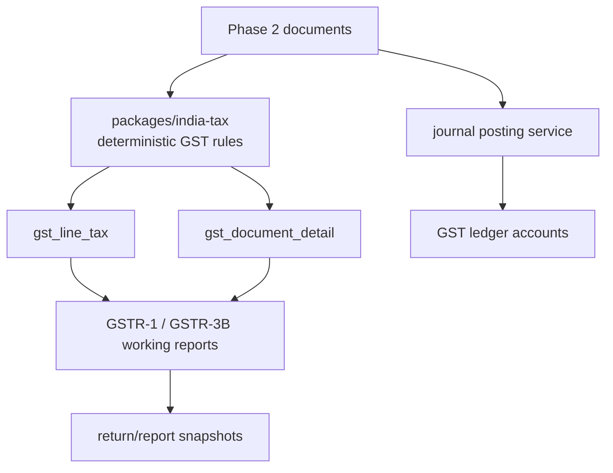
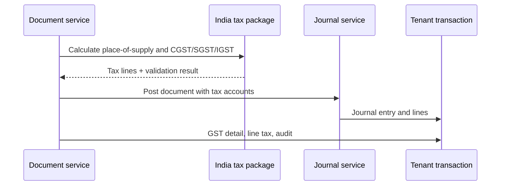

# Phase 03 India GST Core Implementation Plan

> **For agentic workers:** REQUIRED SUB-SKILL: Use superpowers:subagent-driven-development (recommended) or superpowers:executing-plans to implement this plan task-by-task. Steps use checkbox (`- [ ]`) syntax for tracking.

**Goal:** Add India GST-aware invoicing, expense tax capture, tax reports, credit/debit notes, and sandbox-ready compliance integration boundaries.

**Architecture:** GST rules live in `packages/india-tax` as deterministic functions. Document services call tax calculation before posting journals. GST reports are built from posted documents and journal lines, not from drafts. External government/GSP APIs are isolated behind adapters and disabled by default.

**Tech Stack:** TypeScript, Zod, Drizzle, PostgreSQL, TanStack Start, Hono, oRPC, OpenAPI snapshots, core accounting, india-tax.

---

## Architecture Flow

Tax-aware posting:

## Foundation Alignment

Before executing this plan, reconcile it with `docs/superpowers/plans/2026-06-17-accounting-foundation-schema-revision-plan.md`.

- This phase creates `tax_code` and `tax_code_component`.
- GST document details attach to Phase 2 document subtype rows and `source_document`.
- GST posting creates or adjusts `journal_entry` rows through the Phase 1 posting service.
- Write `audit_event`. Add `outbox_event` only when GST exports, integrations, or async jobs require durable delivery.
- Store ordinary money as `*_minor bigint`; rates and quantities remain numeric.
- Shared tax contracts belong in `packages/core`; GST services and oRPC procedures belong in `packages/api`.

## Current Official References To Recheck Before Implementation

- GST e-Invoice API sandbox portal: https://einv-apisandbox.nic.in/
- E-Way Bill API portal and release notes: https://docs.ewaybillgst.gov.in/apidocs/index.html
- GSTR-1 help: https://tutorial.gst.gov.in/userguide/returns/GSTR_1.htm
- GSTR-3B help: https://tutorial.gst.gov.in/userguide/returns/GSTR3B.htm

GST behavior changes over time. Re-check official portals during implementation, especially validation rules and return changes.

## Scope

Build:

- GST settings.
- GSTIN/PAN/state fields.
- HSN/SAC validation shape.
- CGST/SGST/IGST calculation.
- Tax invoice fields.
- Expense input tax capture.
- Credit note and debit note.
- GSTR-1 working report.
- GSTR-3B working report.
- E-invoice/e-way adapter schema and sandbox request logs behind feature flags.

Do not build automated GST filing, production IRP credentials, automatic e-way bill generation, GST payment challans, or ITC reconciliation in this phase.

## Schema Additions

### `gst_settings`

- `organization_id`
- `registration_type`: `UNREGISTERED`, `REGULAR`, `COMPOSITION`, `SEZ`, `EXPORTER`
- `default_gstin`
- `default_state_code`
- `invoice_type_default`: `TAX_INVOICE`, `BILL_OF_SUPPLY`
- `e_invoice_enabled`
- `e_way_bill_enabled`
- `created_at`
- `updated_at`

### `tax_code_component`

- `id`
- `organization_id`
- `tax_code_id`
- `component_type`: `CGST`, `SGST`, `IGST`, `CESS`
- `rate`
- `account_id`
- `created_at`

### `gst_document_detail`

- `id`
- `organization_id`
- `document_type`: `INVOICE`, `EXPENSE`, `CREDIT_NOTE`, `DEBIT_NOTE`
- `document_id`
- `supplier_gstin`
- `recipient_gstin`
- `place_of_supply_state_code`
- `supply_type`: `INTRA_STATE`, `INTER_STATE`, `EXPORT`, `SEZ`
- `invoice_type`: `TAX_INVOICE`, `BILL_OF_SUPPLY`, `EXPORT_INVOICE`
- `reverse_charge`
- `ecommerce_gstin`
- `created_at`
- `updated_at`

### `gst_line_tax`

- `id`
- `organization_id`
- `document_type`
- `document_line_id`
- `tax_code_id`
- `taxable_amount`
- `cgst_rate`
- `cgst_amount`
- `sgst_rate`
- `sgst_amount`
- `igst_rate`
- `igst_amount`
- `cess_rate`
- `cess_amount`

### `adjustment_note`

- `id`
- `organization_id`
- `fiscal_year_id`
- `note_type`: `CREDIT_NOTE`, `DEBIT_NOTE`
- `note_number`
- `note_date`
- `party_id`
- `original_document_type`
- `original_document_id`
- `reason_code`
- `status`: `DRAFT`, `POSTED`, `VOID`
- `subtotal_amount`
- `tax_amount`
- `total_amount`
- `journal_entry_id`
- `posted_by`
- `posted_at`
- `created_at`
- `updated_at`

### `adjustment_note_line`

- `id`
- `organization_id`
- `adjustment_note_id`
- `line_no`
- `item_id`
- `description`
- `quantity`
- `unit_price`
- `tax_code_id`
- `line_subtotal_amount`
- `line_tax_amount`
- `line_total_amount`

### `gst_return_period`

- `id`
- `organization_id`
- `return_type`: `GSTR1`, `GSTR3B`
- `period_start`
- `period_end`
- `status`: `OPEN`, `SNAPSHOTTED`, `EXPORTED`, `LOCKED`
- `snapshot_json`
- `created_at`
- `updated_at`

### `gst_api_request`

- `id`
- `organization_id`
- `provider`: `NIC_EINVOICE_SANDBOX`, `NIC_EWAY_SANDBOX`, `GSP_SANDBOX`
- `operation`
- `request_hash`
- `request_json`
- `response_json`
- `status`: `DRAFT`, `SENT`, `SUCCESS`, `FAILED`
- `error_code`
- `error_message`
- `created_at`
- `sent_at`

## Backend Contracts

Internal oRPC routers:

- `gst.settings.get`
- `gst.settings.update`
- `gst.taxCodes.seedIndiaDefaults`
- `gst.calculateInvoiceTax`
- `gst.calculateExpenseTax`
- `gst.notes.createDraft`
- `gst.notes.post`
- `gst.reports.gstr1`
- `gst.reports.gstr3b`
- `gst.eInvoice.prepareSandboxPayload`
- `gst.eWay.prepareSandboxPayload`

Future public REST/OpenAPI mapping:

- `GET /api/v1/gst/settings`
- `PATCH /api/v1/gst/settings`
- `POST /api/v1/gst/tax-calculations/invoice`
- `GET /api/v1/gst/reports/gstr-1`
- `GET /api/v1/gst/reports/gstr-3b`
- `POST /api/v1/credit-notes`
- `POST /api/v1/debit-notes`

Do not expose these as public endpoints until Phase 6.

## Task Checklist

### Task 1: India Tax Package

**Files:**

- Create: `packages/india-tax/package.json`
- Create: `packages/india-tax/src/gstin.ts`
- Create: `packages/india-tax/src/place-of-supply.ts`
- Create: `packages/india-tax/src/gst-calculation.ts`
- Test: `packages/india-tax/src/gst-calculation.test.ts`

- [ ] Test GSTIN checksum/shape validation for valid and invalid samples.
- [ ] Test intra-state supply splits 18% into 9% CGST and 9% SGST.
- [ ] Test inter-state supply applies 18% IGST.
- [ ] Test unregistered business produces no GST lines.
- [ ] Implement pure GST calculation functions with no database imports.
- [ ] Run `rtk vp run --filter @tsu-stack/india-tax test:unit`.
- [ ] Commit: `feat: add india gst tax calculations`.

### Task 2: GST Schema

**Files:**

- Create: `packages/db/src/schema/gst.ts`
- Modify: `packages/db/src/schema/index.ts`
- Test: `packages/db/src/schema/gst.test.ts`

- [ ] Add schema test for `organization_id` on every GST table.
- [ ] Add `gst_settings`, `tax_code`, `tax_code_component`, `gst_document_detail`, `gst_line_tax`, `adjustment_note`, `adjustment_note_line`, `gst_return_period`, `gst_api_request`.
- [ ] Add indexes by organization, document, return period, provider operation.
- [ ] Generate migration.
- [ ] Run `rtk vp run --filter @tsu-stack/db test:unit`.
- [ ] Run `rtk vp run -w db migrate`.
- [ ] Commit: `feat: add gst database schema`.

### Task 3: GST Settings And Tax Code Seeding

**Files:**

- Create: `packages/api/src/services/gst/gst-settings.schemas.ts`
- Create: `packages/api/src/services/gst/gst-settings.service.ts`
- Create: `packages/api/src/services/gst/india-tax-code-seed.service.ts`
- Test: `packages/api/src/services/gst/gst-settings.service.test.ts`

- [ ] Test GST settings default to unregistered business.
- [ ] Test registered business requires GSTIN and state code.
- [ ] Test seeding tax codes is idempotent.
- [ ] Implement settings update with audit event and `gst.settings_updated`.
- [ ] Implement default India tax code seed: 0%, 5%, 12%, 18%, 28%.
- [ ] Run `rtk vp run --filter @tsu-stack/api test:unit`.
- [ ] Commit: `feat: add gst settings and tax codes`.

### Task 4: GST-Aware Invoice And Expense Posting

**Files:**

- Modify: `packages/api/src/services/invoices/invoice-posting.ts`
- Modify: `packages/api/src/services/expenses/expense-posting.ts`
- Create: `packages/api/src/services/gst/gst-posting.ts`
- Test: `packages/api/src/services/gst/gst-posting.test.ts`

- [ ] Test invoice posts sales, receivable, and output GST accounts.
- [ ] Test expense posts expense, payable, and input GST accounts.
- [ ] Test tax document detail links to invoice.
- [ ] Test tax lines sum to document tax amount.
- [ ] Implement GST line generation before journal posting.
- [ ] Implement journal mapping for input/output tax components.
- [ ] Write audit record for applied tax; queue outbox only if a GST export/integration consumer exists.
- [ ] Run `rtk vp run --filter @tsu-stack/api test:unit`.
- [ ] Commit: `feat: apply gst to posted documents`.

### Task 5: Credit And Debit Notes

**Files:**

- Create: `packages/api/src/services/gst/adjustment-note.schemas.ts`
- Create: `packages/api/src/services/gst/adjustment-note.service.ts`
- Test: `packages/api/src/services/gst/adjustment-note.service.test.ts`

- [ ] Test credit note reduces receivable and output tax.
- [ ] Test debit note increases receivable and output tax.
- [ ] Test note references original invoice or expense.
- [ ] Test posted note cannot be edited.
- [ ] Implement draft, post, and void flows through journal service.
- [ ] Write audit records for posted credit/debit notes; queue outbox only if a delivery/integration consumer exists.
- [ ] Run `rtk vp run --filter @tsu-stack/api test:unit`.
- [ ] Commit: `feat: add gst credit debit notes`.

### Task 6: GST Reports

**Files:**

- Create: `packages/api/src/services/gst/reports/gstr1.service.ts`
- Create: `packages/api/src/services/gst/reports/gstr3b.service.ts`
- Test: `packages/api/src/services/gst/reports/gstr1.service.test.ts`
- Test: `packages/api/src/services/gst/reports/gstr3b.service.test.ts`

- [ ] Test GSTR-1 uses posted outward supplies only.
- [ ] Test GSTR-3B summarizes outward tax and input tax.
- [ ] Test drafts and void documents are excluded.
- [ ] Test report snapshot is immutable after locking.
- [ ] Implement report builders from posted documents and GST lines.
- [ ] Add CSV/JSON export format for accountant review.
- [ ] Run `rtk vp run --filter @tsu-stack/api test:unit`.
- [ ] Commit: `feat: add gst working reports`.

### Task 7: Sandbox Adapter Boundaries

**Files:**

- Create: `packages/api/src/services/gst/einvoice-adapter.ts`
- Create: `packages/api/src/services/gst/eway-adapter.ts`
- Test: `packages/api/src/services/gst/einvoice-adapter.test.ts`

- [ ] Test e-invoice payload builder validates required invoice fields.
- [ ] Test adapter stores request hash before sending.
- [ ] Test adapter can be disabled by feature flag.
- [ ] Implement payload preparation only; production submission remains disabled.
- [ ] Store request/response in `gst_api_request`.
- [ ] Run `rtk vp run --filter @tsu-stack/api test:unit`.
- [ ] Commit: `feat: add gst sandbox adapter boundaries`.

### Task 8: oRPC And OpenAPI Snapshot

**Files:**

- Create: `packages/api/src/routers/gst.router.ts`
- Modify: `packages/api/src/router.ts`
- Create: `packages/api/src/openapi/internal-gst.snapshot.test.ts`

- [ ] Add `gst` oRPC router.
- [ ] Add role checks: owner/accountant can update GST settings and generate reports; operator can calculate taxes.
- [ ] Generate internal OpenAPI snapshot from oRPC router.
- [ ] Assert public `/api/v1/gst` remains unmounted.
- [ ] Run `rtk vp run --filter @tsu-stack/api test:unit`.
- [ ] Commit: `feat: add gst rpc contracts`.

### Task 9: GST Frontend

**Files:**

- Create: `apps/web/src/routes/settings/gst.tsx`
- Create: `apps/web/src/routes/reports/gstr-1.tsx`
- Create: `apps/web/src/routes/reports/gstr-3b.tsx`
- Create: `apps/web/src/routes/credit-notes/new.tsx`
- Create: `apps/web/src/routes/debit-notes/new.tsx`
- Modify: `apps/web/src/routes/invoices/new.tsx`
- Modify: `apps/web/src/routes/expenses/new.tsx`

- [ ] Build GST settings wizard.
- [ ] Add GST tax preview to invoice editor.
- [ ] Add input tax preview to expense editor.
- [ ] Build credit/debit note screens.
- [ ] Build GSTR-1 and GSTR-3B review screens with export buttons.
- [ ] Use owner-friendly copy: "Tax collected", "Tax paid", "GST report".
- [ ] Run `rtk vp run --filter /web check`.
- [ ] Run `rtk vp run -r build`.
- [ ] Commit: `feat: add gst owner ui`.

## Exit Checklist

- [ ] GST settings support unregistered and registered businesses.
- [ ] GSTIN validation exists.
- [ ] HSN/SAC captured on items.
- [ ] Intra-state invoice calculates CGST/SGST.
- [ ] Inter-state invoice calculates IGST.
- [ ] Expenses capture input GST.
- [ ] GST postings use system tax accounts.
- [ ] Credit notes and debit notes post journals.
- [ ] GSTR-1 and GSTR-3B reports exclude drafts.
- [ ] Sandbox API payloads can be prepared but not submitted accidentally.
- [ ] oRPC contracts and OpenAPI snapshots exist.
- [ ] No production GST API credentials are required.
