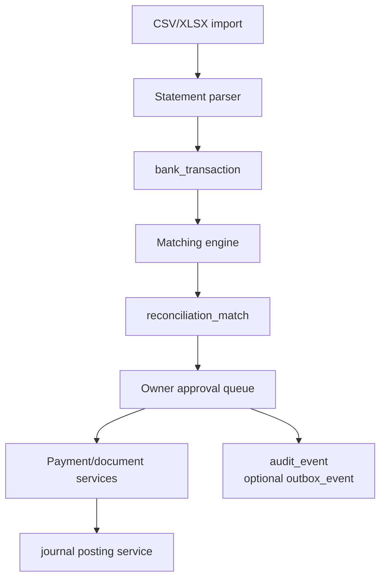
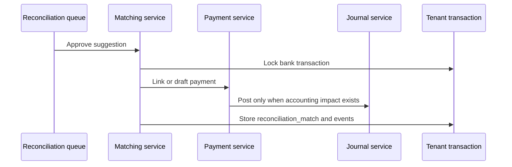

# Phase 04 Bank And Reconciliation Implementation Plan

> **For agentic workers:** REQUIRED SUB-SKILL: Use superpowers:subagent-driven-development (recommended) or superpowers:executing-plans to implement this plan task-by-task. Steps use checkbox (`- [ ]`) syntax for tracking.

**Goal:** Let owners import bank statements, match transactions to invoices/expenses/payments, approve suggestions, and see reconciliation status.

**Architecture:** Bank imports create normalized transactions without immediately changing books. Matching services propose links to existing documents or draft payments. Owner approval posts or links journal impact through existing services. External bank feeds are deferred; CSV/XLSX import is the reliable first path.

**Tech Stack:** TanStack Start, React Hook Form, PostgreSQL, Drizzle, Hono, oRPC, Zod, core accounting, CSV parser, spreadsheet parser.

> **2026-06-29 source-document update:** [ADR-0012](../../decisions/0012-replace-source-document-with-journal-source-metadata.md)
> supersedes this plan's `source_document` references. Reconciliation should
> link typed documents, payments/allocations, and `journal_entry_id`.

---

## Architecture Flow

Reconciliation approval:

## Foundation Alignment

Before executing this plan, reconcile it with `docs/superpowers/plans/2026-06-17-accounting-foundation-schema-revision-plan.md`.

- Bank imports and matches link to existing typed documents, `journal_entry`,
  payments, and allocations.
- Approved matches post or link through existing posting services.
- Write `audit_event`. Add `outbox_event` only when imports, integrations, or async matching jobs require durable delivery.
- Store money as `*_minor bigint`.
- Shared import/matching contracts belong in `packages/core`; parsing and reconciliation services belong in `packages/api`.

## Scope

Build:

- Bank account setup.
- Statement import.
- Duplicate detection.
- Normalized bank transactions.
- Deterministic matching.
- Owner approval queue.
- Reconciliation report.

Do not build live bank feeds, account aggregation, UPI direct integrations, AI matching, or payment initiation in this phase.

## Schema Additions

### `bank_account`

- `id`
- `organization_id`
- `account_id`
- `display_name`
- `bank_name`
- `account_number_masked`
- `ifsc`
- `currency_code`
- `opening_balance`
- `opening_balance_date`
- `is_active`
- `created_at`
- `updated_at`

### `bank_statement_import`

- `id`
- `organization_id`
- `bank_account_id`
- `attachment_id`
- `filename`
- `import_hash`
- `status`: `UPLOADED`, `PARSED`, `FAILED`, `COMMITTED`
- `row_count`
- `parsed_count`
- `duplicate_count`
- `error_count`
- `created_by`
- `created_at`
- `completed_at`
- `last_error`

### `bank_transaction`

- `id`
- `organization_id`
- `bank_account_id`
- `statement_import_id`
- `transaction_date`
- `value_date`
- `description`
- `reference`
- `amount`
- `direction`: `INFLOW`, `OUTFLOW`
- `running_balance`
- `fingerprint`
- `status`: `UNMATCHED`, `SUGGESTED`, `MATCHED`, `IGNORED`
- `matched_payment_id`
- `created_at`

Constraints:

- Unique `(organization_id, bank_account_id, fingerprint)`.

### `reconciliation_match`

- `id`
- `organization_id`
- `bank_transaction_id`
- `match_type`: `EXISTING_PAYMENT`, `NEW_PAYMENT`, `TRANSFER`, `IGNORE`
- `target_type`
- `target_id`
- `confidence_score`
- `status`: `SUGGESTED`, `APPROVED`, `REJECTED`, `REVERSED`
- `approved_by`
- `approved_at`
- `created_at`

### `bank_rule`

- `id`
- `organization_id`
- `name`
- `direction`
- `description_contains`
- `amount_min`
- `amount_max`
- `party_id`
- `account_id`
- `payment_mode`
- `is_active`
- `created_at`
- `updated_at`

### `reconciliation_period`

- `id`
- `organization_id`
- `bank_account_id`
- `period_start`
- `period_end`
- `statement_closing_balance`
- `book_closing_balance`
- `difference_amount`
- `status`: `OPEN`, `RECONCILED`, `LOCKED`
- `created_at`
- `reconciled_at`

## Backend Contracts

Internal oRPC routers:

- `bankAccounts.list`
- `bankAccounts.create`
- `bankImports.upload`
- `bankImports.parse`
- `bankTransactions.list`
- `reconciliation.suggestMatches`
- `reconciliation.approveMatch`
- `reconciliation.rejectMatch`
- `reconciliation.report`
- `bankRules.create`
- `bankRules.update`

Future public REST/OpenAPI mapping:

- `GET /api/v1/bank/accounts`
- `POST /api/v1/bank/accounts`
- `POST /api/v1/bank/imports`
- `GET /api/v1/bank/transactions`
- `POST /api/v1/reconciliation/matches/{id}/approve`

Public mounting waits until Phase 6.

## Task Checklist

### Task 1: Bank Schema

**Files:**

- Create: `packages/db/src/schema/bank.ts`
- Modify: `packages/db/src/schema/index.ts`
- Test: `packages/db/src/schema/bank.test.ts`

- [ ] Test all bank tables have `organization_id`.
- [ ] Add bank account, import, transaction, match, rule, and period tables.
- [ ] Add unique fingerprint constraint.
- [ ] Add indexes by bank account, date, status.
- [ ] Generate and run migration.
- [ ] Commit: `feat: add bank reconciliation schema`.

### Task 2: Statement Parser

**Files:**

- Create: `packages/api/src/services/bank/statement-parser.ts`
- Create: `packages/api/src/services/bank/statement.schemas.ts`
- Test: `packages/api/src/services/bank/statement-parser.test.ts`

- [ ] Test parser accepts CSV with date, description, debit, credit, balance.
- [ ] Test parser rejects rows with both debit and credit.
- [ ] Test parser produces stable fingerprint.
- [ ] Implement parser for configurable column mapping.
- [ ] Validate parsed rows with Zod.
- [ ] Run `rtk vp run --filter @tsu-stack/api test:unit`.
- [ ] Commit: `feat: add bank statement parser`.

### Task 3: Import Service

**Files:**

- Create: `packages/api/src/services/bank/bank-import.service.ts`
- Test: `packages/api/src/services/bank/bank-import.service.test.ts`

- [ ] Test duplicate file hash is rejected.
- [ ] Test duplicate transaction fingerprint is counted.
- [ ] Test committed import creates bank transactions.
- [ ] Implement upload metadata and parse flow.
- [ ] Write audit event and `bank.import_committed` event.
- [ ] Run `rtk vp run --filter @tsu-stack/api test:unit`.
- [ ] Commit: `feat: add bank import service`.

### Task 4: Matching Engine

**Files:**

- Create: `packages/api/src/services/bank/matching-engine.ts`
- Create: `packages/api/src/services/bank/reconciliation.service.ts`
- Test: `packages/api/src/services/bank/matching-engine.test.ts`
- Test: `packages/api/src/services/bank/reconciliation.service.test.ts`

- [ ] Test exact amount/date/reference matches existing payment.
- [ ] Test invoice amount inflow suggests new payment.
- [ ] Test expense amount outflow suggests new payment.
- [ ] Test low-confidence suggestions require manual review.
- [ ] Implement deterministic matching before any AI suggestions.
- [ ] Store suggestions in `reconciliation_match`.
- [ ] Run `rtk vp run --filter @tsu-stack/api test:unit`.
- [ ] Commit: `feat: add bank matching engine`.

### Task 5: Approval Flow

**Files:**

- Modify: `packages/api/src/services/bank/reconciliation.service.ts`
- Test: `packages/api/src/services/bank/reconciliation-approval.test.ts`

- [ ] Test approving existing payment links bank transaction.
- [ ] Test approving new invoice payment creates payment through Phase 2 service.
- [ ] Test approving new expense payment creates payment through Phase 2 service.
- [ ] Test rejection keeps bank transaction unmatched.
- [ ] Implement approval transaction with audit/event/idempotency.
- [ ] Write audit record for approved match; queue outbox only if a bank/integration consumer exists.
- [ ] Run `rtk vp run --filter @tsu-stack/api test:unit`.
- [ ] Commit: `feat: approve reconciliation matches`.

### Task 6: oRPC And OpenAPI Snapshot

**Files:**

- Create: `packages/api/src/routers/bank.router.ts`
- Create: `packages/api/src/openapi/internal-bank.snapshot.test.ts`
- Modify: `packages/api/src/router.ts`

- [ ] Add bank and reconciliation oRPC procedures.
- [ ] Enforce owner/accountant permissions; viewer has no accounting-kernel access by default.
- [ ] Validate uploads and match approvals.
- [ ] Generate internal OpenAPI snapshot.
- [ ] Keep public routes unmounted.
- [ ] Run `rtk vp run --filter @tsu-stack/api test:unit`.
- [ ] Commit: `feat: add bank rpc contracts`.

### Task 7: Frontend

**Files:**

- Create: `apps/web/src/routes/bank/accounts.tsx`
- Create: `apps/web/src/routes/bank/import.tsx`
- Create: `apps/web/src/routes/bank/transactions.tsx`
- Create: `apps/web/src/routes/bank/reconcile.tsx`
- Create: `apps/web/src/routes/reports/bank-reconciliation.tsx`

- [ ] Build bank account setup.
- [ ] Build import wizard with column mapping.
- [ ] Build transaction list with unmatched filter.
- [ ] Build review queue with approve/reject actions.
- [ ] Build reconciliation report.
- [ ] Use plain labels: "Match money received", "Match money paid", "Ignore bank line".
- [ ] Run `rtk vp run --filter /web check`.
- [ ] Run `rtk vp run -r build`.
- [ ] Commit: `feat: add bank reconciliation ui`.

## Exit Checklist

- [ ] Owner can add bank account.
- [ ] Owner can import CSV statement.
- [ ] Duplicate import rows are detected.
- [ ] Matching suggestions are deterministic.
- [ ] Owner approves match before ledger changes.
- [ ] Approval creates/links payment correctly.
- [ ] Bank transaction status updates.
- [ ] Reconciliation report shows difference.
- [ ] oRPC contracts pass tests.
- [ ] No live bank integration exists yet.
