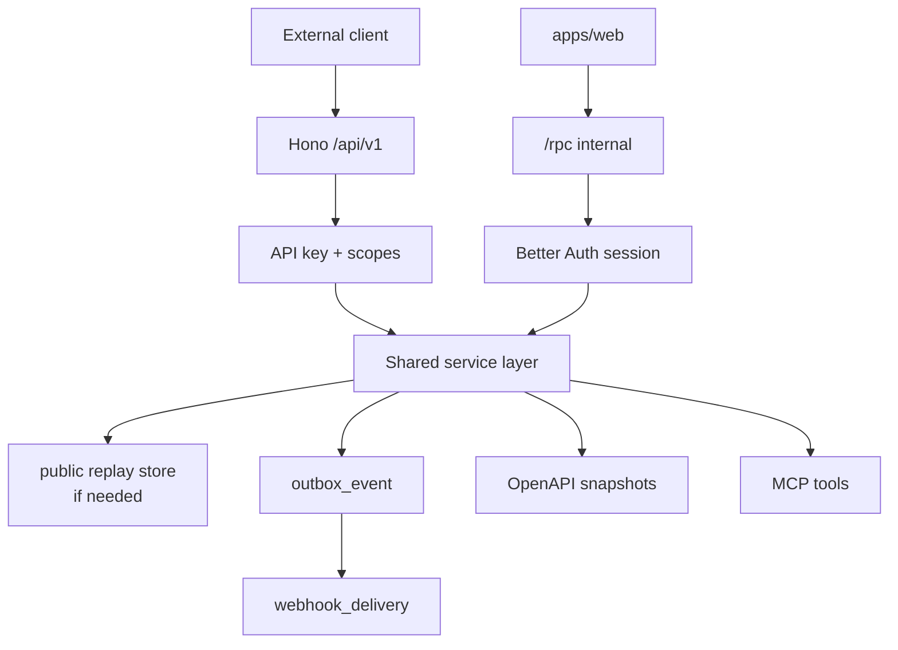
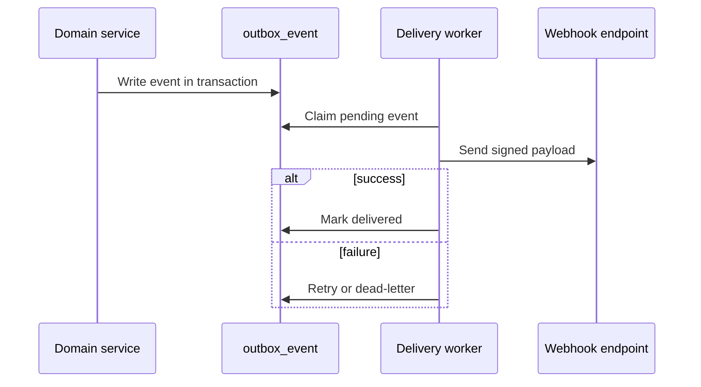

# Phase 06 Platform API Integrations Implementation Plan

> **For agentic workers:** REQUIRED SUB-SKILL: Use superpowers:subagent-driven-development (recommended) or superpowers:executing-plans to implement this plan task-by-task. Steps use checkbox (`- [ ]`) syntax for tracking.

**Goal:** Expose stable public API, OpenAPI documentation, webhooks, integration logs, and MCP tools after core workflows are trusted.

**Architecture:** oRPC remains the contract source for internal and public APIs. Hono mounts `/rpc` for app clients and `/api/v1` for external clients. Public endpoints use API keys, scoped permissions, pagination, idempotency, structured errors, signed webhooks, and explicit OpenAPI generation.

**Tech Stack:** Hono, oRPC, OpenAPI generator, Zod, Better Auth API keys, PostgreSQL, Drizzle, background jobs, MCP server, TanStack Start developer settings UI.

---

## Architecture Flow



Webhook delivery:



## Foundation Alignment

Before executing this plan, reconcile it with `docs/superpowers/plans/2026-06-17-accounting-foundation-schema-revision-plan.md`.

- Public mutations accept `Idempotency-Key` when they can create documents,
  payments, postings, or delivery attempts. Phase 6 may add a central replay
  store for public API terminal response replay; internal accounting commands
  still use their operation-local keys.
- Webhook delivery is fed from `outbox_event`.
- API keys are Better Auth-owned machine credentials unless a separate decision creates an app-owned credential model.
- External references map external IDs to existing domain rows; they do not replace source documents or journal batches.
- Shared public API contracts belong in `packages/core`; route handlers and integration services belong in `packages/api`.

## API Design Rules

- Public API paths use plural nouns.
- All list endpoints are paginated.
- All mutation endpoints validate Zod input at boundary.
- All mutation endpoints accept `Idempotency-Key` when they can create documents, payments, postings, or delivery attempts.
- Error body shape is consistent.
- Response fields use camelCase.
- Enum response values use UPPER_SNAKE.
- New fields are additive and optional.
- API keys are organization-owned machine credentials.
- Human users never share API keys for accountant access.

## Schema Additions

### `webhook_endpoint`

- `id`
- `organization_id`
- `name`
- `url`
- `secret_ciphertext`
- `event_types`
- `is_active`
- `created_by`
- `created_at`
- `updated_at`

### `webhook_delivery`

- `id`
- `organization_id`
- `webhook_endpoint_id`
- `outbox_event_id`
- `event_type`
- `payload_json`
- `signature`
- `status`: `PENDING`, `DELIVERED`, `FAILED`, `ABANDONED`
- `attempt_count`
- `next_attempt_at`
- `last_status_code`
- `last_response_body`
- `last_error`
- `created_at`
- `delivered_at`

### `integration_connection`

- `id`
- `organization_id`
- `provider`
- `connection_type`: `API_KEY`, `OAUTH`, `WEBHOOK_ONLY`, `MCP`
- `display_name`
- `status`: `ACTIVE`, `PAUSED`, `ERROR`, `REVOKED`
- `scopes`
- `metadata_json`
- `created_by`
- `created_at`
- `updated_at`

### `integration_log`

- `id`
- `organization_id`
- `integration_connection_id`
- `direction`: `INBOUND`, `OUTBOUND`
- `operation`
- `status`: `SUCCESS`, `FAILED`
- `request_json`
- `response_json`
- `error_code`
- `error_message`
- `created_at`

### `external_id_map`

- `id`
- `organization_id`
- `provider`
- `external_resource_type`
- `external_resource_id`
- `internal_resource_type`
- `internal_resource_id`
- `created_at`

### `mcp_tool_policy`

- `id`
- `organization_id`
- `tool_name`
- `permission_scope`
- `requires_human_confirmation`
- `is_enabled`
- `created_at`
- `updated_at`

## Public API Surface

Initial public endpoints:

- `GET /api/v1/customers`
- `POST /api/v1/customers`
- `GET /api/v1/customers/{id}`
- `PATCH /api/v1/customers/{id}`
- `GET /api/v1/vendors`
- `POST /api/v1/vendors`
- `GET /api/v1/items`
- `POST /api/v1/items`
- `GET /api/v1/invoices`
- `POST /api/v1/invoices`
- `GET /api/v1/invoices/{id}`
- `POST /api/v1/invoices/{id}/post`
- `GET /api/v1/payments`
- `POST /api/v1/payments`
- `GET /api/v1/reports/trial-balance`
- `GET /api/v1/reports/general-ledger`
- `GET /api/v1/webhooks`
- `POST /api/v1/webhooks`
- `PATCH /api/v1/webhooks/{id}`
- `GET /api/v1/webhooks/{id}/deliveries`

Structured error:

```ts
type PublicApiError = {
  error: {
    code: string;
    message: string;
    details?: unknown;
    requestId: string;
  };
};
```

Paginated response:

```ts
type Page<T> = {
  data: T[];
  pagination: {
    cursor: string | null;
    nextCursor: string | null;
    pageSize: number;
  };
};
```

Webhook event payload:

```ts
type WebhookEvent = {
  id: string;
  type: string;
  organizationId: string;
  occurredAt: string;
  data: Record<string, unknown>;
};
```

## Task Checklist

### Task 1: Integration Schema

**Files:**

- Create: `packages/db/src/schema/integrations.ts`
- Modify: `packages/db/src/schema/index.ts`
- Test: `packages/db/src/schema/integrations.test.ts`

- [ ] Test all integration tables have `organization_id`.
- [ ] Add webhook endpoint, webhook delivery, integration connection, integration log, external ID map, MCP policy.
- [ ] Add indexes by organization, provider, endpoint, event status.
- [ ] Generate and run migration.
- [ ] Commit: `feat: add integration schema`.

### Task 2: Public API Contracts

**Files:**

- Create: `packages/api/src/public/errors.ts`
- Create: `packages/api/src/public/pagination.ts`
- Create: `packages/api/src/public/contracts/customers.contract.ts`
- Create: `packages/api/src/public/contracts/invoices.contract.ts`
- Create: `packages/api/src/public/contracts/payments.contract.ts`
- Create: `packages/api/src/public/contracts/reports.contract.ts`
- Test: `packages/api/src/public/contracts.test.ts`

- [ ] Test every list contract includes pagination input.
- [ ] Test mutation contracts include idempotency where needed.
- [ ] Test error contract includes request ID.
- [ ] Implement Zod input/output contracts.
- [ ] Run `rtk vp run --filter @tsu-stack/api test:unit`.
- [ ] Commit: `feat: define public api contracts`.

### Task 3: API Key Middleware

**Files:**

- Create: `packages/api/src/middleware/api-key-auth.ts`
- Create: `packages/api/src/middleware/public-api-context.ts`
- Test: `packages/api/src/middleware/api-key-auth.test.ts`

- [ ] Test missing API key returns 401.
- [ ] Test insufficient scope returns 403.
- [ ] Test revoked key returns 401.
- [ ] Verify API key with Better Auth API key plugin.
- [ ] Map key permissions to organization context.
- [ ] Run `rtk vp run --filter @tsu-stack/api test:unit`.
- [ ] Commit: `feat: add public api key middleware`.

### Task 4: Hono Public Routes And oRPC OpenAPI

**Files:**

- Create: `packages/api/src/public/public-router.ts`
- Create: `packages/api/src/openapi/generate-openapi.ts`
- Create: `packages/api/src/openapi/public-api.test.ts`
- Modify: `packages/api/src/app.ts`

- [ ] Mount internal `/rpc` router separately from public `/api/v1`.
- [ ] Mount public routes through oRPC route metadata.
- [ ] Generate OpenAPI JSON using oRPC OpenAPI generator and Zod converter.
- [ ] Test OpenAPI contains `/api/v1/invoices`.
- [ ] Test OpenAPI has security scheme for API key.
- [ ] Run `rtk vp run --filter @tsu-stack/api test:unit`.
- [ ] Commit: `feat: expose public api routes`.

### Task 5: Webhook Delivery

**Files:**

- Create: `packages/api/src/services/integrations/webhook.service.ts`
- Create: `packages/jobs/src/webhook-delivery.job.ts`
- Test: `packages/api/src/services/integrations/webhook.service.test.ts`
- Test: `packages/jobs/src/webhook-delivery.job.test.ts`

- [ ] Test endpoint secret signs payload.
- [ ] Test inactive endpoint receives no delivery.
- [ ] Test failed delivery schedules retry.
- [ ] Test abandoned delivery stops after max attempts.
- [ ] Convert outbox events to webhook deliveries.
- [ ] Deliver signed JSON payloads.
- [ ] Emit `webhook.delivered` or `webhook.failed`.
- [ ] Commit: `feat: add signed webhook delivery`.

### Task 6: MCP Server

**Files:**

- Create: `packages/mcp/package.json`
- Create: `packages/mcp/src/server.ts`
- Create: `packages/mcp/src/tools/read-tools.ts`
- Create: `packages/mcp/src/tools/draft-tools.ts`
- Create: `packages/mcp/src/tools/posting-tools.ts`
- Test: `packages/mcp/src/tools/tool-policy.test.ts`

- [ ] Add read tools: search customers, list invoices, get report.
- [ ] Add draft tools: draft invoice, draft expense.
- [ ] Add posting tools as disabled by default and requiring human confirmation.
- [ ] Test tool policy blocks disabled posting tool.
- [ ] Test all tools require organization context.
- [ ] Commit: `feat: add mcp tool server`.

### Task 7: Developer Settings UI

**Files:**

- Create: `apps/web/src/routes/settings/developers/api-keys.tsx`
- Create: `apps/web/src/routes/settings/developers/webhooks.tsx`
- Create: `apps/web/src/routes/settings/developers/integrations.tsx`
- Create: `apps/web/src/routes/settings/developers/openapi.tsx`

- [ ] Build API key list/create/revoke UI.
- [ ] Build webhook endpoint list/create/test UI.
- [ ] Build delivery log viewer.
- [ ] Build OpenAPI download page.
- [ ] Show scopes in plain language.
- [ ] Run `rtk vp run --filter /web check`.
- [ ] Run `rtk vp run -r build`.
- [ ] Commit: `feat: add developer settings ui`.

## Exit Checklist

- [ ] Public `/api/v1` exists.
- [ ] OpenAPI JSON generated and tested.
- [ ] API key auth enforces scopes.
- [ ] All list endpoints paginate.
- [ ] Idempotency required on posting mutations.
- [ ] Webhooks are signed.
- [ ] Webhooks retry and log failures.
- [ ] MCP read and draft tools work.
- [ ] MCP posting tools require human confirmation.
- [ ] Developer settings expose keys, webhooks, logs, OpenAPI.
