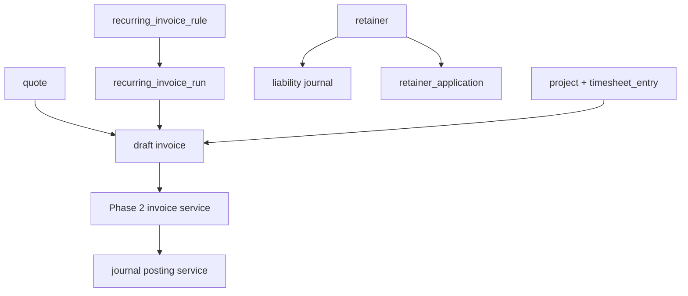
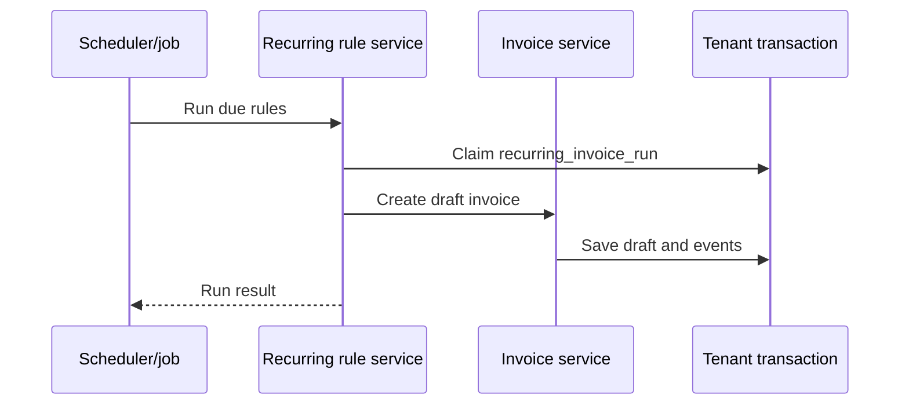

# Phase 07 Service SMB Expansion Implementation Plan

> **For agentic workers:** REQUIRED SUB-SKILL: Use superpowers:subagent-driven-development (recommended) or superpowers:executing-plans to implement this plan task-by-task. Steps use checkbox (`- [ ]`) syntax for tracking.

**Goal:** Add service-business workflows: quotes, recurring invoices, retainers, lightweight projects, timesheets, payment links, and client statements.

**Architecture:** Service features extend Phase 2.5 documents rather than introducing a separate project-management system. Quotes and recurring rules create draft invoices. Retainers post liability entries and later apply against invoices. Projects and timesheets provide invoice context but do not become full task management.

**Tech Stack:** TanStack Start, React Hook Form, Hono, oRPC, OpenAPI contracts, PostgreSQL, Drizzle, background jobs, core accounting.

---

## Architecture Flow

Recurring invoice run:

## Foundation Alignment

Before executing this plan, reconcile it with `docs/superpowers/plans/2026-06-17-accounting-foundation-schema-revision-plan.md`.

- Quotes and recurring rules create drafts; posting still goes through Phase 2 document services and Phase 1 `journal_entry`.
- Retainers post through existing liability accounts and settlement/allocation services.
- Write `audit_event`. Add `outbox_event` only when recurring jobs, notifications, or integrations require durable delivery.
- Store money as `*_minor bigint`.

## Schema Additions

### `quote`

- `id`
- `organization_id`
- `party_id`
- `quote_number`
- `quote_date`
- `valid_until`
- `status`: `DRAFT`, `SENT`, `ACCEPTED`, `DECLINED`, `CONVERTED`, `EXPIRED`
- `subtotal_amount`
- `tax_amount`
- `total_amount`
- `notes`
- `terms`
- `converted_invoice_id`
- `created_at`
- `updated_at`

### `quote_line`

- `id`
- `organization_id`
- `quote_id`
- `line_no`
- `item_id`
- `description`
- `quantity`
- `unit_price`
- `tax_code_id`
- `line_total_amount`

### `recurring_invoice_rule`

- `id`
- `organization_id`
- `party_id`
- `template_invoice_id`
- `frequency`: `WEEKLY`, `MONTHLY`, `QUARTERLY`, `YEARLY`
- `start_date`
- `end_date`
- `next_run_at`
- `status`: `ACTIVE`, `PAUSED`, `ENDED`
- `auto_send`
- `created_at`
- `updated_at`

### `recurring_invoice_run`

- `id`
- `organization_id`
- `rule_id`
- `scheduled_for`
- `status`: `PENDING`, `CREATED`, `FAILED`, `SKIPPED`
- `invoice_id`
- `last_error`
- `created_at`

### `retainer`

- `id`
- `organization_id`
- `party_id`
- `retainer_number`
- `received_date`
- `amount`
- `balance_amount`
- `status`: `OPEN`, `APPLIED`, `REFUNDED`, `VOID`
- `journal_entry_id`
- `created_at`
- `updated_at`

### `retainer_application`

- `id`
- `organization_id`
- `retainer_id`
- `invoice_id`
- `amount`
- `journal_entry_id`
- `created_at`

### `project`

- `id`
- `organization_id`
- `party_id`
- `name`
- `status`: `ACTIVE`, `PAUSED`, `COMPLETED`, `ARCHIVED`
- `billing_type`: `FIXED_FEE`, `TIME_AND_MATERIALS`, `RETAINER`
- `default_hourly_rate`
- `created_at`
- `updated_at`

### `timesheet_entry`

- `id`
- `organization_id`
- `project_id`
- `user_id`
- `entry_date`
- `duration_minutes`
- `description`
- `billable`
- `hourly_rate`
- `invoice_id`
- `status`: `DRAFT`, `APPROVED`, `INVOICED`
- `created_at`
- `updated_at`

### `payment_link`

- `id`
- `organization_id`
- `provider`
- `target_type`
- `target_id`
- `url`
- `status`: `CREATED`, `PAID`, `EXPIRED`, `CANCELLED`
- `metadata_json`
- `created_at`
- `updated_at`

### `client_statement_snapshot`

- `id`
- `organization_id`
- `party_id`
- `period_start`
- `period_end`
- `opening_balance`
- `closing_balance`
- `snapshot_json`
- `created_at`

## Backend Contracts

Internal and future public oRPC/OpenAPI resources:

- `quotes.*` -> `/api/v1/quotes`
- `recurringInvoices.*` -> `/api/v1/recurring-invoices`
- `retainers.*` -> `/api/v1/retainers`
- `projects.*` -> `/api/v1/projects`
- `timesheets.*` -> `/api/v1/timesheets`
- `paymentLinks.*` -> `/api/v1/payment-links`
- `clientStatements.*` -> `/api/v1/client-statements`

Public exposure should be enabled only for resources explicitly added to Phase 6 API scope.

## Task Checklist

### Task 1: Service SMB Schema

**Files:**

- Create: `packages/db/src/schema/service-smb.ts`
- Modify: `packages/db/src/schema/index.ts`
- Test: `packages/db/src/schema/service-smb.test.ts`

- [ ] Add schema test for tenant scoping.
- [ ] Add quote, recurring invoice, retainer, project, timesheet, payment link, and statement tables.
- [ ] Add indexes by party, status, next run, project, invoice.
- [ ] Generate and run migration.
- [ ] Commit: `feat: add service smb schema`.

### Task 2: Quotes

**Files:**

- Create: `packages/api/src/services/quotes/quote.schemas.ts`
- Create: `packages/api/src/services/quotes/quote.service.ts`
- Test: `packages/api/src/services/quotes/quote.service.test.ts`

- [ ] Test accepted quote can convert to draft invoice.
- [ ] Test converted quote cannot convert twice.
- [ ] Test expired quote cannot convert.
- [ ] Implement quote draft/send/accept/decline/convert.
- [ ] Write quote audit records; queue outbox only if notifications/integrations consume them.
- [ ] Commit: `feat: add quote workflow`.

### Task 3: Recurring Invoices

**Files:**

- Create: `packages/api/src/services/recurring-invoices/recurring-invoice.service.ts`
- Create: `packages/jobs/src/recurring-invoice.job.ts`
- Test: `packages/jobs/src/recurring-invoice.job.test.ts`

- [ ] Test monthly rule creates one draft invoice per run.
- [ ] Test rerun is idempotent.
- [ ] Test paused rule creates no invoice.
- [ ] Implement scheduler job.
- [ ] Write recurring run audit records; queue outbox only if notifications/integrations consume them.
- [ ] Commit: `feat: add recurring invoice runs`.

### Task 4: Retainers

**Files:**

- Create: `packages/api/src/services/retainers/retainer.schemas.ts`
- Create: `packages/api/src/services/retainers/retainer.service.ts`
- Test: `packages/api/src/services/retainers/retainer.service.test.ts`

- [ ] Test received retainer credits liability account.
- [ ] Test applying retainer reduces invoice due.
- [ ] Test application cannot exceed retainer balance.
- [ ] Implement receive/apply/refund flows.
- [ ] Commit: `feat: add retainer accounting`.

### Task 5: Projects And Timesheets

**Files:**

- Create: `packages/api/src/services/projects/project.service.ts`
- Create: `packages/api/src/services/timesheets/timesheet.service.ts`
- Test: `packages/api/src/services/timesheets/timesheet.service.test.ts`

- [ ] Test approved billable time can become invoice lines.
- [ ] Test invoiced time cannot be edited.
- [ ] Test non-billable time is excluded from invoice generation.
- [ ] Implement lightweight project and timesheet services.
- [ ] Commit: `feat: add service project timesheets`.

### Task 6: Payment Links

**Files:**

- Create: `packages/api/src/services/payment-links/payment-link.service.ts`
- Test: `packages/api/src/services/payment-links/payment-link.service.test.ts`

- [ ] Test link can be created for posted invoice.
- [ ] Test paid callback records payment through payment service.
- [ ] Test duplicate callback is idempotent.
- [ ] Implement provider abstraction.
- [ ] Commit: `feat: add payment link abstraction`.

### Task 7: Client Statements

**Files:**

- Create: `packages/api/src/services/client-statements/client-statement.service.ts`
- Test: `packages/api/src/services/client-statements/client-statement.service.test.ts`

- [ ] Test statement includes invoices, payments, retainers, and closing balance.
- [ ] Test statement snapshot is immutable.
- [ ] Implement statement builder.
- [ ] Commit: `feat: add client statements`.

### Task 8: API And Frontend

**Files:**

- Create: `packages/api/src/routers/service-smb.router.ts`
- Create: `apps/web/src/routes/quotes/index.tsx`
- Create: `apps/web/src/routes/quotes/new.tsx`
- Create: `apps/web/src/routes/recurring-invoices.tsx`
- Create: `apps/web/src/routes/retainers.tsx`
- Create: `apps/web/src/routes/projects.tsx`
- Create: `apps/web/src/routes/timesheets.tsx`
- Create: `apps/web/src/routes/client-statements.tsx`

- [ ] Add oRPC router and OpenAPI snapshot.
- [ ] Build quote editor and convert action.
- [ ] Build recurring invoice setup.
- [ ] Build retainer receive/apply UI.
- [ ] Build project and timesheet UI.
- [ ] Build client statement screen.
- [ ] Run `rtk vp check`, `rtk vp run -r test:unit`, `rtk vp run -r build`.
- [ ] Commit: `feat: add service smb ui and rpc`.

## Exit Checklist

- [ ] Quote converts to invoice.
- [ ] Recurring rule creates draft invoices idempotently.
- [ ] Retainer posts liability and applies to invoice.
- [ ] Timesheets can generate invoice lines.
- [ ] Client statement balances match ledger.
- [ ] Payment link callback posts payment idempotently.
- [ ] APIs have oRPC contracts and OpenAPI snapshots.
- [ ] UI remains owner-friendly and not project-management-heavy.
