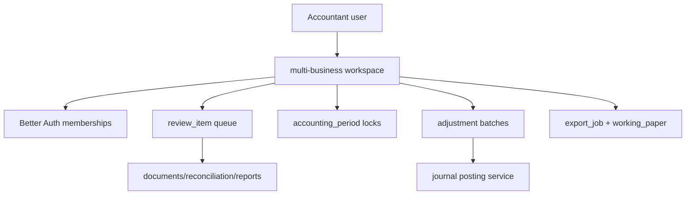
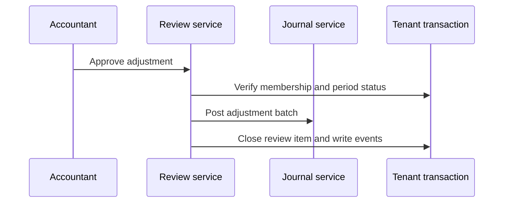

# Phase 08 Accountant Mode Implementation Plan

> **For agentic workers:** REQUIRED SUB-SKILL: Use superpowers:subagent-driven-development (recommended) or superpowers:executing-plans to implement this plan task-by-task. Steps use checkbox (`- [ ]`) syntax for tracking.

**Goal:** Add accountant review, multi-business workspace, period locks, adjustment workflows, working papers, and exports.

**Architecture:** Accountants are users with membership in many organizations. Accountant mode adds review and controls on top of existing books; it must not create separate tenancy or API-key-based human access. Period locks and adjustment journals enforce auditability.

**Tech Stack:** TanStack Start, Hono, oRPC, OpenAPI snapshots, PostgreSQL, Drizzle, accounting-core, object storage, export jobs.

---

## Architecture Flow

Adjustment flow:

## Foundation Alignment

Before executing this plan, reconcile it with `docs/superpowers/plans/2026-06-17-accounting-foundation-schema-revision-plan.md`.

- Prefer existing `accounting_period` lock fields before adding a separate period-lock table.
- Adjustment work posts through `journal_batch` with explicit accountant permissions.
- Accountant access uses Better Auth membership across organizations, not API keys.
- Write `audit_event` and `outbox_event`.

## Schema Additions

### `review_item`

- `id`
- `organization_id`
- `resource_type`
- `resource_id`
- `reason_code`
- `severity`: `INFO`, `WARNING`, `BLOCKER`
- `status`: `OPEN`, `RESOLVED`, `DISMISSED`
- `assigned_to`
- `created_by`
- `resolved_by`
- `resolved_at`
- `notes`
- `created_at`

### `period_lock`

- `id`
- `organization_id`
- `fiscal_year_id`
- `period_start`
- `period_end`
- `status`: `OPEN`, `LOCKED`, `UNLOCKED_WITH_REASON`
- `locked_by`
- `locked_at`
- `unlock_reason`
- `created_at`

### `adjustment_batch`

- `id`
- `organization_id`
- `fiscal_year_id`
- `name`
- `status`: `DRAFT`, `POSTED`, `VOID`
- `created_by`
- `posted_by`
- `posted_at`
- `created_at`

### `working_paper`

- `id`
- `organization_id`
- `fiscal_year_id`
- `title`
- `resource_type`
- `resource_id`
- `attachment_id`
- `notes`
- `created_by`
- `created_at`

### `export_job`

- `id`
- `organization_id`
- `export_type`: `TRIAL_BALANCE`, `GENERAL_LEDGER`, `TALLY`, `EXCEL`, `GST_WORKING`
- `status`: `QUEUED`, `RUNNING`, `SUCCESS`, `FAILED`
- `filters_json`
- `attachment_id`
- `created_by`
- `created_at`
- `completed_at`
- `last_error`

## Backend Contracts

Internal and future public resources:

- `accountant.workspaces.list`
- `reviews.list`, `reviews.resolve`, `reviews.dismiss`
- `periodLocks.create`, `periodLocks.unlockWithReason`
- `adjustments.createBatch`, `adjustments.postBatch`
- `workingPapers.create`, `workingPapers.list`
- `exports.create`, `exports.get`

Public API exposure should be read-heavy. Adjustment and lock mutations require accountant or owner permissions and idempotency.

## Task Checklist

### Task 1: Accountant Schema

**Files:**

- Create: `packages/db/src/schema/accountant.ts`
- Modify: `packages/db/src/schema/index.ts`
- Test: `packages/db/src/schema/accountant.test.ts`

- [ ] Add tenant scoping schema test.
- [ ] Add review, period lock, adjustment batch, working paper, export job tables.
- [ ] Add indexes by status, fiscal year, resource, assignee.
- [ ] Generate and run migration.
- [ ] Commit: `feat: add accountant mode schema`.

### Task 2: Multi-Business Workspace

**Files:**

- Create: `packages/api/src/services/accountant/workspace.service.ts`
- Test: `packages/api/src/services/accountant/workspace.service.test.ts`

- [ ] Test accountant sees organizations where membership role is accountant.
- [ ] Test owner sees owned organizations.
- [ ] Test API key cannot list accountant workspace.
- [ ] Implement workspace list and route-based organization switching support.
- [ ] Commit: `feat: add accountant workspace service`.

### Task 3: Review Queue

**Files:**

- Create: `packages/api/src/services/accountant/review.service.ts`
- Test: `packages/api/src/services/accountant/review.service.test.ts`

- [ ] Test high-value invoice creates review item.
- [ ] Test missing GSTIN can create warning review item.
- [ ] Test resolved item stores resolver and timestamp.
- [ ] Implement manual and automatic review item creation.
- [ ] Commit: `feat: add accountant review queue`.

### Task 4: Period Locks

**Files:**

- Create: `packages/api/src/services/accountant/period-lock.service.ts`
- Test: `packages/api/src/services/accountant/period-lock.service.test.ts`

- [ ] Test locked period blocks normal posting.
- [ ] Test unlock requires reason and owner/accountant role.
- [ ] Test adjustment journal can post with explicit adjustment permission.
- [ ] Implement period lock checks in journal posting service.
- [ ] Commit: `feat: enforce period locks`.

### Task 5: Adjustment Batches

**Files:**

- Create: `packages/api/src/services/accountant/adjustment-batch.service.ts`
- Test: `packages/api/src/services/accountant/adjustment-batch.service.test.ts`

- [ ] Test draft batch can contain multiple balanced journals.
- [ ] Test posting batch posts all journals transactionally.
- [ ] Test failed batch posts no journals.
- [ ] Implement batch posting with audit/event records.
- [ ] Commit: `feat: add adjustment batches`.

### Task 6: Working Papers And Exports

**Files:**

- Create: `packages/api/src/services/accountant/working-paper.service.ts`
- Create: `packages/api/src/services/accountant/export.service.ts`
- Create: `packages/jobs/src/export.job.ts`
- Test: `packages/api/src/services/accountant/export.service.test.ts`

- [ ] Test working paper links to fiscal year and resource.
- [ ] Test export job stores generated attachment.
- [ ] Test Tally export uses posted journals only.
- [ ] Implement Excel/CSV export generators.
- [ ] Commit: `feat: add working papers and export jobs`.

### Task 7: API And Frontend

**Files:**

- Create: `packages/api/src/routers/accountant.router.ts`
- Create: `apps/web/src/routes/accountant/workspaces.tsx`
- Create: `apps/web/src/routes/accountant/review.tsx`
- Create: `apps/web/src/routes/accountant/period-locks.tsx`
- Create: `apps/web/src/routes/accountant/adjustments.tsx`
- Create: `apps/web/src/routes/accountant/working-papers.tsx`
- Create: `apps/web/src/routes/accountant/exports.tsx`

- [ ] Add accountant oRPC router and OpenAPI snapshot.
- [ ] Build multi-business switcher.
- [ ] Build review queue.
- [ ] Build period lock screen.
- [ ] Build adjustment batch editor.
- [ ] Build working paper upload.
- [ ] Build export job screen.
- [ ] Run `rtk vp check`, `rtk vp run -r test:unit`, `rtk vp run -r build`.
- [ ] Commit: `feat: add accountant mode ui and api`.

## Exit Checklist

- [ ] Accountant accesses businesses through membership.
- [ ] API keys cannot impersonate human accountant workspace.
- [ ] Review queue works.
- [ ] Period locks block normal posting.
- [ ] Unlock requires reason.
- [ ] Adjustment batch posts transactionally.
- [ ] Working papers attach to resources.
- [ ] Export jobs produce files.
- [ ] All accountant actions audit event.
