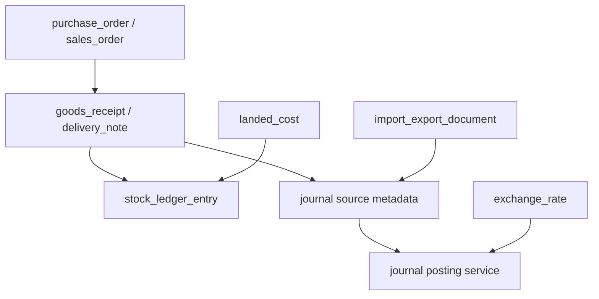
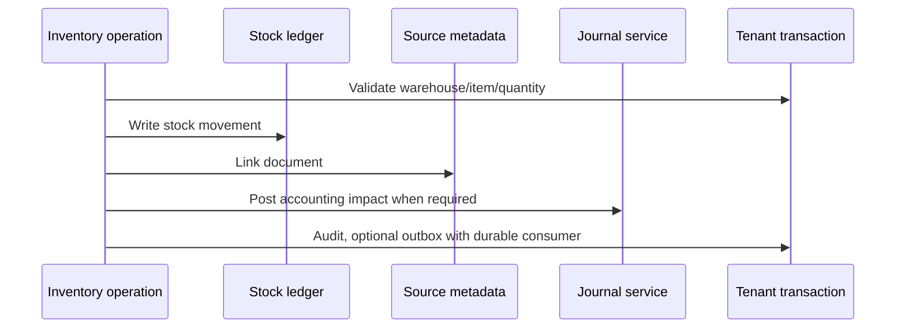

# Phase 09 Trade Inventory Import Export Implementation Plan

> **For agentic workers:** REQUIRED SUB-SKILL: Use superpowers:subagent-driven-development (recommended) or superpowers:executing-plans to implement this plan task-by-task. Steps use checkbox (`- [ ]`) syntax for tracking.

**Goal:** Add inventory, purchase/sales orders, goods movement, landed cost, foreign currency, and import/export document foundations.

**Architecture:** Inventory has its own stock ledger that reconciles to accounting journals. Goods movement and accounting movement are separate but linked. Foreign currency introduces exchange rates, realized gains/losses, and revaluation journals.

**Tech Stack:** PostgreSQL, Drizzle, core accounting, inventory-core package, Hono, oRPC, OpenAPI snapshots, TanStack Start.

> **2026-06-29 source-document update:** [ADR-0012](../../decisions/0012-replace-source-document-with-journal-source-metadata.md)
> supersedes this plan's `source_document` references. Trade workflows should
> link typed documents or movement rows to `journal_entry_id`; journal entries
> carry source trace/cache metadata.

---

## Architecture Flow

Goods movement vs accounting movement:

## Foundation Alignment

Before executing this plan, reconcile it with `docs/superpowers/plans/2026-06-17-accounting-foundation-schema-revision-plan.md`.

- Stock ledger is separate from the accounting ledger but reconciles to `journal_entry`.
- Foreign-currency documents still store money in minor units and use explicit exchange-rate numeric fields.
- Trade documents attach to `journal_entry_id` where they create accounting
  impact; journal entries carry source metadata.
- Write `audit_event`. Add `outbox_event` only when import/export jobs, integrations, or async inventory/accounting consumers require durable delivery.

## Schema Additions

### `warehouse`

- `id`
- `organization_id`
- `name`
- `code`
- `address_id`
- `is_active`
- `created_at`
- `updated_at`

### `stock_item_detail`

- `item_id`
- `organization_id`
- `tracking_type`: `NONE`, `BATCH`, `SERIAL`
- `valuation_method`: `FIFO`, `WEIGHTED_AVERAGE`
- `inventory_account_id`
- `cogs_account_id`
- `is_stocked`
- `created_at`
- `updated_at`

### `stock_ledger_entry`

- `id`
- `organization_id`
- `item_id`
- `warehouse_id`
- `posting_date`
- `source_type`
- `source_id`
- `direction`: `IN`, `OUT`, `ADJUSTMENT`
- `quantity`
- `unit_cost`
- `total_cost`
- `running_quantity`
- `running_value`
- `created_at`

### `purchase_order`

- `id`
- `organization_id`
- `party_id`
- `po_number`
- `order_date`
- `expected_date`
- `status`: `DRAFT`, `SENT`, `PARTIALLY_RECEIVED`, `RECEIVED`, `CLOSED`, `CANCELLED`
- `currency_code`
- `subtotal_amount`
- `tax_amount`
- `total_amount`
- `created_at`
- `updated_at`

### `purchase_order_line`

- `id`
- `organization_id`
- `purchase_order_id`
- `item_id`
- `quantity`
- `received_quantity`
- `unit_price`
- `tax_code_id`
- `line_total_amount`

### `sales_order`

- `id`
- `organization_id`
- `party_id`
- `so_number`
- `order_date`
- `expected_ship_date`
- `status`: `DRAFT`, `CONFIRMED`, `PARTIALLY_DELIVERED`, `DELIVERED`, `CLOSED`, `CANCELLED`
- `currency_code`
- `subtotal_amount`
- `tax_amount`
- `total_amount`
- `created_at`
- `updated_at`

### `sales_order_line`

- `id`
- `organization_id`
- `sales_order_id`
- `item_id`
- `quantity`
- `delivered_quantity`
- `unit_price`
- `tax_code_id`
- `line_total_amount`

### `goods_receipt`

- `id`
- `organization_id`
- `purchase_order_id`
- `warehouse_id`
- `receipt_number`
- `receipt_date`
- `status`: `DRAFT`, `POSTED`, `VOID`
- `journal_entry_id`
- `created_at`
- `posted_at`

### `delivery_note`

- `id`
- `organization_id`
- `sales_order_id`
- `warehouse_id`
- `delivery_number`
- `delivery_date`
- `status`: `DRAFT`, `POSTED`, `VOID`
- `journal_entry_id`
- `created_at`
- `posted_at`

### `landed_cost`

- `id`
- `organization_id`
- `goods_receipt_id`
- `allocation_method`: `BY_VALUE`, `BY_QUANTITY`, `BY_WEIGHT`
- `amount`
- `status`: `DRAFT`, `POSTED`, `VOID`
- `journal_entry_id`
- `created_at`
- `posted_at`

### `exchange_rate`

- `id`
- `organization_id`
- `base_currency_code`
- `quote_currency_code`
- `rate`
- `rate_date`
- `source`
- `created_at`

### `import_export_document`

- `id`
- `organization_id`
- `document_type`: `IMPORT`, `EXPORT`
- `linked_document_type`
- `linked_document_id`
- `iec`
- `port_code`
- `shipping_bill_number`
- `bill_of_entry_number`
- `lut_number`
- `metadata_json`
- `created_at`
- `updated_at`

## Backend Contracts

Internal and future public resources:

- `warehouses.*`
- `inventory.stockLedger`
- `purchaseOrders.*`
- `salesOrders.*`
- `goodsReceipts.*`
- `deliveryNotes.*`
- `landedCosts.*`
- `exchangeRates.*`
- `tradeDocuments.*`

Public API must expose inventory and orders only after stock/accounting reconciliation tests pass.

## Task Checklist

### Task 1: Inventory Core

**Files:**

- Create: `packages/inventory-core/src/valuation.ts`
- Create: `packages/inventory-core/src/stock-ledger.ts`
- Test: `packages/inventory-core/src/valuation.test.ts`

- [ ] Test FIFO cost for sale after multiple purchases.
- [ ] Test weighted average cost.
- [ ] Test stock cannot go negative unless setting allows it.
- [ ] Implement pure stock ledger functions.
- [ ] Commit: `feat: add inventory core valuation`.

### Task 2: Trade Schema

**Files:**

- Create: `packages/db/src/schema/inventory.ts`
- Create: `packages/db/src/schema/trade.ts`
- Modify: `packages/db/src/schema/index.ts`
- Test: `packages/db/src/schema/inventory.test.ts`

- [ ] Add all inventory, order, landed cost, exchange rate, and trade document tables.
- [ ] Add tenant scoping tests.
- [ ] Add unique document number constraints.
- [ ] Generate and run migration.
- [ ] Commit: `feat: add trade inventory schema`.

### Task 3: Warehouses And Stock Items

**Files:**

- Create: `packages/api/src/services/inventory/warehouse.service.ts`
- Create: `packages/api/src/services/inventory/stock-item.service.ts`
- Test: `packages/api/src/services/inventory/stock-item.service.test.ts`

- [ ] Test stock item requires inventory and COGS accounts.
- [ ] Test archived warehouse cannot receive stock.
- [ ] Implement warehouse and stock item details.
- [ ] Commit: `feat: add warehouse stock item services`.

### Task 4: Purchase Flow

**Files:**

- Create: `packages/api/src/services/trade/purchase-order.service.ts`
- Create: `packages/api/src/services/trade/goods-receipt.service.ts`
- Test: `packages/api/src/services/trade/goods-receipt.service.test.ts`

- [ ] Test purchase order can receive partial quantity.
- [ ] Test goods receipt creates stock ledger entries.
- [ ] Test goods receipt debits inventory and credits GRNI/payable.
- [ ] Implement purchase order and goods receipt posting.
- [ ] Commit: `feat: add purchase receipt inventory flow`.

### Task 5: Sales Flow

**Files:**

- Create: `packages/api/src/services/trade/sales-order.service.ts`
- Create: `packages/api/src/services/trade/delivery-note.service.ts`
- Test: `packages/api/src/services/trade/delivery-note.service.test.ts`

- [ ] Test sales order can deliver partial quantity.
- [ ] Test delivery note reduces stock ledger.
- [ ] Test delivery posts COGS and inventory reduction.
- [ ] Implement sales order and delivery note posting.
- [ ] Commit: `feat: add sales delivery inventory flow`.

### Task 6: Landed Cost

**Files:**

- Create: `packages/api/src/services/trade/landed-cost.service.ts`
- Test: `packages/api/src/services/trade/landed-cost.service.test.ts`

- [ ] Test landed cost allocates by value.
- [ ] Test landed cost increases inventory value.
- [ ] Test posted landed cost creates journal.
- [ ] Implement landed cost posting.
- [ ] Commit: `feat: add landed cost allocation`.

### Task 7: Foreign Currency

**Files:**

- Create: `packages/core/src/accounting/fx.ts`
- Create: `packages/api/src/services/fx/exchange-rate.service.ts`
- Test: `packages/core/src/accounting/fx.test.ts`

- [ ] Test exchange conversion uses decimal-safe math.
- [ ] Test realized gain/loss on payment at different rate.
- [ ] Test missing exchange rate blocks posting.
- [ ] Implement exchange rate lookup and gain/loss posting.
- [ ] Commit: `feat: add foreign currency accounting`.

### Task 8: Import Export Documents

**Files:**

- Create: `packages/api/src/services/trade/import-export-document.service.ts`
- Test: `packages/api/src/services/trade/import-export-document.service.test.ts`

- [ ] Test export document links to invoice.
- [ ] Test import document links to purchase flow.
- [ ] Test IEC and port code validation shape.
- [ ] Implement metadata capture and attachments.
- [ ] Commit: `feat: add import export documents`.

### Task 9: API And Frontend

**Files:**

- Create: `packages/api/src/routers/trade.router.ts`
- Create: `apps/web/src/routes/inventory/warehouses.tsx`
- Create: `apps/web/src/routes/inventory/stock-ledger.tsx`
- Create: `apps/web/src/routes/purchase-orders/index.tsx`
- Create: `apps/web/src/routes/sales-orders/index.tsx`
- Create: `apps/web/src/routes/goods-receipts/index.tsx`
- Create: `apps/web/src/routes/delivery-notes/index.tsx`
- Create: `apps/web/src/routes/trade/import-export.tsx`

- [ ] Add trade oRPC router and OpenAPI snapshot.
- [ ] Build warehouse and stock item screens.
- [ ] Build purchase order and goods receipt screens.
- [ ] Build sales order and delivery note screens.
- [ ] Build landed cost screen.
- [ ] Build import/export metadata screen.
- [ ] Run `rtk vp check`, `rtk vp run -r test:unit`, `rtk vp run -r build`.
- [ ] Commit: `feat: add trade inventory ui and api`.

## Exit Checklist

- [ ] Stock ledger reconciles with inventory accounts.
- [ ] Purchase receipt increases stock.
- [ ] Delivery reduces stock.
- [ ] COGS posts correctly.
- [ ] Landed cost adjusts inventory valuation.
- [ ] Foreign currency posting records exchange impact.
- [ ] Import/export documents attach to source docs.
- [ ] Trade API contracts have OpenAPI snapshots.
