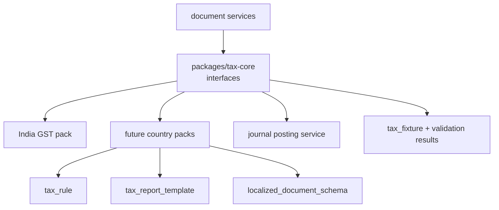
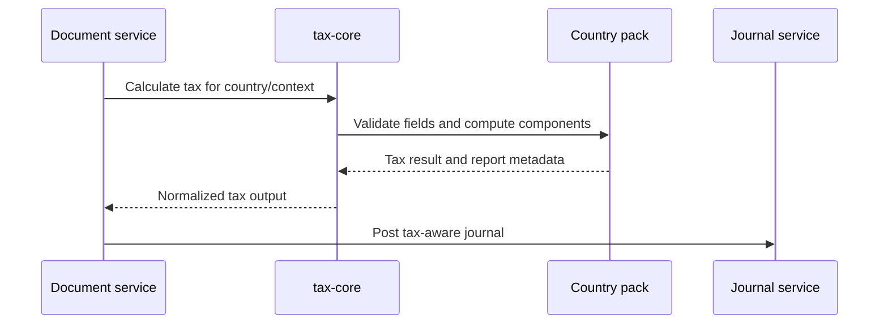

# Phase 10 Country Tax Engine Implementation Plan

> **For agentic workers:** REQUIRED SUB-SKILL: Use superpowers:subagent-driven-development (recommended) or superpowers:executing-plans to implement this plan task-by-task. Steps use checkbox (`- [ ]`) syntax for tracking.

**Goal:** Convert India-specific tax behavior into a localization-driven tax platform that can support VAT/GST countries without changing the accounting kernel.

**Architecture:** `packages/tax-core` defines country-neutral tax interfaces. Country packs implement tax calculation, document fields, report templates, validations, and compliance exports. India GST becomes one pack using the same plugin contract.

**Tech Stack:** TypeScript, Zod, PostgreSQL, Drizzle, Hono, oRPC, OpenAPI snapshots, accounting-core, tax-core, country packs.

---

## Architecture Flow



Country pack execution:



## Foundation Alignment

Before executing this plan, reconcile it with `docs/superpowers/plans/2026-06-17-accounting-foundation-schema-revision-plan.md`.

- Country tax packs extend the Phase 3 tax-code/component model.
- Country packs must not change the Phase 1 accounting kernel invariants.
- Shared tax-pack contracts belong in `packages/core` or a pure tax-core package.
- Runtime tax services and oRPC procedures belong in `packages/api`.

## Schema Additions

### `tax_localization_pack`

- `id`
- `country_code`
- `code`
- `name`
- `version`
- `status`: `DRAFT`, `ACTIVE`, `DEPRECATED`
- `metadata_json`
- `created_at`
- `updated_at`

### `tax_rule`

- `id`
- `localization_pack_id`
- `rule_type`: `RATE`, `PLACE_OF_SUPPLY`, `REVERSE_CHARGE`, `EXEMPTION`, `ROUNDING`
- `priority`
- `condition_json`
- `effect_json`
- `valid_from`
- `valid_to`
- `is_active`

### `tax_report_template`

- `id`
- `localization_pack_id`
- `report_code`
- `name`
- `periodicity`: `MONTHLY`, `QUARTERLY`, `ANNUAL`, `ON_DEMAND`
- `template_json`
- `created_at`
- `updated_at`

### `localized_document_schema`

- `id`
- `localization_pack_id`
- `document_type`
- `schema_json`
- `ui_schema_json`
- `created_at`
- `updated_at`

### `country_compliance_setting`

- `id`
- `organization_id`
- `country_code`
- `localization_pack_id`
- `settings_json`
- `is_active`
- `created_at`
- `updated_at`

### `tax_fixture`

- `id`
- `localization_pack_id`
- `fixture_name`
- `input_json`
- `expected_output_json`
- `created_at`

### `compliance_validation_result`

- `id`
- `organization_id`
- `document_type`
- `document_id`
- `localization_pack_id`
- `status`: `VALID`, `INVALID`, `WARNING`
- `messages_json`
- `created_at`

## Tax Core Interfaces

```ts
export type TaxCalculationInput = {
  organizationId: string;
  countryCode: string;
  documentType: "INVOICE" | "EXPENSE" | "CREDIT_NOTE" | "DEBIT_NOTE";
  sellerState?: string;
  buyerState?: string;
  lines: Array<{
    itemId?: string;
    taxCategory?: string;
    quantity: string;
    unitPrice: string;
    discountAmount: string;
  }>;
};

export type TaxCalculationOutput = {
  taxableAmount: string;
  taxAmount: string;
  lines: Array<{
    taxableAmount: string;
    components: Array<{
      name: string;
      rate: string;
      amount: string;
      payableAccountKind: string;
    }>;
  }>;
  messages: Array<{ code: string; severity: "INFO" | "WARNING" | "ERROR"; message: string }>;
};
```

## Backend Contracts

Internal and public resources:

- `taxPacks.list`
- `taxPacks.activate`
- `taxPacks.validateFixture`
- `tax.calculate`
- `tax.validateDocument`
- `tax.reports.build`
- `tax.reports.export`

Public API endpoints after stabilization:

- `GET /api/v1/tax/localization-packs`
- `POST /api/v1/tax/calculate`
- `POST /api/v1/tax/validate-document`
- `GET /api/v1/tax/reports/{reportCode}`

## Task Checklist

### Task 1: Tax Core Package

**Files:**

- Create: `packages/tax-core/src/types.ts`
- Create: `packages/tax-core/src/plugin.ts`
- Create: `packages/tax-core/src/registry.ts`
- Test: `packages/tax-core/src/registry.test.ts`

- [ ] Test registering duplicate country/code/version fails.
- [ ] Test active pack lookup by country.
- [ ] Test calculation output requires balanced tax components.
- [ ] Implement plugin interface and registry.
- [ ] Commit: `feat: add tax core plugin interface`.

### Task 2: Localization Schema

**Files:**

- Create: `packages/db/src/schema/tax-localization.ts`
- Modify: `packages/db/src/schema/index.ts`
- Test: `packages/db/src/schema/tax-localization.test.ts`

- [ ] Add localization pack, rule, report template, document schema, compliance setting, fixture, validation result tables.
- [ ] Add tenant scoping where organization-owned.
- [ ] Add unique pack version constraint.
- [ ] Generate and run migration.
- [ ] Commit: `feat: add tax localization schema`.

### Task 3: India Pack Migration

**Files:**

- Create: `packages/tax-packs/india-gst/src/index.ts`
- Create: `packages/tax-packs/india-gst/src/fixtures.ts`
- Test: `packages/tax-packs/india-gst/src/india-gst-pack.test.ts`

- [ ] Move GST calculation behavior behind tax-core interface.
- [ ] Keep existing Phase 3 APIs compatible.
- [ ] Add fixtures for intra-state, inter-state, unregistered, export.
- [ ] Test India pack output matches Phase 3 behavior.
- [ ] Commit: `feat: migrate india gst to tax pack`.

### Task 4: Second Country Pack Fixture

**Files:**

- Create: `packages/tax-packs/generic-vat/src/index.ts`
- Create: `packages/tax-packs/generic-vat/src/fixtures.ts`
- Test: `packages/tax-packs/generic-vat/src/generic-vat-pack.test.ts`

- [ ] Add generic VAT pack with single VAT component.
- [ ] Add fixture proving same invoice shape works outside India.
- [ ] Test generic VAT does not require GSTIN.
- [ ] Commit: `feat: add generic vat tax pack`.

### Task 5: Tax Localization Services

**Files:**

- Create: `packages/api/src/services/tax-localization/tax-pack.service.ts`
- Create: `packages/api/src/services/tax-localization/tax-calculation.service.ts`
- Create: `packages/api/src/services/tax-localization/tax-report.service.ts`
- Test: `packages/api/src/services/tax-localization/tax-calculation.service.test.ts`

- [ ] Test organization active pack controls tax calculation.
- [ ] Test missing pack returns `TAX_PACK_NOT_CONFIGURED`.
- [ ] Test document validation stores result.
- [ ] Implement service layer using tax-core registry.
- [ ] Commit: `feat: add tax localization services`.

### Task 6: API And OpenAPI

**Files:**

- Create: `packages/api/src/routers/tax-localization.router.ts`
- Create: `packages/api/src/openapi/tax-localization.snapshot.test.ts`
- Modify: `packages/api/src/router.ts`

- [ ] Add tax localization oRPC router.
- [ ] Add public API contracts for pack list, calculate, validate, report.
- [ ] Generate OpenAPI snapshot.
- [ ] Test API keeps response field names country-neutral.
- [ ] Commit: `feat: add tax localization api`.

### Task 7: Frontend

**Files:**

- Create: `apps/web/src/routes/settings/tax-localization.tsx`
- Create: `apps/web/src/routes/settings/tax-packs.tsx`
- Create: `apps/web/src/routes/reports/tax/[reportCode].tsx`

- [ ] Build country/tax pack selection screen.
- [ ] Build tax pack details screen.
- [ ] Build generic tax report renderer from report template.
- [ ] Keep India GST screens working through India pack adapter.
- [ ] Run `rtk vp check`, `rtk vp run -r test:unit`, `rtk vp run -r build`.
- [ ] Commit: `feat: add tax localization ui`.

## Exit Checklist

- [ ] India GST behavior runs through tax-core pack.
- [ ] Generic VAT pack works with same invoice shape.
- [ ] Organization selects active localization pack.
- [ ] Tax calculation API is country-neutral.
- [ ] Report templates render country-specific reports.
- [ ] Existing GST reports remain compatible.
- [ ] OpenAPI docs expose country-neutral tax endpoints.
- [ ] Accounting kernel remains country-neutral.
