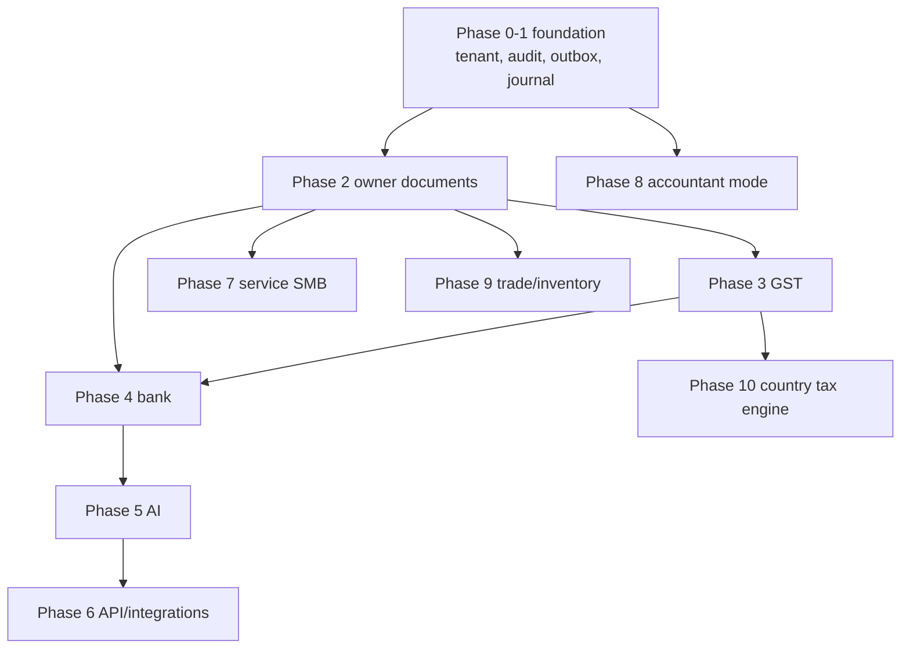
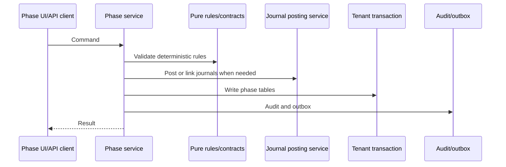

# Phases 02-10 Roadmap Plans

Date: 2026-06-16

Updated: 2026-06-17.

Source spec: `docs/superpowers/specs/2026-06-16-ai-native-accounting-foundation-design.md`

Foundation amendment: `docs/superpowers/plans/2026-06-17-accounting-foundation-schema-revision-plan.md`

Use this file as the compact roadmap. Dedicated phase files remain execution references, but each later phase must receive a fresh review before execution.

## Foundation Alignment

All later phases build on:

- `organization_setting`.
- `ledger_account`.
- `number_sequence`.
- `source_document`.
- `journal_batch`.
- `journal_line`.
- `audit_event`.
- `outbox_event`.
- `idempotency_ledger`.

Do not reintroduce `business_profile`, `account_group`, simple `journal`, `internal_event`, `audit_log`, document-specific sequence tables, or app-owned API-key tables.

## Roadmap Architecture Map

Shared service pattern for every later phase:

## Phase 02: Owner Workflow MVP

**Goal:** Let non-technical owners create invoices, record expenses, record payments, and see a simple business dashboard.

**Prerequisites:**

- Phase 0 complete.
- Phase 1 complete.
- `journal_batch` posting service stable.
- `ledger_account` default chart seeded.
- `number_sequence` available.

**Core modules:**

- `party`.
- `item`.
- `sales_invoice`.
- `sales_invoice_line`.
- `purchase_bill` or `expense`.
- `purchase_bill_line` or `expense_line`.
- `receipt`.
- `payment`.
- `receipt_allocation`.
- `payment_allocation`.
- document attachments.
- PDF rendering.
- email/share link.

**Data model additions:**

- `party`: customers/vendors using owner-facing labels in UI.
- `item`: goods/services catalog.
- document subtype tables link to `source_document`.
- posted documents link to the created `journal_batch`.
- payments allocate against invoices/bills through settlement/allocation tables.

**UX rule:** UI says customer, vendor, invoice, expense, money received, money paid. It does not require debit/credit knowledge.

**Accounting rule:** Every posted invoice, expense, receipt, and payment creates a balanced `journal_batch` through the existing posting service.

**Exit criteria:**

- Owner can create customer/vendor.
- Owner can create item/service.
- Draft document does not affect books.
- Posted document creates balanced batch.
- Owner can download/share invoice PDF.
- Owner can record money received/paid.
- Dashboard shows receivables, payables, cash/bank, sales, and expenses.

## Phase 03: India GST Core

**Goal:** Make owner workflows GST-aware for India without starting full filing automation.

**Prerequisites:**

- Phase 2 document posting stable.
- Parties and items exist.
- Source documents and posted batches are reliable.

**Core modules:**

- GST settings.
- GSTIN/PAN/state validation.
- HSN/SAC on items.
- Place-of-supply rules.
- `tax_code`.
- `tax_code_component`.
- CGST/SGST/IGST split.
- Tax invoice fields.
- Credit/debit notes.
- GSTR-1 working report.
- GSTR-3B working report.

**Data model additions:**

- `tax_code` and `tax_code_component`.
- GST details on source/document subtype tables.
- line-level tax summaries.
- credit/debit note subtype tables or document type extension.
- GST return snapshot tables only when reports need immutable exports.

**Exit criteria:**

- Registered business can create GST tax invoice.
- Unregistered business can create bill of supply or non-GST invoice.
- Intra-state invoice calculates CGST/SGST.
- Inter-state invoice calculates IGST.
- GST reports reconcile with posted batches.
- Credit/debit notes post reversals or adjustments correctly.

## Phase 04: Bank and Reconciliation

**Goal:** Reduce manual bookkeeping through bank import, matching, and review.

**Prerequisites:**

- Phase 2 payments stable.
- Phase 3 tax posting stable for taxable entries.

**Core modules:**

- Bank account setup.
- Statement import.
- Transaction normalization.
- Matching engine.
- Rule engine.
- Reconciliation queue.
- Reconciliation report.

**Data model additions:**

- `bank_statement`.
- `bank_statement_line`.
- `reconciliation_match`.
- optional `bank_rule` after matching patterns are clear.

**Exit criteria:**

- Owner imports bank CSV/XLSX.
- Duplicate import rows are detected.
- System suggests invoice/expense/payment matches.
- Owner approves suggested matches.
- Approved match links or posts through existing batch services.
- Reconciliation report shows unmatched rows.

## Phase 05: AI Assistant

**Goal:** Add controlled AI suggestions over receipts, bank transactions, invoices, and reports.

**Prerequisites:**

- Phase 4 reconciliation queue exists.
- `outbox_event` exists.
- `audit_event` exists.
- Service layer covers all mutations.

**Core modules:**

- Receipt extraction.
- Expense categorization suggestions.
- Invoice draft suggestions.
- Bank matching suggestions.
- Report Q&A.
- Evidence and confidence storage.

**Data model additions:**

- `ai_suggestion`.
- `ai_extraction`.
- `ai_conversation`.
- `ai_message`.
- `ai_tool_call`.

**Guardrail:** AI suggests and drafts. Human approves all postings.

**Exit criteria:**

- Receipt image can produce draft expense.
- Bank transaction can produce suggested match.
- Owner can ask simple report questions.
- AI answer links source documents.
- Rejected suggestions are stored for learning signals.
- No AI path writes posted batches directly.

## Phase 06: Platform API and Integrations

**Goal:** Expose stable integration surface after core workflows are trusted.

**Prerequisites:**

- Phase 5 service layer stable.
- API key decision finalized and dependency versions aligned.
- `outbox_event` covers core domain actions.

**Core modules:**

- Public REST/RPC API.
- OpenAPI documentation.
- API key scopes.
- Webhook subscriptions.
- Webhook delivery worker.
- Signed webhooks.
- Delivery retries.
- Dead-letter queue.
- MCP server.
- Integration logs.

**Data model additions:**

- `app_connection`.
- `external_reference`.
- `webhook_destination`.
- `webhook_subscription`.
- `webhook_delivery`.
- `integration_log`.
- `mcp_tool_policy`.

**Exit criteria:**

- Developer can create scoped API key.
- API can read customers, invoices, payments, reports.
- API can create draft invoices.
- Posting endpoints require explicit permission and idempotency ledger.
- Webhooks deliver signed events from `outbox_event`.
- Failed webhooks retry and expose logs.
- MCP exposes read/draft tools separately from posting tools.

## Phase 07: Service SMB Expansion

**Goal:** Serve service businesses better without becoming full project-management software.

**Core modules:**

- Recurring invoice.
- Retainer tracking.
- Quote/proposal.
- Client statement.
- Lightweight project.
- Lightweight timesheet.
- Payment link integration.

**Data model additions:**

- `quote`.
- `quote_line`.
- recurring schedule/template/run tables.
- `project`.
- `timesheet_entry`.
- `client_statement_snapshot`.
- payment-link metadata.

## Phase 08: Accountant Mode

**Goal:** Give accountants review and adjustment tools without making them a day-1 dependency.

**Core modules:**

- Multi-business switcher.
- Review queue.
- Period lock workflow.
- Adjustment batch workflow.
- Working paper attachments.
- Tally export.
- Excel export.

**Data model additions:**

- `review_item`.
- accountant workspace metadata if needed.
- working papers.
- `export_job`.

Prefer using existing `accounting_period` lock fields before adding a separate `period_lock` table.

## Phase 09: Trade, Inventory, Import, Export

**Goal:** Expand from service and simple SMB accounting into inventory and trade workflows.

**Core modules:**

- Stock item.
- Warehouse.
- Stock ledger.
- Purchase order.
- Sales order.
- Delivery note.
- Goods receipt.
- Landed cost.
- Foreign currency invoice.
- Import/export documents.

**Data model additions:**

- `warehouse`.
- stock item extensions.
- `stock_ledger_entry`.
- `purchase_order`.
- `sales_order`.
- `goods_receipt`.
- `delivery_note`.
- `landed_cost_allocation`.
- exchange-rate tables and FX posting support.

## Phase 10: Country-Agnostic Tax Engine

**Goal:** Turn India-specific accounting into a localization-based accounting platform.

**Core modules:**

- Tax plugin interface.
- Country pack registry.
- VAT/GST report templates.
- Invoice schema registry.
- Localization fixtures.
- Country-specific validation.

**Data model additions:**

- `tax_localization_pack`.
- `tax_rule`.
- `tax_report_template`.
- `localized_document_schema`.
- `country_compliance_setting`.

## Roadmap Discipline

Each phase starts with:

- fresh design review;
- detailed implementation plan refresh;
- test plan;
- migration plan;
- exit criteria review.

Each phase should avoid expanding scope until its exit criteria pass.
