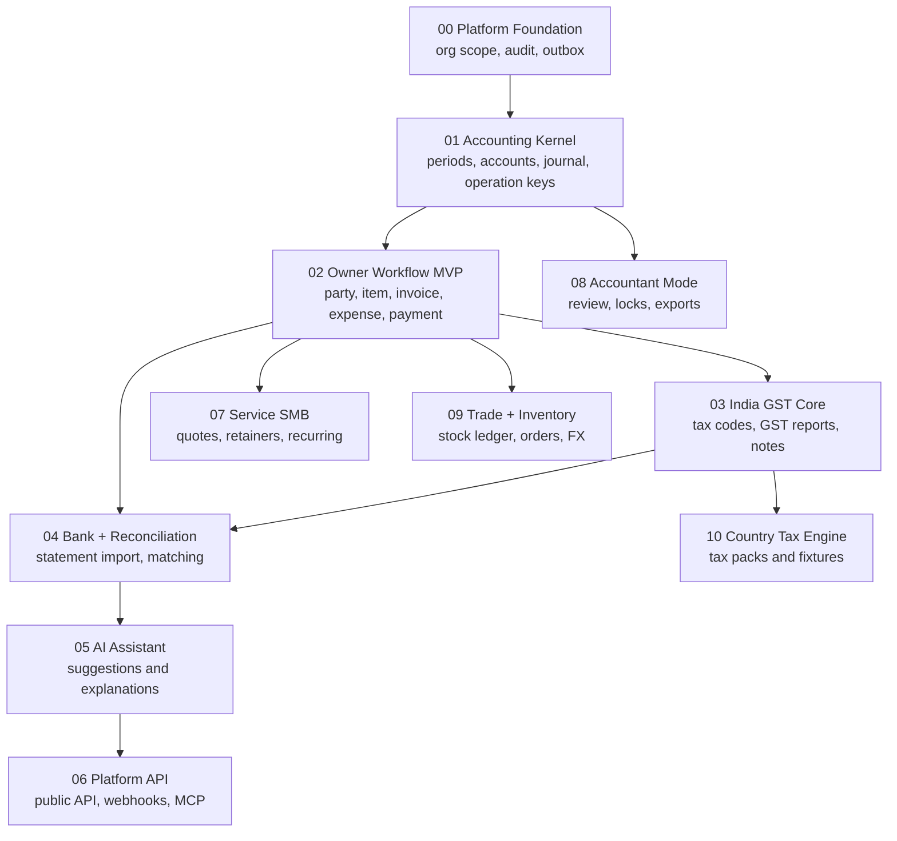

# AI-Native Accounting Plan Set

Date: 2026-06-16

Updated: 2026-06-19.

Source spec: `docs/superpowers/specs/2026-06-16-ai-native-accounting-foundation-design.md`

Schema amendment: `docs/superpowers/plans/2026-06-17-accounting-foundation-schema-revision-plan.md`

Decision record: `docs/decisions/0001-accounting-foundation-spine.md`

## Plan Files

- `docs/superpowers/plans/2026-06-16-phase-00-platform-foundation-implementation-plan.md`
- `docs/superpowers/plans/2026-06-16-phase-01-accounting-kernel-implementation-plan.md`
- `docs/superpowers/plans/2026-06-16-phase-02-owner-workflow-mvp-detailed-plan.md`
- `docs/superpowers/plans/2026-06-16-phase-03-india-gst-core-detailed-plan.md`
- `docs/superpowers/plans/2026-06-16-phase-04-bank-reconciliation-detailed-plan.md`
- `docs/superpowers/plans/2026-06-16-phase-05-ai-assistant-detailed-plan.md`
- `docs/superpowers/plans/2026-06-16-phase-06-platform-api-integrations-detailed-plan.md`
- `docs/superpowers/plans/2026-06-16-phase-07-service-smb-expansion-detailed-plan.md`
- `docs/superpowers/plans/2026-06-16-phase-08-accountant-mode-detailed-plan.md`
- `docs/superpowers/plans/2026-06-16-phase-09-trade-inventory-import-export-detailed-plan.md`
- `docs/superpowers/plans/2026-06-16-phase-10-country-tax-engine-detailed-plan.md`
- `docs/superpowers/plans/2026-06-16-phases-02-10-roadmap-plans.md`
- `docs/superpowers/plans/2026-06-17-accounting-foundation-schema-revision-plan.md`

## Execution Order

1. Phase 0: Platform Foundation.
2. Phase 1: Accounting Kernel.
3. Phase 2: Owner Workflow MVP.
4. Phase 3: India GST Core.
5. Phase 4: Bank and Reconciliation.
6. Phase 5: AI Assistant.
7. Phase 6: Platform API and Integrations.
8. Phase 7: Service SMB Expansion.
9. Phase 8: Accountant Mode.
10. Phase 9: Trade, Inventory, Import, Export.
11. Phase 10: Country-Agnostic Tax Engine.

## Current Progress

Phase 0 is the active phase.

Done:

- Workspace dependency catalog and lockfile refreshed.
- Better Auth organization support enabled and generated into the DB schema.
- `packages/db` split into client, migration, query, schema, health, and utility modules.
- Foundation tables added: `organization_setting`, `currency`, `audit_event`, and `outbox_event`.
- App-owned UUID primary keys use UUID-v7 runtime defaults.
- API context carries eager `authSession`, DB client, and request logger.
- `organizationProcedure` verifies membership from client-provided `orgSlug` and exposes canonical `organizationId`.
- Organization settings get/upsert procedures are wired.
- Organization settings upsert writes settings and best-effort user audit, then returns `{ ok: true, organizationId }`.
- Currency seed migration inserts `INR`, `USD`, `EUR`, and `GBP`.
- Role permission helpers/tests exist in `packages/auth`.
- Organization membership, settings audit, and schema invariant tests exist.

Not done:

- Business onboarding/settings UI.
- Local migration apply is blocked until local Postgres/Docker is running.
- Transactional outbox writes for commands that have real async consumers.
- Phase 1 accounting kernel schema and posting services.

Important current decision: `outbox_event` is foundation infrastructure, not a blanket side effect for every mutation. For settings upsert, audit is fire-and-forget because no caller depends on it. Phase 1 posting and future integration commands should use awaited transactional audit/outbox when correctness, retries, or downstream delivery depend on those rows.

Idempotency decision: `requestId` is tracing only. Phase 0 does not include a
generic `idempotency_ledger`; Phase 1 posting should use operation-local
idempotency through a command key or domain-owned unique constraint. Reconsider
a central replay store only for Phase 6 public API response-replay semantics.

## Execution Graph

Execution rules:

- Phase 0 and Phase 1 are hard gates.
- Phase 3 should not start until Phase 2 document posting is stable.
- Phase 5 can suggest and draft only after deterministic services exist.
- Phase 6 exposes public contracts only after internal services are stable.
- Phase 9 stock ledger is separate from tenant-scope inventory.

## Foundation Vocabulary

Use these names across all plans:

- `organization_setting`, not `business_profile`.
- `ledger_account`, not `account_group` plus `account`.
- `journal_batch` and `journal_line`, not a simple `journal` table.
- `audit_event`, not `audit_log`.
- `outbox_event`, not `internal_event`.
- operation-local idempotency keys, not a generic Phase 0 ledger.
- `number_sequence`, not document-specific sequence tables.
- `source_document` as the common document-to-ledger traceability shell.

## Plain-Language Glossary

Use these meanings when reading or implementing the plans:

- `organization`: Better Auth's word for a business tenant. In the UI, call it "Business".
- `tenant`: one isolated business's data. A user may belong to many tenants, especially accountants.
- `organization_id`: the column that marks which business owns a row.
- `tenant scope`: the active Better Auth business context used to filter app-owned rows.
- `tenant-scope inventory`: a security checklist that verifies app-owned business tables have `organization_id` and query paths include explicit organization scope. It is not product inventory, stock, warehouses, or goods movement.
- `PostgreSQL RLS`: row-level security. Deferred for MVP because this repo uses Better Auth with direct Drizzle/Postgres instead of Supabase Auth/PostgREST request context.
- `organization-scoped transaction`: a normal database transaction where every tenant query includes `organizationId`.
- `report snapshot`: a stable read view for reports/exports. It does not mean an organization data snapshot table or stock inventory.
- `Better Auth-owned table`: a table generated and managed by Better Auth, such as `user`, `session`, `organization`, `member`, or `invitation`.
- `app-owned table`: a table owned by this accounting app, such as `organization_setting`, `journal_batch`, or `invoice`.
- `global reference table`: shared lookup data that is not owned by one business, such as `currency`.
- `audit_event`: durable record that a sensitive action happened, who did it, and what changed.
- `outbox_event`: a queued domain event written in the same database transaction as the business change, then processed later by jobs, webhooks, AI indexing, or integrations.
- `requestId`: per-attempt log correlation id. It is not replay protection.
- `operation key`: domain command key used to prevent duplicate accounting commands, usually enforced with a per-organization unique constraint.
- `source_document`: shared document header used to connect invoices, expenses, payments, and other business documents to accounting postings.
- `journal_batch`: one accounting posting operation.
- `journal_line`: one debit or credit line inside a `journal_batch`.
- `number_sequence`: the per-business counter that allocates journal, invoice, receipt, and other document numbers.
- `minor units`: integer money storage, such as paise/cents. INR 123.45 is stored as `12345`, avoiding floating-point rounding bugs.
- `normal balance`: whether an account normally increases by debit or credit.
- `control account`: a ledger account controlled by another workflow, such as Accounts Receivable from invoices, rather than casual manual journal entry.
- `reconcilable account`: an account expected to be matched against statements or subledgers, such as bank or receivables.
- `reversal`: correcting an accounting posting by creating a new opposite posting instead of editing history.
- `subledger`: detailed customer/vendor/payment records that explain a control account balance.
- `settlement` or `allocation`: linking a receipt/payment amount to one or more invoices/bills.
- `OpenAPI snapshot`: a test fixture of the API schema used to detect accidental API changes. It is unrelated to stock inventory.
- `report snapshot`: an immutable saved copy of a report/export at a point in time.
- `MCP`: Model Context Protocol; future integration surface for AI/tools, not part of Phase 0/1.
- `inventory` or `stock ledger`: actual stock/goods tracking. This starts in Phase 9 and is unrelated to tenant-scope inventory.

## Repo Baseline

- Use `@tsu-stack/*` package names.
- Use `packages/core` for shared contracts and pure helpers.
- Use `packages/db` for schema, migrations, DB client, and query helpers.
- Use `packages/auth` for Better Auth config.
- Use `packages/api` for Hono/oRPC routers.
- Use `apps/web` for TanStack Start UI.
- Use Vite Plus commands through root scripts.

Do not introduce `packages/domain`, `packages/shared`, or `@app/*` imports as part of these plans.

## Core Rule

Phase 0 and Phase 1 are foundation phases. They should be implemented slowly, tested heavily, and kept small enough to reason about.

No invoice, expense, GST filing, bank reconciliation, AI assistant, public API, MCP, webhook delivery, recurring workflow, inventory, import/export, or country-pack work should begin until Phase 0 and Phase 1 are stable.

## Phase Gate

Before moving beyond Phase 1:

- Auth and organization membership work.
- `organization_setting` exists for each business.
- Role checks are server-enforced.
- `audit_event` records sensitive mutations.
- `outbox_event` rows are written transactionally for commands with durable async consumers.
- operation-local idempotency prevents duplicate posting.
- App-owned tenant tables have `organization_id` and are only accessed through organization-scoped service/query paths.
- Fiscal years and accounting periods exist.
- `ledger_account` chart exists.
- `number_sequence` exists.
- `source_document` minimal shell exists.
- `journal_batch` and `journal_line` exist.
- Posted batches are immutable.
- Reversals create separate batches.
- Trial balance balances.
- Accounting-core tests pass.
- Phase 1 does not include `party`, `tax_code`, owner documents, subledger, or balance-cache tables.
