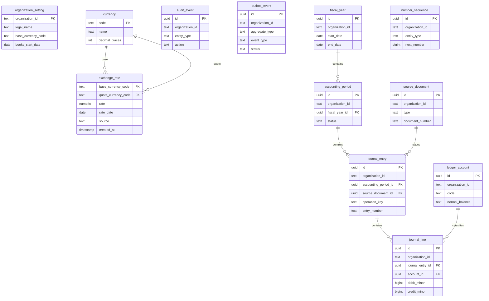
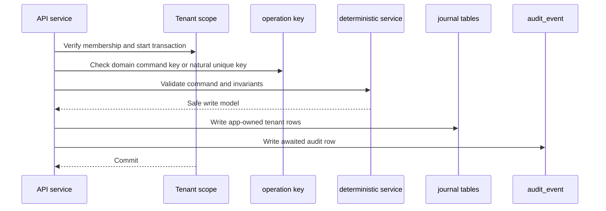

# Accounting Foundation Schema Revision Plan

Date: 2026-06-17

Status: Accepted source of truth for foundation schema and plan vocabulary.

Updated: 2026-06-19. Phase 0 foundation schema is implemented in the worktree:
Better Auth organization tables, `organization_setting`, `currency`,
`exchange_rate`, `audit_event`, and `outbox_event`. App-owned UUID primary keys use UUID-v7
runtime defaults; Better Auth-owned IDs stay generated text IDs.

Reference only: `/Users/docbook/edernal-company/temp-edernal-books`.

Decision record: `docs/decisions/0001-accounting-foundation-spine.md`.

## Purpose

Use the stronger accounting spine found in the reference repo without copying its full future-phase schema into Phase 0/1.

The right direction is:

- Keep the product sequence already planned: platform, ledger kernel, owner workflows, GST, bank, AI, integrations.
- Adopt durable foundation names: `organization_setting`, `ledger_account`, `journal_entry`, `source_document`, `number_sequence`, `audit_event`, and `outbox_event`.
- Keep Phase 0/1 small. Do not add tables or fields until a phase has a service that writes and reads them.

## Foundation Data Map

## Foundation Write Path

## Terminology Notes

- Tenant-scope inventory is a security checklist for app-owned tables and query paths. It is not the inventory/stock module.
- Report snapshot reads should use normal transaction/read-consistency tools when needed. They do not mean a saved organization profile snapshot.
- `snapshot` has three meanings in these plans: database read consistency, immutable report/export copies, and OpenAPI schema snapshot tests. None of those meanings is stock inventory.
- `organization` is Better Auth's internal term for a business tenant. Product UI should say "Business".
- `outbox_event` and `audit_event` are infrastructure tables. `audit_event` protects traceability. `outbox_event` records durable async intent only when a worker, webhook, public API, integration, AI indexer, or other retrying consumer exists.
- Not every Phase 0 mutation must write every infrastructure row. Use
  fire-and-forget audit only for non-critical history trails. Use
  awaited transactional audit for accounting mutations. Use outbox only when
  downstream delivery depends on those rows.

## Decisions

### D1: Identifier Strategy

Do not force Better Auth to use UUID-v7 IDs in this repo.

Why:

- Current generated Better Auth tables use text IDs.
- Forcing UUID-v7 would turn a planning cleanup into an auth schema migration.
- App-owned foreign keys that reference Better Auth tables must match the generated Better Auth column type.

Rules:

- Better Auth-owned IDs keep the type Better Auth generates.
- In this repo today, generated Better Auth IDs are text.
- `organization_id` and `user_id` columns that reference Better Auth tables use text unless the generated Better Auth schema changes in a separate migration decision.
- App-owned accounting table primary keys may use UUID-v7, but tenant foreign keys that point to Better Auth stay aligned with Better Auth IDs.
- App-owned tenant foreign keys compare `organization_id` as text. Do not cast these Better Auth IDs to UUID in this repo.
- Accounting child tables use composite tenant foreign keys for tenant-owned references, for example `journal_line(organization_id, account_id)` to `ledger_account(organization_id, id)`.
- Parent accounting tables add unique `(organization_id, id)` constraints where needed to support composite foreign keys, even when `id` is already the primary key.

### D2: Money

Store ordinary money as integer minor units:

- `*_minor bigint` for money amounts.
- `numeric(20, 10)` for exchange rates.
- `numeric(9, 4)` for tax rates.
- `numeric(18, 4)` for quantities.
- oRPC and JSON DTOs expose `*_minor` values as decimal strings, not JavaScript `bigint`.

Foreign-currency documents store exchange-rate snapshots at transaction time:

- `currency_code`.
- `base_currency_code`.
- `exchange_rate`.
- `exchange_rate_date`.
- foreign amount minor units.
- base amount minor units.

Do not use the current exchange rate when viewing old bills, invoices, payments, or ledger events. Differences between booking-rate and settlement-rate snapshots become realized FX gain/loss postings.

Phase 1 journal posting is simpler: journal lines store only base debit/credit minor units. Base currency lives on `organization_setting`, is locked after fiscal-year setup, and is not fetched or copied into every journal line.

Why:

- Minor units avoid JavaScript floating-point drift.
- Decimal strings stay at input/output boundaries only.
- Tax rates, quantities, and exchange rates still need decimal precision.

### D3: Idempotency

Use operation-local idempotency, not a generic Phase 0 ledger.

Rules:

- `requestId` is log/audit correlation only. It is never a duplicate-prevention key.
- Natural upserts, such as `organization_setting`, rely on their natural key.
- Posting commands carry an operation key and enforce uniqueness in the domain table, for example `(organization_id, operation_key)` on `journal_entry`.
- Phase 1 posting writes journal rows and an audit row in the same database transaction. It stores a narrow request hash on `journal_entry` to reject same-key payload mismatches, but does not write outbox rows. It may take a narrow transaction advisory lock on `(organization_id, operation_key)` before number allocation so concurrent duplicate retries do not consume voucher numbers.
- External provider flows may use provider request ids or provider object ids as the operation-local key when those ids represent the same business operation.
- `source_document` does not get an `idempotency_key` column.
- A central replay store can be reconsidered in Phase 6 only if public API clients need terminal response replay across unrelated endpoint types.

Why:

- Accounting needs duplicate protection, but the key should live where the business operation is defined.
- A generic replay ledger adds lock expiry, response storage, and status transitions before any public API needs that machinery.
- Request ids change per retry, so they cannot protect money-moving writes.

### D4: Tenant Isolation Boundary

Use app-enforced tenant isolation for MVP.

Rules:

- Better Auth-owned tables are excluded from app tenant-scope inventory.
- App-owned tenant tables have `organization_id`.
- Service reads/writes verify Better Auth membership before using an `organizationId`.
- Reusable DB query functions require `organizationId` in their input and include an organization predicate.
- PostgreSQL RLS is deferred until after MVP.

### D5: Phase-Owned Migrations

Use `packages/db/src/schema/migration.ts` as the active migration boundary.

Rules:

- A table is not shipped until it is exported from `schema/migration.ts`.
- Future draft schema files may exist only if clearly marked as future-phase drafts.
- Tenant-scope inventory verifies active migration tables, not every experimental schema export.
- Phase plans must not add future-phase tables to the migration entrypoint early.

## Phase Ownership

### Phase 0: Platform Foundation

Add:

- Better Auth organization/member/invitation support.
- `organization_setting`.
- `currency`.
- `exchange_rate`.
- `audit_event`.
- `outbox_event`.
- Tenant-scoped query helpers as needed.

Current implementation note: Better Auth organization/member/invitation support
is enabled. API-key support remains future Phase 6 unless a concrete public API
surface requires it.

Do not add:

- `party`.
- `tax_code`.
- document subtype tables.
- bank/reconciliation tables.
- webhook delivery tables.
- AI tables.

### Phase 1: Accounting Kernel

Add:

- `fiscal_year`.
- `accounting_period`.
- `ledger_account`.
- `number_sequence`.
- minimal `source_document`.
- `journal_entry`.
- `journal_line`.

Do not add:

- `party`.
- `tax_code`.
- `tax_code_component`.
- invoice/bill/payment tables.
- subledger/settlement tables.
- balance cache tables.
- FX posting fields on journal lines.
- persisted journal drafts.
- central replay tables or public API idempotency ledgers.
- Phase 1 outbox producers.

Why:

- The journal kernel can post opening balances and manual/advanced entries without parties or taxes.
- Party and tax columns would be nullable placeholders until Phase 2/3.
- Adding nullable placeholders early weakens schema clarity and creates migrations before behavior exists.

### Phase 2: Owner Workflow MVP

Add:

- `party`.
- `item`.
- owner documents: invoice, expense/bill, receipt, payment.
- document subtype tables that link to `source_document`.
- subledger/settlement/allocation tables.
- document attachments and delivery logs.

Use existing foundation:

- `number_sequence` allocates document numbers.
- posted documents create `journal_entry` rows.
- document services write `audit_event`.
- document services start `outbox_event` writes only when an async consumer or integration requires them.
- posting replay uses operation-local command keys.

### Phase 3: India GST Core

Add:

- `tax_code`.
- `tax_code_component`.
- GST settings/details/line tax summaries.
- credit/debit note support.
- GST report snapshots/exports.

Why tax starts here:

- Phase 2 can create tax-ready document shapes, but GST correctness needs state, registration, HSN/SAC, place-of-supply, and component split rules.
- Keeping tax out of Phase 1 prevents a pretend tax foundation with no owner workflow consumer.

### Later Phases

- Phase 4 adds bank statement import and reconciliation.
- Phase 5 adds AI suggestion/explanation tables only after deterministic services exist.
- Phase 6 adds public API, integrations, webhook delivery, external references, and MCP.
- Phase 7 adds recurring/service-SMB workflows.
- Phase 8 adds accountant review/adjustment workflow metadata.
- Phase 9 adds inventory/trade/import/export and full FX behavior.
- Phase 10 adds country tax localization packs.

## Table Decisions

### `organization_setting`

One app-owned row per Better Auth organization.

Phase 0 fields:

- `organization_id`.
- `legal_name`.
- `trade_name`.
- `country_code`.
- `base_currency_code`.
- `timezone`.
- `fiscal_year_start_month`.
- `books_start_date`.
- `primary_email`.
- `primary_phone`.
- `created_at`.
- `updated_at`.

Defer:

- PAN, GSTIN, and GST registration details to Phase 3.
- invoice profile fields to Phase 2.
- feature flags to an explicit feature/config table when there is a consumer.
- approval mode until a real approval workflow exists.
- registered address split until documents need formatted addresses.

Lock after books exist:

- `base_currency_code`.
- `fiscal_year_start_month`.
- `books_start_date`.

These fields become immutable once fiscal years exist. Phase 1 enforces this in the settings write path; add a PostgreSQL trigger later only when another writer path can bypass the service.

### `currency` and `exchange_rate`

`currency` is static supported currency metadata:

- `code`.
- `name`.
- `symbol`.
- `decimal_places`.
- `active`.

Drizzle migrations create the table only. They do not own reference rows such as `INR`, `USD`, `EUR`, or `GBP`; those rows belong to a separate seed/admin path.

`exchange_rate` is a dated FX snapshot table:

- `base_currency_code`.
- `quote_currency_code`.
- `rate`.
- `rate_date`.
- `source`.
- `created_at`.

Documents and payments copy exchange-rate details into their own snapshot fields when posted. Historical views read stored snapshots, not the latest `exchange_rate` row. Journal lines stay base-amount-only until FX workflows exist.

### `ledger_account`

Use one hierarchical chart table instead of `account_group` plus `account`.

Keep:

- hierarchy.
- account category/type.
- normal balance.
- system key.
- group/posting distinction.
- manual posting flag.

Why:

- Separate account groups are too weak for posting rules.
- A single table handles system accounts, groups, and leaf accounts.
- Composite `(organization_id, parent_account_id)` references prevent cross-tenant account hierarchies.
- Parent and child accounts must share the same accounting category.
- Accounts Receivable and Accounts Payable are control-style system accounts, but Phase 1 enforces that through `allow_manual_posting = false` instead of a separate control-account flag.

### `source_document`

Phase 1 anchor fields:

- `id`.
- `organization_id`.
- `type`.
- nullable `document_number`.
- `created_at`.

- Do not add raw idempotency keys to `source_document`; posting replay belongs
  to the posting command or external provider boundary that owns the duplicate
  risk.
- document status/lifecycle until Phase 2.
- document dates, totals, currency, and exchange rates until Phase 2.
- `party_id` until Phase 2.
- approval lifecycle until Phase 2 or later.
- snapshots/render context until PDFs and delivery exist.
- outstanding/allocation fields until payments and subledger exist.

### `journal_entry` and `journal_line`

`journal_entry` represents one posted accounting fact. `journal_line` represents balanced debits and credits.

Keep in Phase 1:

- entry number.
- posting date.
- accounting period link.
- source document link.
- operation key.
- reversal link.
- posted metadata.
- line account, base debit/credit minor units, and description.

Database invariants:

- `journal_entry` has unique `(organization_id, id)` and unique `(organization_id, operation_key)`.
- `journal_line` references `journal_entry` through `(organization_id, journal_entry_id)`.
- `journal_line` references `ledger_account` through `(organization_id, account_id)`.
- `journal_entry.accounting_period_id`, `source_document_id`, and `reversal_of_entry_id` are tenant-scoped composite references.
- Posted entries and lines are written only by posting/reversal services in Phase 1; composite foreign keys, checks, and unique constraints guard table shape. Add PostgreSQL immutability triggers only when another writer path exists.
- Posting validates at least two lines, no negative/zero lines, one side per line, and balanced base debit/credit totals.
- `number_sequence` allocation uses atomic `UPDATE ... RETURNING` or an explicit row lock inside the posting transaction.
- Reversal creates another posted journal entry linked by `reversal_of_entry_id`; the original does not get a `reversed` status.

Defer:

- `party_id` on lines until Phase 2.
- `tax_code_id` on lines until Phase 3.
- per-line currency, transaction-currency, and exchange-rate fields until FX workflows exist.
- dimensions until there is a reporting requirement.

## Naming Replacements

Use these replacements everywhere in docs and implementation:

- `business_profile` -> `organization_setting`.
- `account_group` + `account` -> `ledger_account`.
- simple `journal` table -> `journal_entry`.
- `internal_event` -> `outbox_event`.
- `audit_log` -> `audit_event`.
- `idempotency_key` table -> operation-local command key.
- `number_sequence` -> `number_sequence`.
- `journal_entry_id` -> `journal_entry_id` or `source_document_id`, depending on direction.

## Repo Fit

This repo is `tsu-stack`, not a fresh `@app/*` scaffold.

Plan files must use:

- package imports under `@tsu-stack/*`.
- shared schemas/contracts in `packages/core`.
- API/router code in `packages/api`.
- database schema in `packages/db`.
- web UI in `apps/web`.
- Vite Plus commands (`vp`) through the root scripts where possible.

Do not introduce `packages/domain` or `packages/shared` unless a later architecture decision explicitly creates them.

## Review of Other Agent Plan

The other agent's June 17 direction makes sense at the accounting-spine level:

- stronger `ledger_account`;
- `journal_entry` as posting unit;
- `source_document` as traceability backbone;
- audit from day one, with operation-local idempotency at posting boundaries;
- tenant isolation from day one.

Changes needed before using it:

- remove forced Better Auth UUID-v7 assumption;
- keep Better Auth ID types generated by this repo;
- move `party` from Phase 1 to Phase 2;
- move `tax_code`/`tax_code_component` from Phase 1 to Phase 3;
- slim `organization_setting`;
- slim Phase 1 `source_document`;
- remove `party_id`, `tax_code_id`, and dimensions from Phase 1 journal lines;
- keep Phase 1 journal lines base-amount-only with no per-line currency column;
- keep request hashing local to `journal_entry` and remove central idempotency ledgers from Phase 1 posting;
- defer Phase 1 outbox producers until public/integration/async consumers exist;
- align package paths and commands to `tsu-stack`.

## Verification Checklist

- [x] Docs say `organization == business`.
- [x] App-owned settings live in `organization_setting`.
- [x] Supported currency rows are seeded/admin-managed outside schema migrations.
- [x] `exchange_rate` stores dated FX snapshots.
- [x] No `business_entity` table in Phase 0/1.
- [x] No forced Better Auth UUID-v7 migration.
- [x] `organization_id` references Better Auth IDs as text in this repo.
- [x] Tenant query predicates compare text IDs and do not cast to UUID.
- [x] Tenant-scoped services verify membership before querying.
- [x] Active migrations export only current phase-owned tables.
- [x] Phase 1 uses `ledger_account`.
- [x] Phase 1 uses `journal_entry`.
- [x] Phase 1 includes `accounting_period`.
- [x] Phase 1 includes minimal `source_document`.
- [x] Phase 1 excludes `party`.
- [x] Phase 1 excludes `tax_code` and `tax_code_component`.
- [x] Phase 1 journal lines store base debit/credit amounts only; no per-line currency code.
- [x] Phase 1 has no persisted journal drafts.
- [x] Money uses minor units.
- [x] oRPC serializes minor units as strings.
- [x] `outbox_event` replaces `internal_event`.
- [x] `audit_event` replaces `audit_log`.
- [x] Operation-local command keys replace simple global idempotency-key tables.
- [x] Phase 1 operation keys use a narrow `journal_entry.request_hash`, not a central replay store; journal posting uses a narrow transaction advisory lock before number allocation.
- [x] `number_sequence` replaces document-specific sequence tables.
- [x] Phase 1 references use composite tenant foreign keys.
- [x] Posted journal writes go through posting/reversal services with DB constraints; triggers are deferred until another writer path exists.
- [x] Accounting foundation settings lock after fiscal-year setup in the settings write path.
- [x] Later plans reference this amendment before execution.
