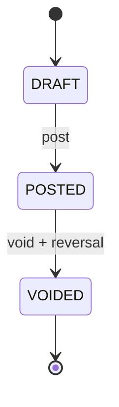

# Phase 02.5 Document Spine Plan

Date: 2026-06-28
Status: Implemented baseline
Roadmap position: between Phase 02 parties/items foundation and Phase 03 India GST Core

Source-document update: [ADR-0012](../../decisions/0012-replace-source-document-with-journal-source-metadata.md)
supersedes this plan's `source_document` references. Current document spine
uses typed document tables with `journal_entry_id`; `journal_entry` carries
source trace/cache metadata.

## Purpose

Build the document spine that Phase 03 GST, Phase 04 bank reconciliation,
Phase 05 AI, Phase 06 public API, and later PDF/share workflows can attach to.
This slice turns invoices, purchase bills/expenses, and settlements into
source-backed posted documents through the Phase 01 accounting kernel.

This is not a GST slice, PDF delivery slice, AI assistant slice, or bank
reconciliation slice.

Related glossary and decisions:

- `CONTEXT.md`: Document Spine, Tax-Ready Metadata, Settlement, Void.
- `docs/decisions/0006-quarantine-tax-ready-metadata-until-gst-core.md`.
- `docs/decisions/0007-use-settlement-for-receipts-and-payments.md`.
- `docs/decisions/0008-document-lifecycle.md`.
- `docs/decisions/0009-use-typed-document-tables.md`.
- `docs/decisions/0010-allocate-document-numbers-on-post.md`.

## Current Gate

Phase 02 foundation drift was repaired before implementing this slice:

- Paraglide generated message functions were regenerated.
- DB integration script now runs the intended accounting, parties/items, and
  document integration tests.
- Party/item PostgreSQL error mapping unwraps Drizzle-wrapped errors.
- `@tsu-stack/api` still has no `test:unit` script; use workspace check and DB
  service tests as the current API gate.

Latest local verification for this implementation:

- `rtk vp run --filter @tsu-stack/core test:unit`.
- `rtk vp run --filter @tsu-stack/db test:unit`.
- `rtk vp run --filter @tsu-stack/db test:integration` with
  `DB_INTEGRATION_TESTS=1`.
- `rtk vp check`.

## Reference Architecture Notes

### Midday AI / Modern Production Shape

Use Midday as the modern product/code-organization reference, especially for
draft invoice tooling, invoice preview/PDF package boundaries, product-aware
line-item UX, and assistant-callable deterministic tools.

Reference files:

- [chat prompt invoice rules](https://github.com/midday-ai/midday/blob/main/apps/api/src/chat/prompt.ts)
- [invoice MCP tools](https://github.com/midday-ai/midday/blob/main/apps/api/src/mcp/tools/invoices.ts)
- [invoice package types](https://github.com/midday-ai/midday/blob/main/packages/invoice/src/types.ts)
- [PDF template package](https://github.com/midday-ai/midday/blob/main/packages/invoice/src/templates/pdf/index.tsx)
- [invoice form](https://github.com/midday-ai/midday/blob/main/apps/dashboard/src/components/invoice/form.tsx)
- [invoice product queries](https://github.com/midday-ai/midday/blob/main/packages/db/src/queries/invoice-products.ts)

Adopt:

- AI or chat tools create and update drafts first; sending or finalizing needs
  explicit user confirmation.
- Customer resolution happens before draft creation. Fuzzy matches ask instead
  of silently creating parties.
- Invoice numbers are system-generated and not set by assistant/user tools.
- Midday has draft-first invoice UX and assistant guardrails, but its
  create/finalize flow is not an accounting post. Treat it as UX and tool
  safety precedent, not as document-numbering precedent.
- Renderable invoice output belongs behind a package/service boundary, not
  inside the page component.
- Line-item product recall/search can improve owner speed later without
  changing the posted document model.

Adapt:

- Midday stores invoice line items and template blocks as JSON-rich snapshots.
  This repo should keep accounting-impacting document rows typed and
  relational, while allowing later render snapshots for PDF/email presentation.
- Midday statuses are SaaS invoice statuses. This repo uses `DRAFT`, `POSTED`,
  and `VOIDED` for accounting lifecycle; payment state comes from settlements
  and allocations.
- Midday draft invoices can carry invoice numbers. This repo should show a
  `draft_reference` before posting and allocate the official `document_number`
  only when posting succeeds.

Avoid:

- Do not copy tRPC, Supabase, team/RLS, worker, or email assumptions.
- Do not let assistant tools post, void, send, or mark paid without explicit
  owner confirmation.
- Do not treat PDF generation as the accounting source of truth.

### Frappe Books / India Accounting Shape

Use Frappe Books as the accounting and India-oriented input/output reference,
especially party roles, item purchase/sales usage, sales/purchase invoice
inputs, payment allocation, transactional submit/cancel behavior, and print
template concepts.

Reference files:

- [Party schema](https://github.com/frappe/books/blob/master/schemas/app/Party.json)
- [Item schema](https://github.com/frappe/books/blob/master/schemas/app/Item.json)
- [Invoice schema](https://github.com/frappe/books/blob/master/schemas/app/Invoice.json)
- [SalesInvoice schema](https://github.com/frappe/books/blob/master/schemas/app/SalesInvoice.json)
- [PurchaseInvoice schema](https://github.com/frappe/books/blob/master/schemas/app/PurchaseInvoice.json)
- [Transactional base](https://github.com/frappe/books/blob/master/models/Transactional/Transactional.ts)
- [Payment model](https://github.com/frappe/books/blob/master/models/baseModels/Payment/Payment.ts)
- [Print templates](https://github.com/frappe/books/tree/master/templates)
- [Discount accounting](https://docs.frappe.io/books/discount-accounting)

Adopt:

- One party concept can act as customer, vendor, or both.
- Item kind and item usage stay separate: goods/service versus sales/purchase
  use.
- Sales and purchase documents submit through a transactional posting boundary.
- Payments/settlements allocate to sales or purchase documents and update
  outstanding state through document workflow.
- Printable output needs from/bill-to, dates, document number, line items,
  totals, payment details, terms/notes, and optional logo/template settings.
- Line rate remains directly editable in the document line. Discount UI and
  discount accounting are not Phase 2.5 scope.

Adapt:

- Frappe's `Transactional` inheritance becomes explicit service functions and
  database transactions in `packages/api`/`packages/db`.
- Frappe Books supports item-wise discount percent/amount and discount-after-tax
  behavior. Edernal Books defers that surface until Phase 3 GST/tax core so the
  taxable base, discount account, tax breakup, and journal posting rules are
  designed together.
- Inventory, stock transfers, returns, pricing rules, loyalty, and print
  template builders are later phases.

Avoid:

- Do not pull inventory or stock status fields into Phase 2.5.
- Do not add discount fields, discount account setup, or discount-after-tax
  controls before GST/tax core.
- Do not implement return invoices or credit/debit notes before Phase 3.
- Do not make printable templates mutate accounting facts.

### Tripay Books Reference

The user named Tripay Books as an additional PDF/input reference, but the exact
source artifact is not captured in this repo yet. Before implementing PDF
composition or final owner input copy from that reference, add a source note or
screenshots to the relevant spec. Until then, treat Tripay Books as a pending
UX reference, not an accounting invariant source.

## Scope

In Phase 2.5:

- Sales invoice draft/post/void.
- Purchase bill or expense draft/post/void.
- Settlement draft/post/void with direction `RECEIVED` or `PAID`.
- Settlement allocation to posted sales or purchase documents.
- Official document numbering through `number_sequence` at post time.
- `journal_entry_id` link for every posted document, with journal source
  metadata.
- Balanced `journal_entry` creation through the Phase 01 posting service.
- `audit_event` for post and void actions.
- Typed update-draft commands for invoices, purchase documents, and
  settlements.
- Basic owner UI for create draft, post, void, list, and detail.
- Render-ready document data shape for later PDF/share work.

Out of Phase 2.5:

- GST calculation, GST reports, e-invoicing, e-way bills, TDS, and tax filing.
- PDF generation, email sending, public share links, and delivery logs.
- AI assistant or LLM flows.
- Bank import/reconciliation.
- Recurring invoices, quotes, retainers, payment links, and subscriptions.
- Inventory, stock ledger, purchase orders, sales orders, and COGS automation.
- Credit notes, debit notes, returns, partial voids, and approval workflows.

## Persistence Shape

Use typed document tables, not a generic document table:

- `sales_document`.
- `sales_document_line`.
- `purchase_document`.
- `purchase_document_line`.
- `settlement_document`.
- `settlement_allocation`.

Repeat common lifecycle fields in each typed table: status, `draft_reference`,
official `document_number`, journal entry, posted metadata,
void metadata, separate posted/void operation keys, and separate posted/void
request hashes. Share lifecycle behavior through service functions and tests.

Do not put accounting-impacting facts into a generic JSON document payload.
Presentation snapshots for later PDF/email work can exist later, but they are
not the accounting source of truth.

## Lifecycle

- Drafts are editable and have no ledger impact.
- Drafts have a non-official `draft_reference`; they do not consume official
  document numbers.
- Posted documents are immutable for accounting-impacting fields.
- Posting allocates the official document number in the same transaction as the
  journal entry, source metadata, lines, and audit event.
- Voiding a posted document is terminal and creates a reversal posting.
- Voided documents retain their official document number.
- Deleting posted documents is not an owner workflow.

## User Input Shape

### Sales Invoice

Owner inputs:

- customer.
- invoice date.
- due date or payment terms.
- line items: item, description, quantity, unit, rate, income account.
- optional notes/terms.
- optional tax-ready metadata values already present on party/item records.

System outputs:

- draft reference before posting.
- invoice number after posting.
- status.
- totals in minor units.
- outstanding amount derived from settlements/allocations.
- journal entry link and source metadata after posting.

### Purchase Bill / Expense

Owner inputs:

- vendor.
- bill date.
- due date.
- optional vendor bill/reference number.
- line items: item or description, quantity, unit, rate, expense account.
- optional notes.
- optional tax-ready metadata values already present on party/item records.

System outputs:

- draft reference before posting.
- purchase document number after posting.
- status.
- totals in minor units.
- outstanding amount derived from settlements/allocations.
- journal entry link and source metadata after posting.

### Settlement

Owner inputs:

- party.
- direction: money received or money paid.
- settlement date.
- amount in minor units.
- cash/bank ledger account.
- payment mode: cash, bank transfer, UPI, card, cheque, or other.
- optional reference and notes.
- allocations to posted sales or purchase documents; allocation total must
  equal settlement amount.

System outputs:

- draft reference before posting.
- settlement number after posting.
- status.
- allocated amount.
- journal entry link and source metadata after posting.

## Accounting Rules

- Sales invoice posting debits Accounts Receivable and credits income accounts.
- Purchase bill/expense posting debits expense accounts and credits Accounts
  Payable or the configured payable account.
- Settlement received debits cash/bank and credits Accounts Receivable.
- Settlement paid debits Accounts Payable and credits cash/bank.
- Allocations cannot exceed the settlement amount or the target outstanding
  amount.
- Settlement direction must match target document type.
- One settlement can allocate to a target document only once; duplicate
  allocation targets are rejected before insert and protected by partial unique
  indexes.
- All postings use base-currency minor units until the FX phase.
- Tax-ready metadata is preserved but does not create tax lines.

## AI-Native Contract Rules

Do not implement an LLM in Phase 2.5. Make the deterministic services easy for
Phase 05 AI to call later.

Future assistant-facing behavior should follow Midday's guardrails:

- Create or update drafts first.
- Resolve party and item candidates before creating new records.
- Ask on fuzzy matches instead of guessing.
- Never set system-generated document numbers.
- Use draft references before posting; official numbers appear only after a
  confirmed post operation.
- Never post, void, send, or mark settled without explicit owner confirmation.
- Return concise, structured success/error payloads so chat/UI can render the
  document preview separately.

Implementation implication now:

- Core schemas expose explicit create-draft, update-draft, get, list, post, and
  void commands. Settlement allocations are part of the settlement draft/update
  payload.
- Validation errors should be typed and specific.
- List/detail APIs should return enough data for human UI and future assistant
  tool results without scraping presentation components.

## Task Breakdown

### Task 0: Repair Phase 2 Foundation Gate

Acceptance criteria:

- [x] Paraglide messages regenerated and `rtk vp check` no longer fails for
      missing generated message functions.
- [x] Party/item query failures fail fast without Drizzle/Postgres error conversion.
- [x] DB integration command runs the intended integration tests.
- [x] Phase 2 parties/items unit and integration tests pass.

Verification:

- `rtk vp run --filter @tsu-stack/i18n build`
- `rtk vp run --filter @tsu-stack/core test:unit`
- `rtk vp run --filter @tsu-stack/db test:unit`
- DB integration with local Postgres and `DB_INTEGRATION_TESTS=1`
- `rtk vp check`

### Task 1: Core Document Contracts

Acceptance criteria:

- [x] Add shared schemas/enums for document status, document kind, settlement
      direction, payment mode, line inputs, draft commands, post commands, void
      commands, allocation commands, and DTOs.
- [x] Money fields use minor-unit strings at API/JSON boundaries when needed.
- [x] Tax-ready metadata appears only as preserved metadata, not tax behavior.

Verification:

- `rtk vp run --filter @tsu-stack/core test:unit`

### Task 2: Database Schema And Queries

Acceptance criteria:

- [x] Add sales document, purchase document, line, settlement, and allocation
      tables with `organization_id`.
- [x] Posted documents link to `journal_entry`; ADR-0012 replaces
      `source_document` with journal source metadata.
- [x] Draft references, official document numbers, and operation keys are
      organization-scoped.
- [x] Official document numbers are nullable on drafts and required on posted or
      voided documents.
- [x] Tenant-scoped foreign keys prevent cross-organization references.

Verification:

- `rtk vp run --filter @tsu-stack/db test:unit`
- DB integration with local Postgres and `DB_INTEGRATION_TESTS=1`

### Task 3: Posting And Void Services

Acceptance criteria:

- [x] Posting validates document status, period, party/item/account scope, and
      balanced journal command.
- [x] Posting writes document state, `journal_entry` source metadata, lines,
      and `audit_event` in one transaction.
- [x] Posting allocates the official document number through `number_sequence`
      in the same transaction.
- [x] Void creates a reversal and marks the document voided in one transaction.

Verification:

- Focused service tests for post, duplicate operation key, void, locked period,
  cross-tenant references, rollback after sequence allocation, and duplicate
  operation key retry without extra number allocation.

### Task 4: Settlement Allocation

Acceptance criteria:

- [x] Settlement posting creates the correct cash/bank and control-account
      journal lines.
- [x] Allocation enforces direction and outstanding limits.
- [x] Outstanding amounts are derived or transactionally maintained with tests
      proving consistency after post and void.

Verification:

- Focused settlement and allocation tests.

### Task 5: oRPC Routers

Acceptance criteria:

- [x] Add organization-scoped routers for sales documents, purchase documents,
      and settlements.
- [x] Mutations use command schemas from `packages/core`; query/domain/database errors fail fast without router conversion.
- [x] List endpoints avoid heavy render/PDF fields by default.

Verification:

- `rtk vp check`
- Focused API tests if local harness exists.

### Task 6: Owner UI

Acceptance criteria:

- [x] Owners can create drafts, post, void, list, and inspect detail for sales
      documents, purchase documents, and settlements.
- [x] Backend/API can update unposted drafts; richer owner draft-edit UI is the
      next UI task before PDF composition.
- [x] UI labels use customer/vendor/invoice/expense/money received/money paid.
- [x] Posted documents disable accounting-impacting edits at the service layer.
- [x] Views expose draft reference, official document number when posted,
      document status, totals, outstanding, and journal trace.

Verification:

- `rtk vp check`
- Browser smoke test of the main owner flows.

### Task 7: Documentation And Phase Gate

Acceptance criteria:

- [x] Update package READMEs/architecture docs for new public contracts and DB
      tables.
- [x] Update the accounting planning hub and plan index with actual completion
      status and verification evidence.
- [x] Confirm Phase 03 plan starts from stable posted documents, not draft
      UI state.

Verification:

- `rtk rg -n "Phase 2\\.5|Document Spine|Settlement|Tax-Ready Metadata|Tripay" docs CONTEXT.md`
- `rtk vp check`

## Phase 2.5 Exit Criteria

- [x] Sales invoice, purchase bill/expense, and settlement documents can be
      drafted, updated through typed commands, posted, voided, listed, and
      inspected.
- [x] Every posted document has `journal_entry`, source metadata, and
      audit traceability.
- [x] Drafts have non-official references; posted and voided documents retain
      official document numbers allocated through `number_sequence`.
- [x] Settlement allocations explain receivable/payable outstanding amounts.
- [x] Settlement drafts reject unallocated money; advances wait for their own
      accounting contract.
- [x] GST/PAN/HSN fields remain tax-ready metadata only.
- [x] No PDF/share/email/delivery/AI/bank/public API behavior is required for
      the exit gate.
- [x] Phase 03 GST can attach tax settings, tax lines, credit/debit notes, and
      GST reports without replacing the document lifecycle.
