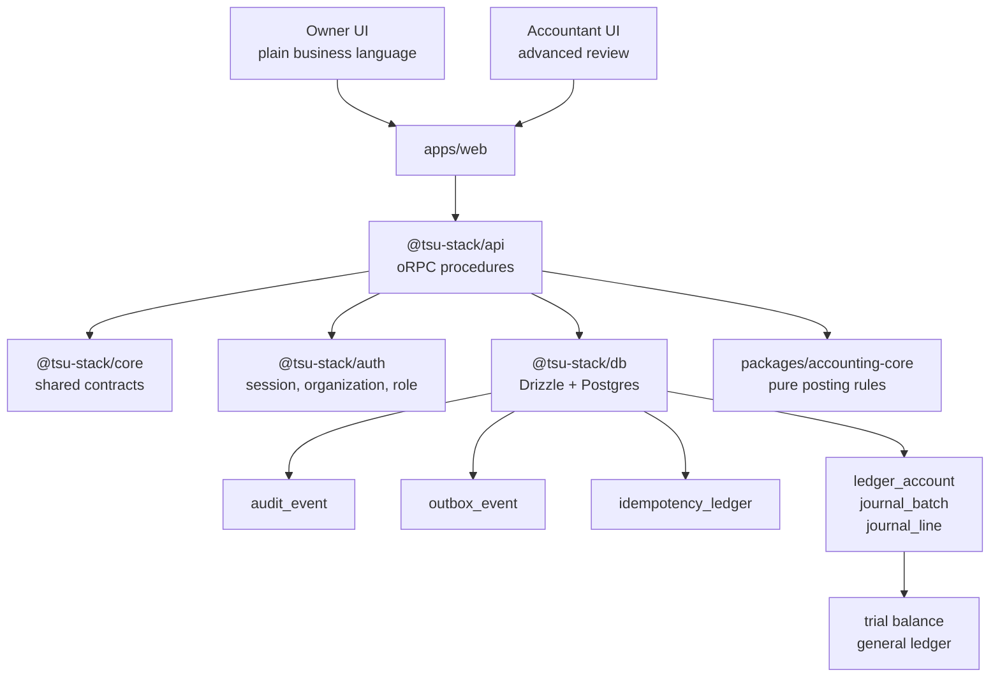
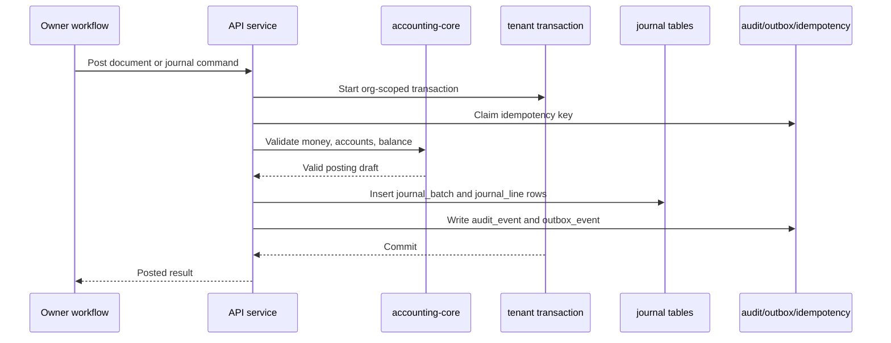
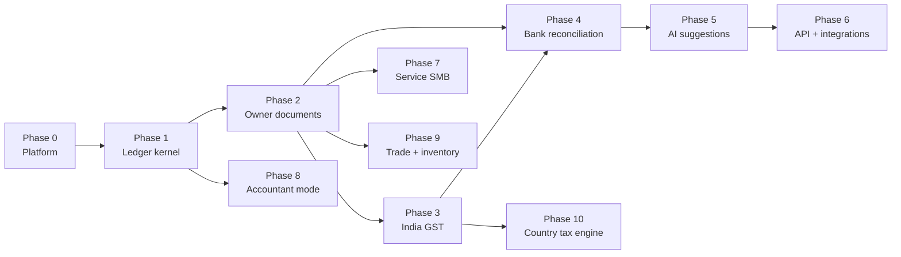

# AI-Native Accounting Foundation Design

Date: 2026-06-16

Updated: 2026-06-17 to align with `docs/superpowers/plans/2026-06-17-accounting-foundation-schema-revision-plan.md`.

Glossary: `docs/superpowers/plans/2026-06-16-plan-set-index.md` defines overloaded terms such as tenant scope, snapshot, `outbox_event`, and `idempotency_ledger`.

## Scope

Build an owner-first accounting application for India SMBs, beginning with a small but durable Phase 0-1 foundation before adding invoices, expenses, GST workflows, bank reconciliation, AI, public APIs, MCP, webhooks, inventory, or country-pack breadth.

The first customer is an owner-operated small business. Accountants come later as reviewers and multi-business operators. Trade, inventory, import, export, and multi-country workflows come after the accounting foundation is trusted.

Core promise: owners can run routine accounting workflows without needing debit/credit knowledge, while the system still produces accountant-grade books.

## Product Direction

The application should combine Tally's accounting discipline with Zoho's owner-friendly workflow model.

Owner-facing workflows should speak in business terms:

- Create invoice.
- Record expense.
- Record money received.
- Record money paid.
- Review tax position.
- Export clean books.

The system core must always maintain double-entry accounting:

- Every posted business document creates balanced journal batches and lines.
- Posted batches are immutable.
- Corrections happen through reversals and new postings.
- Manual batch posting exists only as an advanced/accountant workflow.

AI, external APIs, MCP, webhooks, and marketplace integrations are not Phase 0-1 features. The foundation should still be integration-ready through stable service boundaries, audit events, outbox events, idempotency, permissions, and source-document traceability.

## Stack Decision

Use the existing `tsu-stack` architecture:

- TanStack Start for the SSR web app.
- Hono/oRPC for server and typed procedure boundaries.
- PostgreSQL as the primary database.
- Drizzle for schema and queries.
- Better Auth for authentication, organizations, roles, and invitations.
- Zod for validation at boundaries.
- React Hook Form for dense owner-facing forms.
- S3-compatible object storage when document assets arrive.
- Vite Plus for workspace commands, checks, formatting, and tests.
- Docker/Coolify deployment.

Use existing package boundaries:

- `packages/core`: shared schemas, contracts, pure helpers.
- `packages/db`: Drizzle schema, migrations, database client, and query helpers.
- `packages/auth`: Better Auth configuration and auth helpers.
- `packages/api`: Hono/oRPC context and routers.
- `apps/web`: TanStack Start UI.

Do not introduce `packages/domain` or `packages/shared` as part of this plan set.

## Architecture Overview

The product architecture keeps owner workflows simple while preserving a
deterministic accounting core.

Posting flow:

Phase dependencies:

## Tenancy Model

Use Better Auth `organization` as the business tenant.

Product mental model:

- `organization` = business.
- `member` = user in the business.
- `organization_setting` = legal/accounting settings for the business.

Do not store accounting/legal/tax fields directly on Better Auth-owned tables. App-owned business data belongs in app-owned tables.

There is no separate `business_entity` table in Phase 0-1.

Every app-owned tenant table includes `organization_id` unless it is global reference data. Better Auth-owned tables are managed by Better Auth and excluded from app tenant-scope checks. PostgreSQL row-level security is deferred for MVP; tenant isolation is enforced by server-side membership checks and explicit `organizationId` query predicates.

Accountants are users who are members of multiple organizations. API keys are machine credentials for integrations, not human accountant access.

## Roles

Initial organization roles:

- `owner`: full control over business, members, settings, books, and later integrations.
- `operator`: daily workflow access for owner documents in Phase 2.
- `accountant`: reporting, batch posting, reversals, review, exports, and adjustments.
- `developer`: API keys, integrations, and webhook settings in Phase 6.
- `viewer`: read-only access later.

Role checks are enforced server-side. API keys must not bypass organization permissions.

## Identifier and Money Rules

Better Auth IDs keep the type generated by this repo. App-owned columns that reference Better Auth tables must match the referenced column type.

App-owned accounting table primary keys may use UUID-v7, but do not force a Better Auth UUID-v7 migration unless that is a separate explicit auth migration.

Money rules:

- ordinary money uses `*_minor bigint`;
- exchange rates use `numeric(20, 10)`;
- tax rates use `numeric(9, 4)`;
- quantities use `numeric(18, 4)`;
- JavaScript floating-point arithmetic is not used for accounting money.

## Phase Plan

### Phase 0: Platform Foundation

Acceptance criteria:

- User signup/login.
- Organization/business creation.
- `organization_setting` creation and update.
- Member invitation.
- Server-side role checks.
- `audit_event` table and writer.
- `outbox_event` table and transactional writer.
- `idempotency_ledger` table and request-boundary service.
- `currency` reference data.
- Tenant-scoped query helpers or service checks for app-owned tenant tables.
- Database migrations.
- Docker/Coolify deployment path documented.
- Error logging and basic health checks.

Out of scope:

- app-owned API-key tables;
- public API routes;
- webhook delivery;
- AI tables;
- bank tables;
- invoice/expense/payment tables;
- GST tables.

### Phase 1: Accounting Kernel

Acceptance criteria:

- Fiscal year setup.
- Monthly accounting periods.
- `ledger_account` chart of accounts.
- `number_sequence`.
- minimal `source_document`.
- `journal_batch`.
- `journal_line`.
- double-entry validation.
- immutable posted batches.
- reversal batches.
- trial balance.
- general ledger.
- advanced batch register.
- `packages/accounting-core` tests for money, posting, reversal, and report invariants.

Out of scope:

- `party`;
- `tax_code`;
- invoice/bill/payment documents;
- subledger/settlement;
- balance cache tables.

### Phase 2: Owner Workflow MVP

Add customer/vendor parties, items, invoices, expenses/bills, receipts, payments, allocations, PDFs/share links, and a basic owner dashboard. Users should not need to understand debit and credit in normal workflows.

### Phase 3: India GST Core

Add GST settings, GSTIN/PAN/state fields, HSN/SAC, place-of-supply, CGST/SGST/IGST logic, tax codes/components, tax invoice details, credit/debit notes, GSTR-1/GSTR-3B working reports, and exports.

### Phase 4: Bank and Reconciliation

Add bank statement import, duplicate detection, matching suggestions, owner approval, and reconciliation reports.

### Phase 5: AI Assistant

Add assistant over ledger, documents, bank transactions, and reports. AI can explain, extract, suggest, and draft. AI must not post final accounting or tax changes without deterministic service validation and explicit user approval.

### Phase 6: Platform API and Integrations

Add public API, API-key scope UI, webhook delivery, OpenAPI docs, MCP server, integration logs, retries, dead-letter handling, and external references.

### Phase 7: Service SMB Expansion

Add recurring invoices, retainers, projects, lightweight time tracking, quotes/proposals, payment links, and client statements.

### Phase 8: Accountant Mode

Add multi-business accountant workspace, review queue, locked periods, adjustment batches, working papers, and Tally/Excel exports.

### Phase 9: Trade, Inventory, Import, Export

Add stock ledger, warehouses, purchase orders, sales orders, landed cost, import/export documents, foreign currency, IEC/export invoice flows, and LUT/bond support.

### Phase 10: Country-Agnostic Tax Engine

Add tax plugin contract, VAT/GST localization packs, country invoice schemas, report templates, multi-currency fixtures, and localization tests.

## Core Tables by Phase

### Better Auth-Owned Tables

Better Auth manages:

- `user`.
- `session`.
- `account`.
- `verification`.
- `organization`.
- `member`.
- `invitation`.
- `api_key` if the Better Auth API-key plugin is installed and version-compatible.

The app may configure plugins, but these tables are not accounting-domain tables and are not included in app-owned tenant-scope inventory. Here, inventory means the security checklist of tenant tables and query paths, not stock or warehouse inventory.

### Phase 0 App-Owned Tables

`organization_setting`:

- one row per organization;
- legal/trade name;
- country, base currency, timezone;
- fiscal year start month;
- books start date;
- email/phone;
- timestamps.

`currency`:

- global reference table;
- no `organization_id`;
- code, name, symbol, decimal places, active flag.

`audit_event`:

- structured `{ before, after, metadata }` payload;
- writes who changed what and when.

`outbox_event`:

- transactional outbox for internal jobs, reports, AI indexing, and future webhooks;
- webhook delivery tables come in Phase 6.

`idempotency_ledger`:

- request-boundary duplicate protection;
- stores request hash, lock state, terminal result, and expiry.

### Phase 1 App-Owned Tables

`fiscal_year`:

- organization, name, start/end, status, close metadata.

`accounting_period`:

- organization, fiscal year, month/period name, start/end, lock status.

`ledger_account`:

- one hierarchical account table;
- group/posting distinction;
- system key;
- control/reconcilable/manual-posting flags.

`number_sequence`:

- organization-scoped sequence allocation for batch/document numbers.

`source_document`:

- minimal traceability shell;
- no party/tax/lifecycle/outstanding fields until owner documents exist.

`journal_batch`:

- one posting operation;
- period/source/idempotency/reversal links;
- immutable once posted.

`journal_line`:

- batch lines with account and minor-unit debit/credit values;
- no `party_id` or `tax_code_id` in Phase 1.

## Integration-Ready Foundation

Build now:

- stable internal IDs;
- service layer between UI and database;
- `audit_event`;
- `outbox_event`;
- `idempotency_ledger`;
- permission model;
- Zod contracts;
- source-document links from postings;
- clean error codes;
- Tenant-scoped query helpers.

Do not build now:

- public API documentation;
- webhook delivery;
- MCP server;
- AI chat;
- OAuth marketplace;
- app-owned API-key table;
- external developer portal.

## Accounting Invariants

Non-negotiable rules:

- Posted batch cannot be edited.
- Correction requires reversal plus new posting.
- Batch must balance before posting.
- Batch lines belong to the same organization as the batch.
- Accounts belong to the same organization as the batch line.
- Accounting period controls posting dates and locks.
- Every system-generated posting references a source document once source documents exist.
- Money uses minor units, never JavaScript float.
- Every sensitive mutation writes `audit_event`.
- Posting operations support idempotency.
- Trial balance must balance.

## Owner UX Principles

The owner should not be forced to understand accounting vocabulary.

UI language:

- Use "Business", not "organization".
- Use "Customer" and "Vendor", not "party".
- Use "Money received" and "Money paid", not debit/credit.
- Keep "Journal", "Batch", and "Ledger" in advanced/accountant mode.

Experience principles:

- smart defaults;
- plain-language errors;
- mobile-first capture;
- autosaved drafts where safe;
- slow-network tolerant screens;
- small route bundles;
- server-rendered report pages;
- no final accounting posting without deterministic validation.

## Deferred Decisions

Do not solve in Phase 0-1:

- multi-branch under one organization;
- multi-GSTIN reporting across branches;
- consolidated accountant dashboards;
- public webhook delivery;
- MCP server;
- AI assistant;
- exchange-rate import/revaluation;
- inventory;
- import/export documents;
- country tax plugins.

These are deferred to protect accounting foundation quality.
