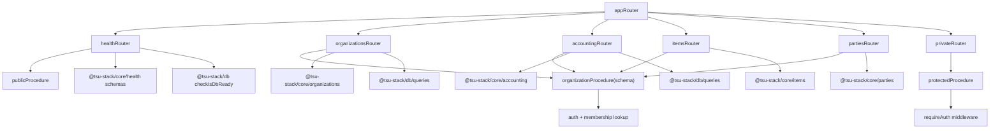
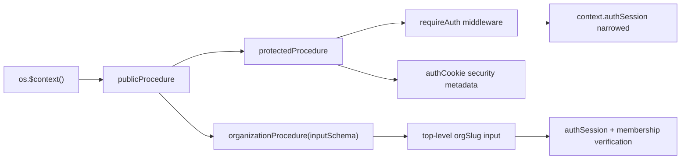
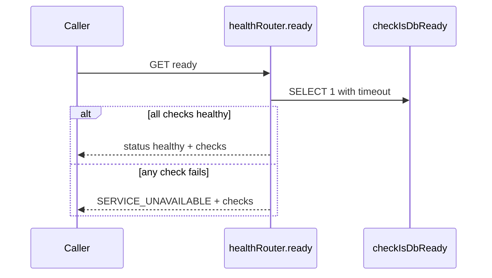

# @tsu-stack/api Architecture

`packages/api` is the transport layer between runtime apps and domain packages.
Its job is to make procedure behavior explicit: context, auth, input/output,
router-owned transport errors, OpenAPI metadata, and orchestration.

## Current Router Graph



## Procedure Factories



`protectedProcedure` rejects when the Better Auth `authSession.user` is missing and adds
OpenAPI security metadata.

Tenant routes use `organizationProcedure(inputSchema)`. The schema parses a
top-level `orgSlug`; the procedure loads `authSession`, verifies membership in
the `member` table, and exposes `authSession`, `organizationId`,
`organizationSlug`, `organizationRole`, and `organizationMembership` to
handlers. Keep the membership check inline in the procedure factory while there
is only one consumer. Role-specific authorization should be a separate named
middleware when needed.

## Context Contract

Current `OrpcContext`:

| Field                    | Source                                          | Purpose                                                         |
| ------------------------ | ----------------------------------------------- | --------------------------------------------------------------- |
| `db`                     | `@tsu-stack/db` request context                 | database client used by procedures and middleware               |
| `authSession`            | `createContext`                                 | Better Auth session plus user, or `null` for anonymous requests |
| `logger`                 | Hono logger middleware or server client context | request or operation logger                                     |
| `organizationId`         | `organizationProcedure`                         | verified organization id for tenant-owned routes                |
| `organizationSlug`       | `organizationProcedure`                         | verified organization slug for stable route references          |
| `organizationRole`       | `organizationProcedure`                         | Better Auth member role                                         |
| `organizationMembership` | `organizationProcedure`                         | membership row used for authorization decisions                 |

Future accounting phases should pass request id and IP/user-agent through
explicit contracts when audit metadata needs them. Idempotency belongs on the
specific command input that needs duplicate protection, not in global context.

## Organization Settings Router

`routers/organizations` is the first tenant-scoped example:

- input/output schemas live in `@tsu-stack/core/organizations`;
- membership verification lives in `organizationProcedure`;
- read/write helpers live in `@tsu-stack/db/queries`;
- settings mutations return a tiny success envelope, not the full saved row;
- settings writes use owner-only permission checks and write audit rows in the
  same DB transaction as the settings change.

## Document Routers

`routers/sales-documents`, `routers/purchase-documents`, and `routers/settlements`
are Phase 2.5 tenant-scoped accounting routers mounted in the current app
router with `accounting`, `health`, `items`, `organizations`, `parties`, and
`private`.

- input/output schemas live in `@tsu-stack/core/documents`;
- membership and accounting permission checks happen through
  `organizationPermissionProcedure`;
- persistence and posting behavior live in `@tsu-stack/db/queries`;
- app procedures cover create/update draft, get/list, post, and void;
- official numbers are never accepted from client input;
- create-and-post inputs do not accept `documentId`; the DB transaction
  generates the id and posts that same document. Existing-document commands
  keep `documentId` because they target rows that already exist.

## Error Policy

Routers do not catch query/database errors to convert them into typed oRPC
errors. Query, domain, cursor, and database failures fail fast so root causes
stay visible and policy does not duplicate across `packages/db` and
`packages/api`.

Use `.errors(...)` only for router-owned expected failures that clients must
branch on, such as health readiness or explicit product/auth state. See
[ADR-0011](../../docs/decisions/0011-fail-fast-query-errors.md).

## Health Router



Health routes stay public and explicitly clear security metadata.

## Extension Pattern

New internal app routers should follow:

```text
packages/api/src/routers/<domain>/
  index.ts       # procedure definitions
  helpers.ts     # transport-local helpers only
```

Promote helpers when:

- shared schemas go to `packages/core`;
- DB logic gets reused or needs transactions, then goes to `packages/db`;
- provider/integration behavior gets its own domain package;
- web query wrappers stay in `apps/web`, not here.

## Public API Future

Phase 6 adds stable public API. Until then:

- do not promise `/api/v1` semantics;
- do not expose API-key auth from normal app procedure middleware;
- keep external route modules separate when raw requests/signatures matter;
- use OpenAPI generation as docs for current app routes, not a third-party SLA.
