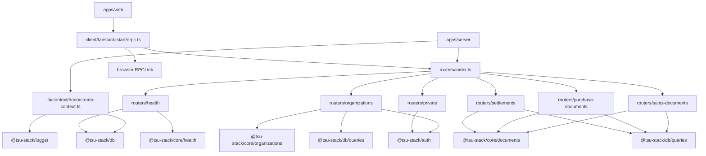
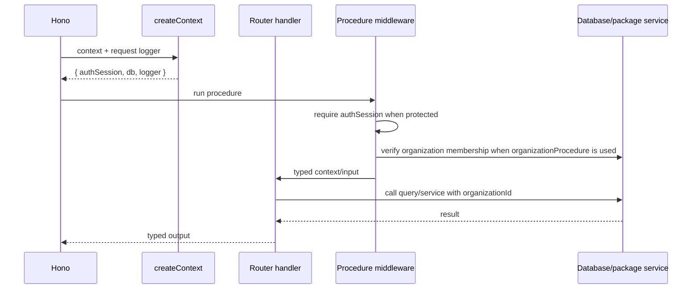

# @tsu-stack/api

Transport contract package. It owns oRPC routers, procedure factories, Hono
context creation, declared transport errors, and the isomorphic TanStack Start oRPC client.

It should orchestrate transport behavior and call package-owned domain/database
logic. It should not become a dumping ground for persistence or UI code.

## Responsibilities

- Compose `appRouter`.
- Provide `publicProcedure`, `protectedProcedure`, and `organizationProcedure`.
- Create request context from Hono and Better Auth.
- Attach OpenAPI metadata to protected routes.
- Expose an isomorphic oRPC client for `apps/web`.
- Keep router handlers thin and linear.

## Architecture



## Public API / Entrypoints

| Import                                           | Purpose                                                          |
| ------------------------------------------------ | ---------------------------------------------------------------- |
| `@tsu-stack/api/routers/index`                   | `appRouter`, `AppRouter`, `AppRouterClient`                      |
| `@tsu-stack/api/lib/context/hono/create-context` | Hono request context factory                                     |
| `@tsu-stack/api/lib/procedures/factory`          | `publicProcedure`, `protectedProcedure`, `organizationProcedure` |
| `@tsu-stack/api/client/tanstack-start/orpc`      | `client` and `orpc` query utils                                  |

`package.json` currently exposes broad `"./*"` subpaths. Treat only documented
subpaths as stable until exports are tightened.

## Router Shape

```text
packages/api/src/
  client/tanstack-start/orpc.ts
  lib/context/
  lib/procedures/
  routers/
    index.ts
    health/
    organizations/
    private/
    purchase-documents/
    sales-documents/
    settlements/
```

Router rules:

- `routers/index.ts` composes only.
- Each slice owns procedure names and transport metadata.
- Use `publicProcedure` for anonymous routes.
- Use `protectedProcedure` for session-required routes.
- Use `organizationProcedure(schema)` when a route needs caller-provided
  `orgSlug` verified against membership.
- Use `@tsu-stack/core` schemas for cross-package contracts.
- Sales, purchase, and settlement routes expose app-internal create/update draft,
  get/list, post, and void procedures; they are not Phase 6 public API contracts.
- Promote DB-heavy reusable logic into `packages/db/src/queries` when it appears.

## Procedure Flow



## Isomorphic Client

`client/tanstack-start/orpc.ts` chooses the fastest safe transport:

- Server render: direct `createRouterClient(appRouter)` with a server-side
  context built from request headers.
- Browser: `RPCLink` to `${VITE_SERVER_URL}/rpc` with `credentials: "include"`.

This avoids network hops during SSR while preserving browser cookie behavior.

## Development Commands

This package currently has no package-local scripts. Use root validation only
when approved:

| Command             | Purpose                                               |
| ------------------- | ----------------------------------------------------- |
| `rtk vp run -w fix` | Workspace fix/check when broad validation is approved |
| `rtk vp run build`  | Build all packages/apps                               |

Future API tests should add `test:unit` to this package and use
`rtk vp run --filter @tsu-stack/api test:unit`.

## Organization Scope

Each organization-scoped route uses `organizationProcedure(inputSchema)`.
The input schema must include a top-level `orgSlug`.

The frontend owns the route organization reference, usually from a TanStack
Start loader for `example.com/<orgSlug>`, and passes that stable reference in
the oRPC input. The server never trusts the reference by itself: middleware
requires the Better Auth `authSession`, checks membership through
`@tsu-stack/db/queries`, and then adds verified `organizationId`,
`organizationSlug`, `organizationRole`, and the membership row to procedure
context.

Handlers pass the verified `context.organizationId` into DB query helpers.

## Gotchas

- `protectedProcedure` only checks for a Better Auth auth session. Use
  `organizationProcedure(schema)` for tenant-owned data.
- Health readiness has a 1500 ms timeout per dependency check.
- Public external APIs are planned for Phase 6; do not expose stable third-party
  contracts early from normal app procedures.
- Request-scoped logging should use `context.logger`.
