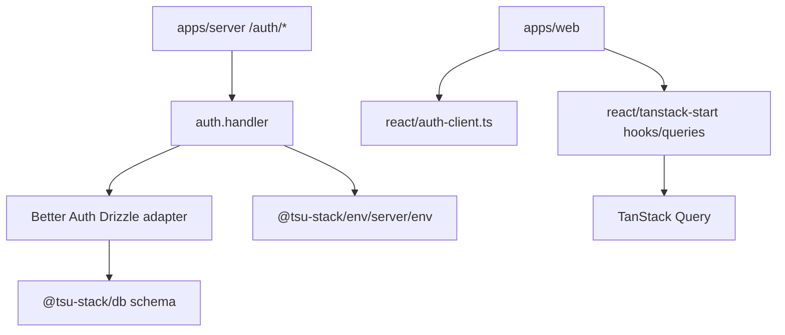

# @tsu-stack/auth

Better Auth package. It owns server auth configuration plus React/TanStack Start
client helpers used by the web app.

## Responsibilities

- Configure Better Auth with Drizzle adapter and repo env.
- Mount email/password auth.
- Enable Better Auth organization/member/invitation support.
- Enable Better Auth OpenAPI plugin.
- Export inferred `AuthSession` type.
- Export Phase 0 app role helpers.
- Provide React auth client, hooks, queries, and middleware helpers.

Does not own app-specific organization accounting data. Future business settings
belong in app-owned tables under `packages/db`.

## Architecture

## Public API / Entrypoints

| Import                                            | Purpose                           |
| ------------------------------------------------- | --------------------------------- |
| `@tsu-stack/auth/index`                           | `auth`, `AuthSession`             |
| `@tsu-stack/auth/permissions`                     | App roles and permission helpers  |
| `@tsu-stack/auth/react/auth-client`               | Browser auth client               |
| `@tsu-stack/auth/react/tanstack-start/hooks`      | React auth hooks                  |
| `@tsu-stack/auth/react/tanstack-start/queries`    | TanStack Query options            |
| `@tsu-stack/auth/react/tanstack-start/middleware` | Route/auth middleware helpers     |
| `@tsu-stack/auth/react/tanstack-start/functions`  | Server functions for auth helpers |

## Current Server Config

- `baseURL`: origin from `VITE_SERVER_URL`.
- `basePath`: `VITE_SERVER_URL` path plus `/auth`.
- `trustedOrigins`: origin from `VITE_WEB_URL`.
- `secret`: `BETTER_AUTH_SECRET`.
- `database`: Drizzle relations-v2 adapter.
- `emailAndPassword.enabled`: true.
- `organization()`: enabled for business tenant membership.
- `session.cookieCache`: enabled for 5 minutes.
- `openAPI`: enabled with `deepSpace` theme.
- telemetry disabled.

## App Roles

Phase 0 app roles:

- `owner`: manages members, business settings, books, owner documents, and integrations.
- `operator`: manages daily owner workflow documents.
- `accountant`: posts journals, reversals, reports, exports, and owner workflow documents.
- `developer`: manages API/integration surfaces later.
- `viewer`: read-only business access.

Better Auth stores multiple organization roles as comma-separated strings, so
`parseOrganizationRoles` normalizes strings and arrays before permission checks.

## Development Commands

| Command                    | Purpose                                          |
| -------------------------- | ------------------------------------------------ |
| `rtk vp run auth:secret`   | Generate a Better Auth secret                    |
| `rtk vp run auth:generate` | Regenerate Better Auth schema through db package |
| `rtk vp run db:migrate`    | Apply auth/db migrations                         |
| `rtk vp run test:unit`     | Run auth unit tests                              |

## Integration Notes

- Server routes delegate raw requests to `auth.handler`.
- API context reads sessions with `auth.api.getSession`.
- Web route guards should use auth query helpers rather than hand-parsing
  cookies.
- Organization role helpers stay here until another package needs direct role
  contracts.

## Gotchas

- Better Auth-owned tables are not app accounting tables. Current auth-owned
  tenant tables include `organization`, `member`, and `invitation`.
- App-owned tenant tables must reference Better Auth ID column types exactly.
- Cross-domain/cross-subpath auth depends on cookie, base URL, CORS, and trusted
  origin alignment.
- Regenerating auth schema can affect database migrations; review generated
  changes carefully.
