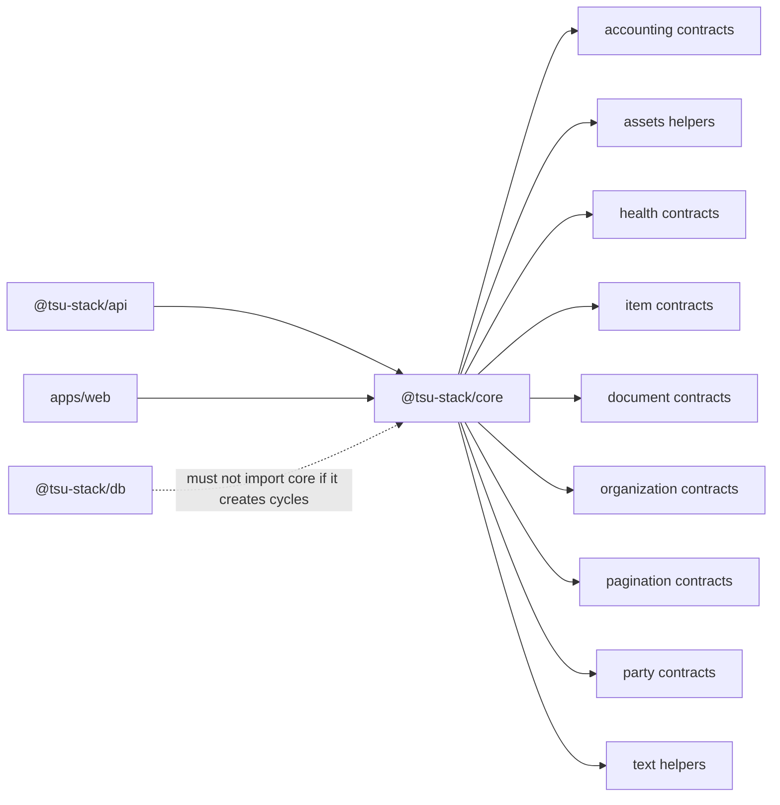

# @tsu-stack/core

Runtime-agnostic shared contracts package. It owns schemas, constants, pure
types, and pure helpers consumed by more than one package.

## Responsibilities

- Export cross-package contracts such as health schemas and asset helpers.
- Export Phase 2 owner-record contracts for parties and items.
- Export Phase 2.5 document contracts for sales invoices, purchase documents,
  settlements, document lifecycle, and posting/void commands.
- Keep domain defaults, enum options, formatters, and validators in one place
  when more than one package consumes them.
- Stay free of runtime dependencies: no DB, env, logger, React, Hono, or oRPC.

## Architecture

## Public API / Entrypoints

| Import                          | Purpose                                                                 |
| ------------------------------- | ----------------------------------------------------------------------- |
| `@tsu-stack/core`               | Barrel for current shared domains                                       |
| `@tsu-stack/core/accounting`    | Accounting schemas, defaults, report helpers, and journal validation    |
| `@tsu-stack/core/assets`        | Public asset URL helpers                                                |
| `@tsu-stack/core/health`        | Health check schemas, types, constants, utilities                       |
| `@tsu-stack/core/items`         | Item schemas, enums, DTOs, and input contracts                          |
| `@tsu-stack/core/documents`     | Document lifecycle, draft, posting, void, settlement, and DTO contracts |
| `@tsu-stack/core/organizations` | Organization settings schemas, defaults, and types                      |
| `@tsu-stack/core/pagination`    | Shared offset and cursor pagination schemas, constants, and helpers     |
| `@tsu-stack/core/parties`       | Party schemas, enums, DTOs, and input contracts                         |
| `@tsu-stack/core/text`          | Shared text normalization and search-query helpers                      |

## Local Structure

| Path                | Purpose                                                              |
| ------------------- | -------------------------------------------------------------------- |
| `src/accounting`    | Accounting shared schemas, defaults, and pure posting/report helpers |
| `src/assets`        | Pure public asset helpers                                            |
| `src/health`        | Health response schemas/types/utilities                              |
| `src/items`         | Item shared schemas and contracts                                    |
| `src/documents`     | Document shared schemas, totals, and lifecycle contracts             |
| `src/organizations` | Organization shared schemas and defaults                             |
| `src/pagination.ts` | Shared pagination schemas and helpers                                |
| `src/parties`       | Party shared schemas and contracts                                   |
| `src/text`          | Shared text normalization and search helpers                         |
| `src/index.ts`      | Small package barrel                                                 |

## Development Commands

| Command                                         | Purpose                                              |
| ----------------------------------------------- | ---------------------------------------------------- |
| `rtk vp run --filter @tsu-stack/core test:unit` | Run core unit tests                                  |
| `rtk vp check`                                  | Package-local check when in package dir and approved |

## Integration Notes

- Add a new domain folder when a schema/enum/helper is used by two or more
  packages.
- Keep schema exports paired with inferred TypeScript types.
- If a helper needs env, DB, logger, network, or React, it does not belong here.
- API packages should import shared schemas from `core` rather than redefining
  literal unions.

## Gotchas

- `packages/core` should not become a generic `utils` package.
- Avoid cycles. If two packages need the same neutral value, move only that
  neutral contract here.
- Current broad `"./*"` export exists for convenience; document stable subpaths
  before relying on them across many packages.
