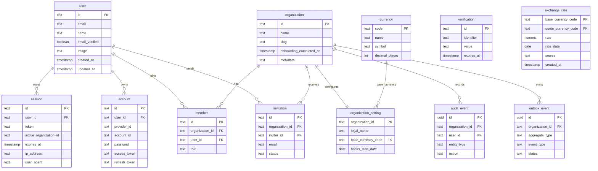
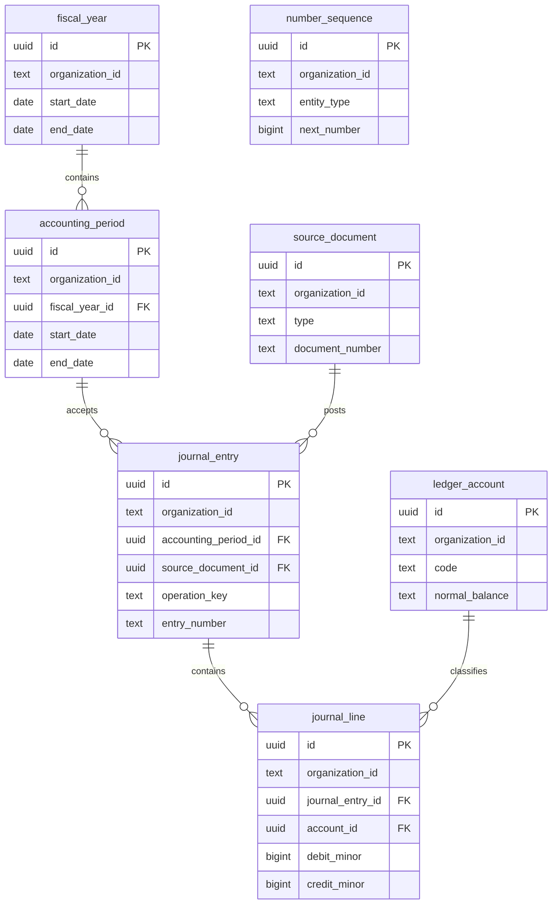
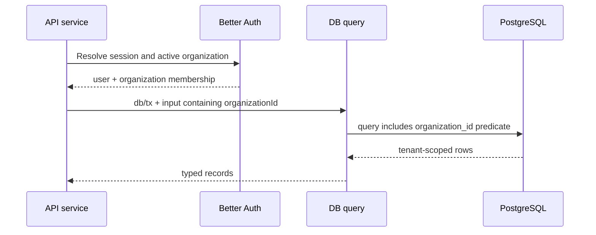

# @tsu-stack/db Architecture

The DB package is the persistence boundary. It exposes intentional schema,
query, migration, and database-client APIs while hiding transport/UI concerns.

## Current Schema

Current schema includes Better Auth identity/organization tables, Phase 0
app-owned platform tables, and the Phase 1 ledger kernel. This diagram shows
the platform foundation subset; the ledger kernel is below.



Better Auth owns `user`, `session`, `account`, `verification`, `organization`,
`member`, and `invitation`. The app owns `currency`, `exchange_rate`,
`organization_setting`, `audit_event`, and `outbox_event`.

`currency` rows are supported reference metadata seeded outside schema
migrations. `exchange_rate` stores dated FX snapshots; posted documents and
payments copy their rate snapshot so historical views never depend on the
latest rate row.

App-owned UUID primary keys use application-side UUIDv7 runtime defaults.
Better Auth-owned text ids stay under Better Auth's generator and schema
contract.

## Phase 1 Ledger Kernel



Phase 1 posting enforces duplicate protection with
`(organization_id, operation_key)` on `journal_entry`. Posting allocates
`number_sequence` values with atomic `UPDATE ... RETURNING`, writes awaited
audit rows transactionally, and enforces posted journal immutability through the
posting/reversal service boundary plus database constraints. PostgreSQL
immutability triggers are deferred until a second writer path or
public/integration API makes service bypass realistic. Phase 1 accounting
posting does not write outbox rows; add outbox producers only when a durable
async consumer exists. Do not add a central idempotency table unless a later
public API needs generic response replay.

The source of truth for foundation and ledger tables is
[../../docs/superpowers/plans/2026-06-17-accounting-foundation-schema-revision-plan.md](../../docs/superpowers/plans/2026-06-17-accounting-foundation-schema-revision-plan.md).

## Migration Boundary

`src/schema/migration.ts` is the active migration export boundary. Future draft
schema files may exist only when clearly marked as drafts and not exported to
migrations.

This prevents future-phase tables from shipping before services read/write them.

## Package Composition

The package root is a narrow barrel. Runtime concerns are split by purpose:

```text
src/
  index.ts             # root public exports
  client.ts            # Drizzle client, lifecycle helpers, DB types
  migrate.ts           # production migration runner
  queries/             # reusable DB helpers, db/tx first
  schema/
  utils/
    health.ts          # DB readiness checks
```

This follows the Midday-inspired package shape used elsewhere in the repo:
keep client setup, future query modules, and utilities separate, but do not
copy Midday's Supabase/team/replica assumptions into this PostgreSQL + Better
Auth organization boundary.

Midday does contain Supabase-native RLS policies using `auth.uid()`,
`auth.jwt()`, `authenticated`/`service_role`, and team helper functions. Their
direct Drizzle client does not set an equivalent tenant context per
transaction. This repo defers PostgreSQL RLS for MVP and uses app-enforced
tenant scope instead. See
[../../docs/decisions/0002-defer-postgresql-rls-for-mvp.md](../../docs/decisions/0002-defer-postgresql-rls-for-mvp.md).

## Tenant Isolation Flow

MVP tenant isolation happens before and during each DB query:



Rules:

- Never trust `organizationId` from client input unless membership has already
  been checked.
- Every tenant-owned table has an `organization_id` column.
- Every reusable tenant query accepts `organizationId` in its input.
- Prefer passing `db` or `tx` into query functions so multi-table writes can
  share one transaction.

## Database URL

`DATABASE_URL` is the only database URL. It is used by:

- runtime queries;
- health checks;
- Drizzle Kit generation;
- local migrations;
- production startup migrations.

## Query Layer Direction

Use this shape for reusable queries:

```ts
export async function listInvoices(
  dbOrTx: DatabaseOrTransaction,
  input: { organizationId: string; cursor?: string; limit?: number }
) {
  // Drizzle query here
}
```

Rules:

- `db` or `tx` first.
- one typed input object second.
- organization scope explicit.
- transport mapping outside DB package unless projection is shared.
- audit rows, outbox rows, or command-key guards stay in the same transaction
  as business writes only when that side effect is part of the durable contract.
- avoid fire-and-forget persistence helpers; callers should decide whether a
  write is durable, transactional, or intentionally omitted.
- request ids are for tracing only; operation-local idempotency belongs in the
  command/query module that owns the mutation.

Current concrete examples:

- `queries/organizations.ts` verifies Better Auth membership for an active organization.
- `queries/organization-settings.ts` reads and upserts organization settings
  and writes audit rows inside the caller's transaction when settings change.
