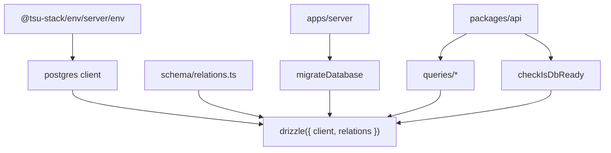

# @tsu-stack/db

Drizzle/PostgreSQL package. It owns schema, relations, the database client,
migrations, readiness checks, Phase 0 platform tables, and future reusable query
modules.

## Responsibilities

- Define Drizzle tables and relations.
- Export the `db` client and selected Drizzle SQL helpers.
- Run production migrations safely through `migrateDatabase()`.
- Check database readiness for health endpoints.
- Keep tenant-owned app tables scoped by `organization_id`.
- Own future reusable query modules.

Does not own transport response shape, route handlers, React UI, auth cookies,
or Better Auth membership checks.

## Architecture

See [ARCHITECTURE.md](ARCHITECTURE.md) for current and planned schema shape.

## Public API / Entrypoints

| Import                       | Purpose                                                |
| ---------------------------- | ------------------------------------------------------ |
| `@tsu-stack/db`              | `db`, `migrateDatabase`, `checkIsDbReady`, SQL helpers |
| `@tsu-stack/db/client`       | `db`, client lifecycle helpers, DB/transaction types   |
| `@tsu-stack/db/migrate`      | production migration runner                            |
| `@tsu-stack/db/queries`      | reusable Drizzle query helpers                         |
| `@tsu-stack/db/schema`       | Drizzle table exports                                  |
| `@tsu-stack/db/utils/health` | database health/readiness helpers                      |

## Local Structure

| Path                                   | Purpose                                                                |
| -------------------------------------- | ---------------------------------------------------------------------- |
| `src/index.ts`                         | Root public barrel                                                     |
| `src/client.ts`                        | DB client, lifecycle helpers, DB/transaction types                     |
| `src/migrate.ts`                       | production migration runner                                            |
| `src/queries/index.ts`                 | reusable query helper barrel                                           |
| `src/queries/organizations.ts`         | organization membership checks                                         |
| `src/queries/organization-settings.ts` | organization settings read/write helpers                               |
| `src/schema/auth.schema.ts`            | Better Auth user/session/account/organization/member/invitation tables |
| `src/schema/organization.ts`           | `currency` and `organization_setting`                                  |
| `src/schema/audit.ts`                  | `audit_event`                                                          |
| `src/schema/outbox.ts`                 | `outbox_event`                                                         |
| `src/schema/idempotency.ts`            | `idempotency_ledger`                                                   |
| `src/schema/migration.ts`              | Active Phase 0 migration exports                                       |
| `src/schema/index.ts`                  | Active schema exports                                                  |
| `src/schema/relations.ts`              | Drizzle relation config                                                |
| `src/utils/health.ts`                  | readiness/health probes                                                |
| `src/utils/id.ts`                      | app-owned UUIDv7 id generation                                         |
| `drizzle.config.ts`                    | Drizzle Kit config                                                     |
| `docker-compose.dev.yaml`              | Local PostgreSQL                                                       |

## Development Commands

| Command                    | Purpose                          |
| -------------------------- | -------------------------------- |
| `rtk vp run db:dev:start`  | Start local PostgreSQL           |
| `rtk vp run db:dev:stop`   | Stop local PostgreSQL            |
| `rtk vp run db:generate`   | Generate Drizzle migration files |
| `rtk vp run db:migrate`    | Apply migrations                 |
| `rtk vp run db:studio`     | Open Drizzle Studio              |
| `rtk vp run auth:generate` | Regenerate Better Auth schema    |

## Migration Behavior

`migrateDatabase()`:

- skips duplicate calls in one process;
- skips during build via `IS_BUILD`;
- skips outside production;
- retries production migrations up to 3 times with 3 seconds between attempts;
- logs migration events through `@tsu-stack/logger/server`.

Drizzle generation, migrations, runtime queries, and health checks all use
`DATABASE_URL`.

## Tenant Isolation

PostgreSQL RLS is deferred for MVP. Tenant isolation is enforced by the
application/query layer:

- API code resolves the active Better Auth organization and checks membership.
- Tenant-owned tables keep an explicit `organization_id`.
- Reusable query functions must accept `db` or `tx` first, then one typed input
  object containing `organizationId`.
- Every tenant-scoped query must include the `organizationId` predicate.
- Business writes that also need audit/outbox rows should happen in one
  transaction.
- Best-effort activity logging may run after the business write and must catch
  its own errors; do not treat it as durable accounting audit.
- App-owned UUID primary keys use UUIDv7 runtime defaults. Better Auth-owned
  text ids remain controlled by Better Auth.

This keeps the system simple now while keeping the data model ready for
PostgreSQL RLS later if the operational tradeoff becomes worth it. See
[../../docs/decisions/0002-defer-postgresql-rls-for-mvp.md](../../docs/decisions/0002-defer-postgresql-rls-for-mvp.md).

## Gotchas

- Better Auth IDs are currently text; app-owned foreign keys referencing them
  must match that type.
- `src/client.ts` passes the relation config to Drizzle with `drizzle({ client, relations })`.
- Midday is a reference for package composition and Supabase-native RLS policy
  shape, not for this repo's tenancy implementation. Supabase gets JWT/role
  context such as `auth.uid()`, `auth.jwt()`, `authenticated`, and
  `service_role`; this repo uses Better Auth with direct Drizzle/Postgres.
