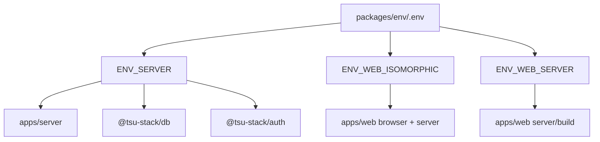

# @tsu-stack/env

Validated environment-variable package. It owns every runtime env surface used
by apps and packages.

## Responsibilities

- Validate server-only env through `ENV_SERVER`.
- Validate web client/server env through `ENV_WEB_ISOMORPHIC`.
- Validate web-server-only env through `ENV_WEB_SERVER`.
- Keep `.env.example` aligned with the Zod schemas.
- Keep client exposure explicit through `VITE_` prefix.

## Architecture

## Env Surfaces

| Object               | File                        | Runtime                             | Notes               |
| -------------------- | --------------------------- | ----------------------------------- | ------------------- |
| `ENV_SERVER`         | `src/server/env.ts`         | `apps/server`, server-only packages | Can read secrets    |
| `ENV_WEB_ISOMORPHIC` | `src/web/env.isomorphic.ts` | browser and web server              | Only `VITE_*`       |
| `ENV_WEB_SERVER`     | `src/web/env.server.ts`     | TanStack Start server/build         | No browser exposure |

## Current Variables

| Variable                  | Surface                | Required   | Default                                  |
| ------------------------- | ---------------------- | ---------- | ---------------------------------------- |
| `VITE_SERVER_URL`         | server, web isomorphic | production | dev: `http://localhost:5000/server`      |
| `VITE_WEB_URL`            | server, web isomorphic | production | dev: `http://localhost:3000/web`         |
| `DATABASE_URL`            | server                 | yes        | none; runtime and migration database URL |
| `BETTER_AUTH_SECRET`      | server                 | yes        | none                                     |
| `NODE_ENV`                | server, web server     | no         | `development`                            |
| `SOURCE_COMMIT`           | server, web server     | no         | `unknown`                                |
| `ENABLE_OPEN_API_DOCS`    | server                 | no         | `false`                                  |
| `IS_BUILD`                | server, web server     | no         | `false`                                  |
| `VITE_IMGPROXY_URL`       | web isomorphic         | no         | none                                     |
| `VITE_IMGPROXY_SIGNATURE` | web isomorphic         | no         | `_`                                      |

## Update Checklist

When adding or changing env, update:

1. Zod schema in `packages/env/src`.
2. `packages/env/.env.example`.
3. Docker Compose `build.args` and `environment` for affected services.
4. Relevant Dockerfile `ARG`/`ENV`.
5. Root [../../README.md](../../README.md) env table and package docs.
6. `apps/web/vite.config.ts` `define` values if build-time injection is needed.

## Development Commands

| Command                                              | Purpose                               |
| ---------------------------------------------------- | ------------------------------------- |
| `rtk cp packages/env/.env.example packages/env/.env` | Create local env file                 |
| `rtk vp run auth:secret`                             | Generate `BETTER_AUTH_SECRET`         |
| `rtk vp env doctor`                                  | Diagnose Vite Plus environment issues |

## Gotchas

- `emptyStringAsUndefined` is enabled.
- `z.stringbool()` parses boolean strings such as `"true"` and `"false"`.
- Server secrets must never use `VITE_`.
- Client-visible values must be safe to expose.
- Env modules log successful loading with `console.debug`.
- `DATABASE_URL` is intentionally the only database URL for MVP. Tenant
  isolation is enforced by application query scope, not PostgreSQL RLS roles.
