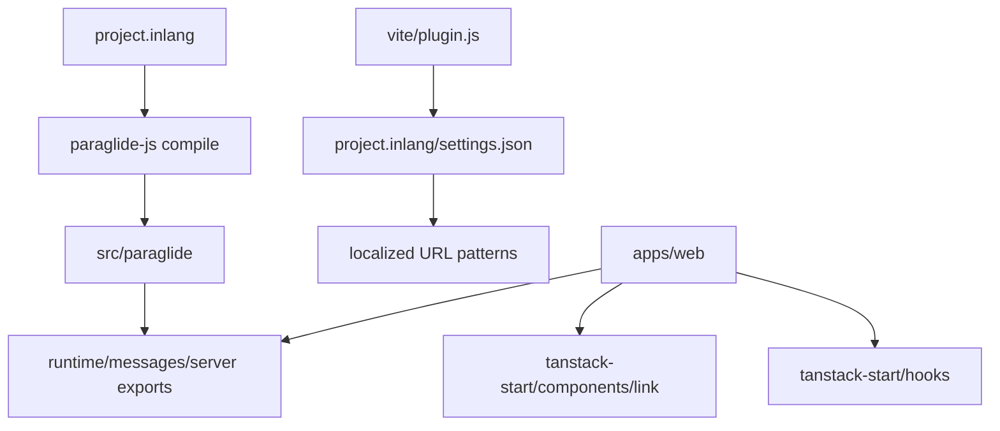

# @tsu-stack/i18n

Paraglide.js i18n package for TanStack Start. It owns message compilation,
runtime exports, localized route helpers, localized links, and the Vite plugin
that configures URL-based locale routing.

## Responsibilities

- Compile messages from `project.inlang` into `src/paraglide`.
- Export Paraglide messages/runtime/server modules.
- Provide TanStack Start link, hook, redirect, and route-path helpers.
- Generate localized URL patterns for Vite/Paraglide.
- Keep base locale URLs unprefixed and non-base locales prefixed.

## Architecture



## Public API / Entrypoints

| Import                                              | Purpose                      |
| --------------------------------------------------- | ---------------------------- |
| `@tsu-stack/i18n/messages`                          | Compiled message functions   |
| `@tsu-stack/i18n/runtime`                           | Locale runtime helpers       |
| `@tsu-stack/i18n/server`                            | Paraglide server helpers     |
| `@tsu-stack/i18n/vite/plugin`                       | Vite plugin wrapper          |
| `@tsu-stack/i18n/tanstack-start/components/link`    | Locale-aware link component  |
| `@tsu-stack/i18n/tanstack-start/hooks/use-navigate` | Locale-aware navigation hook |
| `@tsu-stack/i18n/tanstack-start/types`              | Shared navigation/link types |

## Local Structure

| Path                 | Purpose                                   |
| -------------------- | ----------------------------------------- |
| `project.inlang`     | Locale settings and message source config |
| `src/paraglide`      | Generated Paraglide output                |
| `src/tanstack-start` | Router/link/navigation integration        |
| `src/vite/plugin.js` | Paraglide Vite plugin wrapper             |

## TanStack Start Integration

The web app should wrap the Start server entry with Paraglide middleware:

```ts
import handler from "@tanstack/react-start/server-entry";
import { paraglideMiddleware } from "@tsu-stack/i18n/server";

export default {
  fetch(req: Request): Promise<Response> {
    return paraglideMiddleware(req, () => handler.fetch(req));
  }
};
```

## Development Commands

| Command                                                 | Purpose                        |
| ------------------------------------------------------- | ------------------------------ |
| `rtk vp run --filter @tsu-stack/i18n build`             | Compile Paraglide output       |
| `rtk vp run --filter @tsu-stack/i18n dev`               | Watch and compile messages     |
| `rtk vp run --filter @tsu-stack/i18n machine-translate` | Run Inlang machine translation |

## Gotchas

- `src/paraglide` is generated. Do not edit it manually.
- Non-base locale patterns must come before the base-locale pattern.
- `Link` strips existing locale prefixes before adding the current locale.
- External links render as normal `<a>` tags with `target="_blank"` and
  `rel="noopener noreferrer"`.
