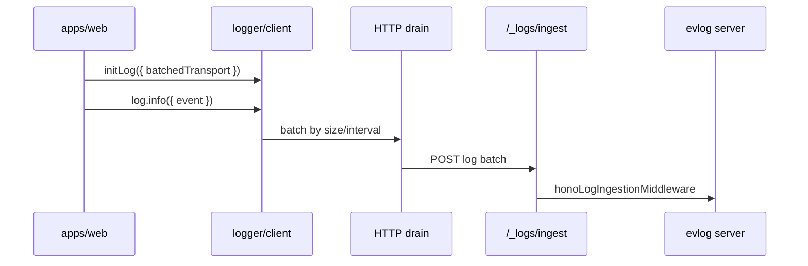
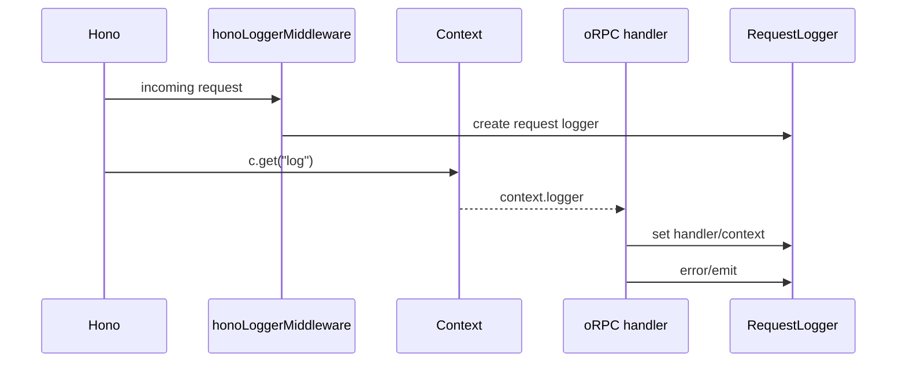
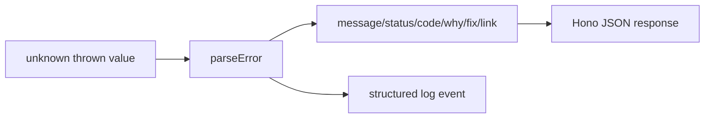

# @tsu-stack/logger Architecture

The logger package normalizes logging across browser, Hono server, TanStack
Start, jobs, and scripts.

## Browser Flow

Default web config batches every 2000 ms or 25 events and retries up to 3 times.

## Server Request Flow

## Logger Types

| Logger                | Use                                               |
| --------------------- | ------------------------------------------------- |
| `log`                 | Simple one-off server/browser events              |
| `createLogger`        | Non-request jobs, scripts, startup/migration work |
| `createRequestLogger` | Request logging without framework middleware      |
| `RequestLogger`       | Request-scoped logger from middleware/context     |

## Error Flow

`parseError` is used by `apps/server` global error handling to avoid returning
unsafe internals while still logging enough detail.

## Service Names

`LOG_SERVICES` centralizes service identifiers. Use it instead of hand-written
strings when initializing app/package loggers.

## Rules

- Enrich one request log rather than emitting many routine logs.
- Add durable logs only when useful for audit, diagnostics, or operations.
- Redact sensitive fields by default and avoid logging full payloads.
- Use request id/correlation id when future context work adds it.
