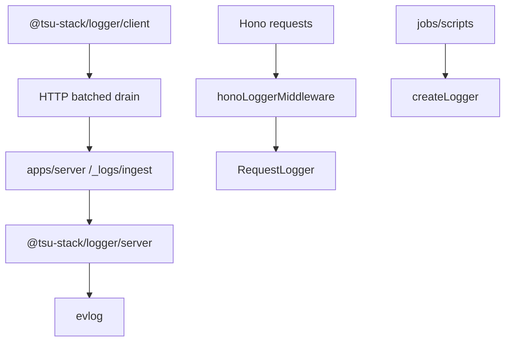

# @tsu-stack/logger

Structured logging facade built on evlog. It provides browser logging, server
logging, Hono middleware, TanStack Start middleware, structured error helpers,
and shared service names.

## Responsibilities

- Initialize browser and server logging consistently.
- Batch browser logs to `/_logs/ingest`.
- Create request-scoped server loggers.
- Redact sensitive fields by default.
- Parse unknown errors into response-safe fields.

## Architecture



See [ARCHITECTURE.md](ARCHITECTURE.md) for flow details.

## Public API / Entrypoints

| Import                                               | Purpose                                                                   |
| ---------------------------------------------------- | ------------------------------------------------------------------------- |
| `@tsu-stack/logger/client`                           | `initLog`, browser `log`, identity helpers, service names                 |
| `@tsu-stack/logger/server`                           | `initLogger`, `createLogger`, `createRequestLogger`, `log`, error helpers |
| `@tsu-stack/logger/server/hono/middleware`           | Hono request logging and browser log ingestion                            |
| `@tsu-stack/logger/server/tanstack-start/middleware` | TanStack Start request/server-function logging                            |

## Redaction

Server logging redacts evlog audit preset paths plus:

- `apiKey`
- `authorization`
- `cookie`
- `cookies`
- `password`
- `secret`
- `set-cookie`
- `token`
- `accessToken`
- `refreshToken`

## Usage

Browser:

```ts
import { LOG_SERVICES, initLog, log } from "@tsu-stack/logger/client";

initLog({ service: LOG_SERVICES.WEB_CLIENT });
log.info({ event: "page_view", path: location.pathname });
```

Server:

```ts
import { createLogger } from "@tsu-stack/logger/server";

const logger = createLogger({ operation: "sync_users" });
logger.emit({ event: "sync_completed", count: 42 });
```

## Integration Notes

- Apps should initialize logging once per runtime.
- Request handlers should use request-scoped loggers from context/middleware.
- Browser identity context should be cleared on sign-out.
- Routine high-volume events should be sampled or avoided.

## Gotchas

- `initLogger` and `initLog` are idempotent.
- Browser logging no-ops outside browser runtime.
- Do not log raw secrets, cookies, provider tokens, or full session payloads.
- Docs should say evlog, not Logtape.
