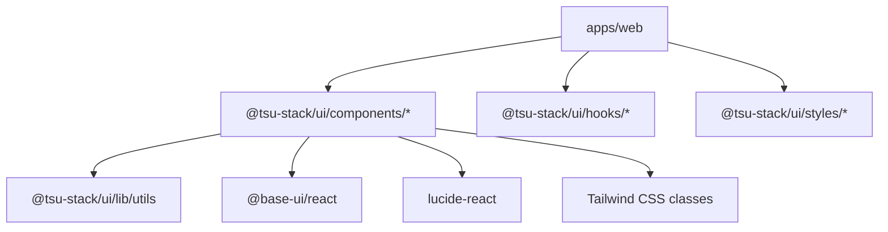

# @tsu-stack/ui

Shared app-agnostic UI primitives, styles, and hooks. Components are derived
from shadcn/base UI patterns and must stay reusable outside `apps/web`.

## Responsibilities

- Own app-agnostic React components in `components`.
- Own shared styles in `styles`.
- Own generic hooks in `hooks`.
- Export `cn` from `lib/utils`.
- Provide shadcn CLI target configuration through `components.json`.

Does not own router links, locale-aware navigation, auth-aware UI, app env,
analytics, or SEO behavior.

## Architecture

## Public API / Entrypoints

| Import                             | Purpose                     |
| ---------------------------------- | --------------------------- |
| `@tsu-stack/ui/components/button`  | Button primitive            |
| `@tsu-stack/ui/components/*`       | Shared component primitives |
| `@tsu-stack/ui/hooks/use-mobile`   | Generic responsive hook     |
| `@tsu-stack/ui/lib/utils`          | `cn(...)` class utility     |
| `@tsu-stack/ui/styles/globals.css` | Global CSS entry            |

## Local Structure

| Path              | Purpose                            |
| ----------------- | ---------------------------------- |
| `components`      | Shared component primitives        |
| `hooks`           | Generic browser/react hooks        |
| `lib/utils.ts`    | Class merging helper               |
| `styles`          | Shared CSS layers and theme styles |
| `components.json` | shadcn CLI config                  |

## Development Commands

| Command             | Purpose                              |
| ------------------- | ------------------------------------ |
| `rtk vp run ui`     | Run shadcn CLI for shared UI package |
| `rtk vp run ui:web` | Run shadcn CLI in web app context    |

## Extraction Rule

Move UI here only when it is:

- reusable;
- app-agnostic;
- free of route, locale, auth, env, and analytics dependencies;
- useful outside one feature.

Keep wrappers in `apps/web/src/components` when they need app behavior.

## Gotchas

- `packages/ui` must not import from `apps/*`.
- Use dependency injection for link/image/navigation behavior.
- Prefer Lucide icons for generic UI controls.
- Do not add React context for simple cross-component state without checking the
  Zustand guidance in `.agents/zustand.md`.
