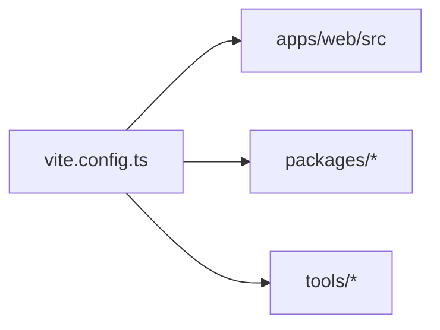

# @tsu-stack/vite-plus

Shared Vite Plus helper package. It centralizes workspace tooling notes for the
root `vite.config.ts`.

## Responsibilities

- Keep workspace lint and format assumptions visible.
- Avoid duplicating long tooling explanations in app and package docs.
- Document app-specific tooling decisions when they are not obvious from config.

## Public API / Entrypoints

This package currently has no exported helper files.

## Architecture



## Web Structure Note

`apps/web/src` uses Midday-style folders:

```text
routes/
components/
hooks/
utils/
lib/
providers/
styles/
config/
```

Do not add tooling rules that require frontend `features`, `pages`, `widgets`,
`entities`, `shared`, or `api` folders.

## Gotchas

- This package is tooling only.
- Keep web-specific assumptions explicit and narrow.
- If another app appears, add a second explicit helper instead of making shared
  tooling generic too early.
