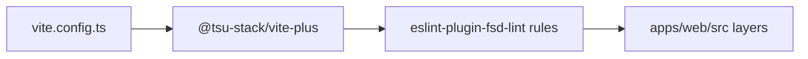

# @tsu-stack/vite-plus

Shared Vite Plus helper package. It currently exports the TanStack Start
Feature-Sliced Design lint override used by root Vite Plus config.

## Responsibilities

- Centralize workspace lint helper configuration.
- Keep app-specific FSD layer rules reusable from root config.
- Avoid duplicating long Oxlint override objects.

## Public API / Entrypoints

| File                         | Purpose                              |
| ---------------------------- | ------------------------------------ |
| `tanstack-start-fsd.lint.ts` | FSD lint override for `apps/web/src` |

## Architecture

## FSD Layers

| Layer    | Path       |
| -------- | ---------- |
| app      | `routes`   |
| pages    | `pages`    |
| widgets  | `widgets`  |
| features | `features` |
| entities | `entities` |
| shared   | `shared`   |

## Gotchas

- This package is tooling only.
- Keep web-specific FSD assumptions here rather than scattered in package docs.
- If another app appears, add a second explicit helper instead of making this
  one generic too early.
